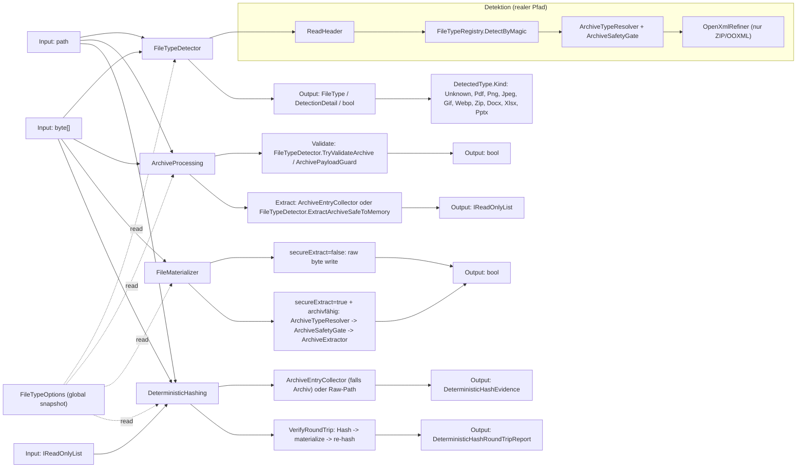

# FileClassifier

## 1. Einstieg
Dieses Dokument ist der zentrale Einstiegspunkt für Nutzer und Entwickler.

## 2. Zielbild
FileClassifier liefert deterministische Dateityperkennung, sichere Archivverarbeitung und reproduzierbare Nachweise mit fail-closed Semantik.

## 3. Public API Surface
- `FileTypeDetector`: inhaltsbasierte Erkennung aus Pfad/Bytes, optional mit Endungsprüfung und Detailtrace.
- `ArchiveProcessing`: statische Fassade für Archiv-Validierung und sichere Memory-Extraktion.
- `FileMaterializer`: persistiert ausschließlich `Byte[]` (raw write oder sichere Archiv-Extraktion nach Zielpfad).
- `DeterministicHashing`: `HashFile`/`HashBytes`/`HashEntries` sowie `VerifyRoundTrip` mit deterministischer Evidence.
- `FileTypeOptions`: globaler Konfigurations-Snapshot für alle Pfade (wird von den Kernklassen gelesen).

## 4. Architekturüberblick
### 4.1 Kernklassen (Datenfluss)
| Kernklasse | Primäre Inputs | Primäre Outputs | Kernlogik |
|---|---|---|---|
| `FileTypeDetector` | `path`, `byte[]`, `verifyExtension` | `FileType`, `DetectionDetail`, `bool`, `IReadOnlyList<ZipExtractedEntry>` | Header/Magic (`FileTypeRegistry`) plus Archiv-Gate (`ArchiveTypeResolver` + `ArchiveSafetyGate`) und optionales OOXML-Refinement (`OpenXmlRefiner`). |
| `ArchiveProcessing` | `path`, `byte[]` | `bool`, `IReadOnlyList<ZipExtractedEntry>` | Fassade auf `FileTypeDetector.TryValidateArchive`, `ArchivePayloadGuard`, `ArchiveEntryCollector` und sichere In-Memory-Extraktion. |
| `FileMaterializer` | `byte[]`, `destinationPath`, `overwrite`, `secureExtract` | `bool` | Nur Byte-basierte Persistenz: raw write oder (bei `secureExtract=true` und archivfähigem Payload) sichere Extraktion via `ArchiveExtractor`. |
| `DeterministicHashing` | `path`, `byte[]`, `IReadOnlyList<ZipExtractedEntry>`, optionale Hash-Optionen | `DeterministicHashEvidence`, `DeterministicHashRoundTripReport` | Erkennung + Archivsammlung (`ArchiveEntryCollector`) und deterministische Manifest-/Payload-Hashes, inkl. RoundTrip über `FileMaterializer`. |

Hinweis zur Typdomäne: `DetectedType.Kind` ist nicht nur "Datei roh", sondern kann auch Archiv/Container-Typen tragen (`Zip`, `Docx`, `Xlsx`, `Pptx`).

### 4.2 Diagramm



## 5. Dokumentationspfad
- [Dokumentationsindex](https://github.com/tomtastisch/FileClassifier/blob/90a2825/docs/001_INDEX_CORE.MD)
- [API-Kernübersicht](https://github.com/tomtastisch/FileClassifier/blob/90a2825/docs/010_API_CORE.MD)
- [Architektur und Flows](https://github.com/tomtastisch/FileClassifier/blob/90a2825/docs/020_ARCH_CORE.MD)
- [Governance und Policies](https://github.com/tomtastisch/FileClassifier/blob/90a2825/docs/governance/001_POLICY_CI.MD)
- [Versioning-Policy](https://github.com/tomtastisch/FileClassifier/blob/90a2825/docs/versioning/001_POLICY_VERSIONING.MD)

## 6. Modul-READMEs
- [Bibliotheksmodul Index](https://github.com/tomtastisch/FileClassifier/blob/90a2825/src/FileTypeDetection/README.md)
- [Detektion](https://github.com/tomtastisch/FileClassifier/blob/90a2825/src/FileTypeDetection/Detection/README.md)
- [Infrastruktur](https://github.com/tomtastisch/FileClassifier/blob/90a2825/src/FileTypeDetection/Infrastructure/README.md)
- [Konfiguration](https://github.com/tomtastisch/FileClassifier/blob/90a2825/src/FileTypeDetection/Configuration/README.md)
- [Abstractions](https://github.com/tomtastisch/FileClassifier/blob/90a2825/src/FileTypeDetection/Abstractions/README.md)

## 7. Verifikation
```bash
python3 tools/check-docs.py
python3 tools/check-policy-roc.py --out artifacts/policy_roc_matrix.tsv
bash tools/versioning/check-versioning.sh
node tools/versioning/test-compute-pr-labels.js
```
