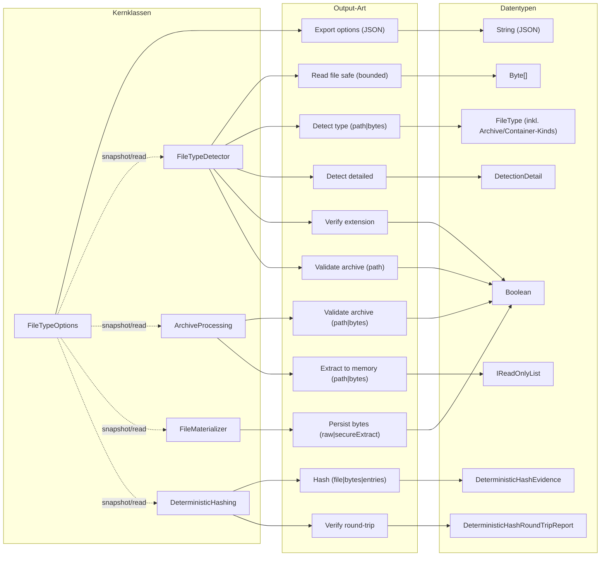

# Tomtastisch.FileClassifier

## 1. Einstieg
Dieses Dokument ist der zentrale Einstiegspunkt für Nutzer und Entwickler.

## 2. Zielbild
Tomtastisch.FileClassifier liefert deterministische Dateityperkennung, sichere Archivverarbeitung und reproduzierbare Nachweise mit fail-closed Semantik.

## 3. Public API Surface
- `FileTypeDetector`: inhaltsbasierte Erkennung aus Pfad/Bytes, optional mit Endungsprüfung und Detailtrace.
- `ArchiveProcessing`: statische Fassade für Archiv-Validierung und sichere Memory-Extraktion.
- `FileMaterializer`: persistiert ausschließlich `Byte[]` (raw write oder sichere Archiv-Extraktion nach Zielpfad).
- `DeterministicHashing`: `HashFile`/`HashBytes`/`HashEntries` sowie `VerifyRoundTrip` mit deterministischer Evidence.
- `FileTypeOptions`: globaler Konfigurations-Snapshot für alle Pfade (wird von den Kernklassen gelesen).

## 4. Installation (NuGet)
- PackageId: `Tomtastisch.FileClassifier`
- Feed: NuGet.org (online such- und installierbar)
- Installation:
```bash
dotnet add package Tomtastisch.FileClassifier --version X.Y.Z
```
- `PackageReference`:
```xml
<ItemGroup>
  <PackageReference Include="Tomtastisch.FileClassifier" Version="X.Y.Z" />
</ItemGroup>
```
- SVT (Single Version Truth):
  - Release-Tag `vX.Y.Z` erzeugt NuGet-Version `X.Y.Z`.
  - CI erzwingt `git version == nupkg version == nuget version` über SVT-Gates.
- Verfügbarkeit/Konsistenz lokal prüfen:
```bash
EXPECTED_VERSION=X.Y.Z bash tools/ci/verify_nuget_release.sh
```
- Details: [NuGet Usage Guide](https://github.com/tomtastisch/FileClassifier/blob/main/docs/021_USAGE_NUGET.MD)
- Portable-Integration: [Portable Adoption Guide](https://github.com/tomtastisch/FileClassifier/blob/main/docs/guides/003_GUIDE_PORTABLE.MD)
- Maintainer-Hinweis: Das Publish-Helper-Skript nutzt `NUGET_API_KEY` aus dem Keychain und gibt den Token nicht aus.
- Migration: Verwende ausschließlich `Tomtastisch.FileClassifier` (Details in `docs/guides/004_GUIDE_MIGRATE_LEGACY_NUGET.MD`).
  - Siehe: [NuGet Usage Guide](https://github.com/tomtastisch/FileClassifier/blob/main/docs/021_USAGE_NUGET.MD)

## 5. Compatibility / TFMs
- Library-Zielplattformen: `net8.0` und `net10.0`
- Release-Versioning: Git-Tag `vX.Y.Z` (optional `-prerelease`) ist SSOT

## 6. Architekturüberblick
### 6.1 Kernklassen (Datenfluss)
| Kernklasse | Primäre Inputs | Primäre Outputs | Kernlogik |
|---|---|---|---|
| `FileTypeDetector` | `path`, `byte[]`, `verifyExtension` | `FileType`, `DetectionDetail`, `bool`, `IReadOnlyList<ZipExtractedEntry>` | Header/Magic (`FileTypeRegistry`) plus Archiv-Gate (`ArchiveTypeResolver` + `ArchiveSafetyGate`) und optionales OOXML-Refinement (`OpenXmlRefiner`). |
| `ArchiveProcessing` | `path`, `byte[]` | `bool`, `IReadOnlyList<ZipExtractedEntry>` | Fassade: path-basierte Validierung/Extraktion delegiert an `FileTypeDetector` (`TryValidateArchive` / `ExtractArchiveSafeToMemory`); byte-basierte Pfade nutzen `ArchivePayloadGuard` und `ArchiveEntryCollector`. |
| `FileMaterializer` | `byte[]`, `destinationPath`, `overwrite`, `secureExtract` | `bool` | Nur Byte-basierte Persistenz: raw write oder (bei `secureExtract=true` und archivfähigem Payload) sichere Extraktion via `ArchiveExtractor`. |
| `DeterministicHashing` | `path`, `byte[]`, `IReadOnlyList<ZipExtractedEntry>`, optionale Hash-Optionen | `DeterministicHashEvidence`, `DeterministicHashRoundTripReport` | Erkennung + Archivsammlung (`ArchiveEntryCollector`) und deterministische Manifest-/Payload-Hashes, inkl. RoundTrip über `FileMaterializer`. |

Hinweis zur Typdomäne: `DetectedType.Kind` ist nicht nur "Datei roh", sondern kann auch Archiv/Container-Typen tragen (`Zip`, `Docx`, `Xlsx`, `Pptx`).

### 6.2 Diagramm (kompakt)


Detailierte Ablaufdiagramme liegen in [Architektur und Flows (Detail)](https://github.com/tomtastisch/FileClassifier/blob/main/docs/020_ARCH_CORE.MD).

Delegationshinweis: `ArchiveProcessing` ist bei path-basierten Archivpfaden eine Fassade auf `FileTypeDetector`; nur die byte-basierten Archivpfade laufen direkt über `ArchivePayloadGuard`/`ArchiveEntryCollector`.


## 7. Dokumentationspfad
- [Dokumentationsindex](https://github.com/tomtastisch/FileClassifier/blob/main/docs/001_INDEX_CORE.MD)
- [API-Kernübersicht](https://github.com/tomtastisch/FileClassifier/blob/main/docs/010_API_CORE.MD)
- [Architektur und Flows](https://github.com/tomtastisch/FileClassifier/blob/main/docs/020_ARCH_CORE.MD)
- [Governance und Policies](https://github.com/tomtastisch/FileClassifier/blob/main/docs/governance/001_POLICY_CI.MD)
- [Versioning-Policy](https://github.com/tomtastisch/FileClassifier/blob/main/docs/versioning/001_POLICY_VERSIONING.MD)

## 8. Modul-READMEs
- [Bibliotheksmodul Index](https://github.com/tomtastisch/FileClassifier/blob/main/src/FileTypeDetection/README.md)
- [Detektion](https://github.com/tomtastisch/FileClassifier/blob/main/src/FileTypeDetection/Detection/README.md)
- [Infrastruktur](https://github.com/tomtastisch/FileClassifier/blob/main/src/FileTypeDetection/Infrastructure/README.md)
- [Konfiguration](https://github.com/tomtastisch/FileClassifier/blob/main/src/FileTypeDetection/Configuration/README.md)
- [Abstractions](https://github.com/tomtastisch/FileClassifier/blob/main/src/FileTypeDetection/Abstractions/README.md)

## 9. Verifikation
```bash
python3 tools/check-docs.py
python3 tools/check-policy-roc.py --out artifacts/policy_roc_matrix.tsv
bash tools/versioning/check-version-policy.sh
dotnet test tests/FileTypeDetectionLib.Tests/FileTypeDetectionLib.Tests.csproj -c Release --filter "Category=ApiContract" -v minimal
dotnet pack src/FileTypeDetection/FileTypeDetectionLib.vbproj -c Release -o artifacts/nuget -v minimal
EXPECTED_VERSION=4.4.0 bash tools/ci/verify_nuget_release.sh
EXPECTED_VERSION=4.4.0 bash tools/ci/publish_nuget_local.sh
node tools/versioning/test-compute-pr-labels.js
```
