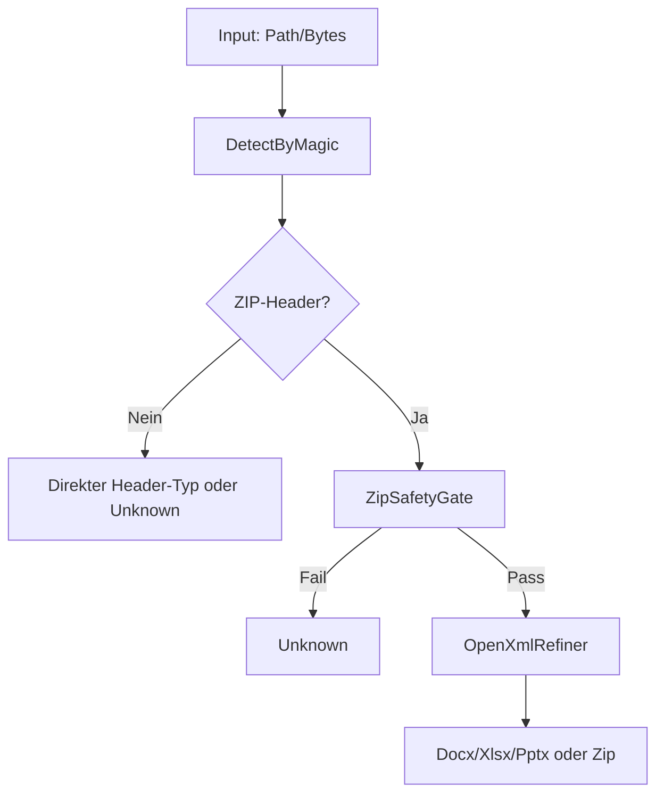

# FileClassifier

## 1. Ziel, Scope und Nicht-Ziele
### 1.1 Ziel
Deterministische, fail-closed Dateityp-Erkennung mit sicherer ZIP-Pruefung und sicherer ZIP-Extraktion.

### 1.2 Scope
- Content-basierte Erkennung (`Detect*`)
- ZIP-Sicherheits-Gate (Limits, nested, ratio)
- Sichere Extraktion auf Disk und in Memory
- Portable Kopierbarkeit nach `portable/FileTypeDetection`

### 1.3 Nicht-Ziele
- Vertrauen auf Dateinamen/Dateiendung als primaere Sicherheitsquelle
- "best effort"-Erkennung ohne fail-closed Verhalten

## 2. Sicherheitsprinzipien
- **Fail-closed:** Fehlerpfade liefern `Unknown` oder `False`.
- **Determinismus:** gleiche Eingabe -> gleiches Ergebnis.
- **Header-first:** Nicht-ZIP-Typen werden nur per Header erkannt (`HeaderOnlyNonZip=True`).
- **ZIP-Sonderregel:** ZIP-Header wird immer sicher inhaltlich geprueft und verfeinert.
- **Least trust:** Dateiname/Endung sind Metadaten, keine Vertrauensquelle.

## 3. Glossar
| Begriff | Definition |
|---|---|
| `Unknown` | fail-closed Rueckgabewert fuer nicht sicher zuordenbare Inhalte |
| Header-Erkennung | Typzuordnung ueber Magic-Bytes im Dateikopf |
| Struktur-Erkennung | Typzuordnung ueber sichere Container-Inhalte (z. B. OOXML-Marker) |
| ZIP-Gate | Sicherheitspruefung fuer ZIP-Container (Limits/Traversal/Nesting) |
| SSOT | Single Source of Truth; zentrale Definition ohne duplizierte Logik |
| `Allowed` | boolesches Policy-Flag im `FileType` (`Unknown=False`) |

## 4. Architekturuebersicht


## 5. Oeffentliche API
| API | Zweck | Sicherheitswirkung |
|---|---|---|
| `Detect(path)` | Inhaltserkennung auf Datei | kein Namensvertrauen |
| `Detect(path, verifyExtension)` | Erkennung + Endungs-Policy | optionale Policy-Haertung |
| `Detect(data)` | Inhaltserkennung fuer Bytes | geeignet fuer Upload-/Queue-Flows |
| `DetectDetailed(path)` | auditierbares Detektionsdetail | ReasonCode + Policy-Flags |
| `DetectDetailed(path, verifyExtension)` | Detailergebnis + Endungs-Policy | nachvollziehbare fail-closed Entscheidung |
| `DetectAndVerifyExtension(path)` | Boolesche Endungspruefung | fail-closed bei Mismatch |
| `TryValidateZip(path)` | reine ZIP-Sicherheitspruefung | kein Extract, nur Gate-Entscheid |
| `ExtractZipSafe(path, dest, verifyBeforeExtract)` | sichere ZIP-Extraktion auf Disk | Traversal-/Bomb-Schutz |
| `ExtractZipSafeToMemory(path, verifyBeforeExtract)` | sichere ZIP-Extraktion in Memory | keine persistente Speicherung |
| `FileTypeSecurityBaseline.ApplyDeterministicDefaults()` | konservative Defaults | reproduzierbare Baseline |

## 6. Abhaengigkeiten (Pflicht)
| Abhaengigkeit | Version | Zweck |
|---|---:|---|
| `DocumentFormat.OpenXml` | `3.4.1` | OOXML-Refinement |
| `Mime` | `3.8.0` | MIME-Metadatenaufloesung |
| `Microsoft.IO.RecyclableMemoryStream` | `3.0.1` | Memory-stabile Streamverarbeitung |
| `FrameworkReference: Microsoft.AspNetCore.App` | n/a | Logging und Runtime |

## 7. Betrieb und Verifikation
```bash
bash tools/sync-doc-conventions.sh
bash tools/sync-portable-filetypedetection.sh
dotnet test FileClassifier.sln -v minimal
bash tools/test-bdd-readable.sh
bash tools/check-portable-filetypedetection.sh --clean
```

## 8. Navigation
- `src/FileTypeDetectionLib/INDEX.md`
- `tests/FileTypeDetectionLib.Tests/INDEX.md`
- `portable/FileTypeDetection/INDEX.md`
