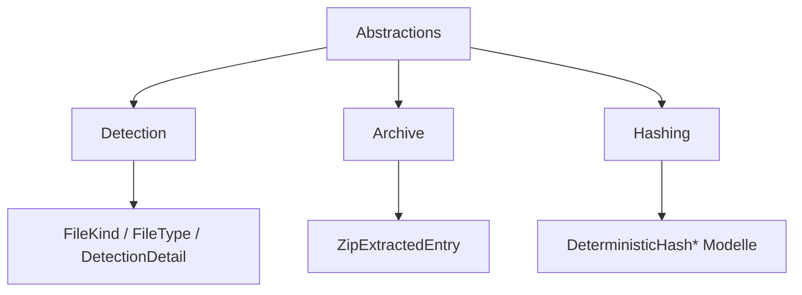

# FileClassifier

## 1. Zielbild
Professionelle, auditierbare und deterministische Dateityp-Erkennung mit sicherer Archiv-Verarbeitung.

## 2. Kernprinzipien
- **fail-closed:** Fehlerpfade liefern `Unknown`, `False` oder leere Ergebnisse.
- **deterministisch:** gleiche Eingabe, gleiche Entscheidung.
- **kleine Public Surface:** nur wenige, klare Einstiegspunkte.
- **Security first:** Archiv-Gate, Traversal-Schutz, Groessen- und Rekursionslimits.

## 3. Architektur-Navigation
- Modulindex: [src/FileTypeDetection/README.md](src/FileTypeDetection/README.md)
- Architektur & Flows (vollstaendig): [docs/02_ARCHITECTURE_AND_FLOWS.md](docs/02_ARCHITECTURE_AND_FLOWS.md)
- DIN-orientierte Spezifikation: [docs/DIN_SPECIFICATION_DE.md](docs/DIN_SPECIFICATION_DE.md)
- Ablauf/UML: [src/FileTypeDetection/README.md](src/FileTypeDetection/README.md)

## 4. API-Einstiegspunkte
- [src/FileTypeDetection/FileTypeDetector.vb](src/FileTypeDetection/FileTypeDetector.vb)
- [src/FileTypeDetection/ArchiveProcessing.vb](src/FileTypeDetection/ArchiveProcessing.vb)
- [src/FileTypeDetection/FileMaterializer.vb](src/FileTypeDetection/FileMaterializer.vb)
- [src/FileTypeDetection/FileTypeOptions.vb](src/FileTypeDetection/FileTypeOptions.vb)

## 5. Traceability (Ziel -> Check -> Evidenz)
| Ziel | Check | Evidenz |
|---|---|---|
| Determinismus | Typ-/Alias-Mapping stabil | [FileTypeRegistryUnitTests.cs](tests/FileTypeDetectionLib.Tests/Unit/FileTypeRegistryUnitTests.cs) |
| Fail-closed | Adversarial Archive werden abgewiesen | [ArchiveAdversarialTests.cs](tests/FileTypeDetectionLib.Tests/Unit/ArchiveAdversarialTests.cs) |
| Sichere Extraktion | Traversal/Kollision/Nesting abgefangen | [ArchiveExtractionUnitTests.cs](tests/FileTypeDetectionLib.Tests/Unit/ArchiveExtractionUnitTests.cs) |
| API-Klarheit | Audit-Details + Archiv-Fassade | [DetectionDetailAndArchiveValidationUnitTests.cs](tests/FileTypeDetectionLib.Tests/Unit/DetectionDetailAndArchiveValidationUnitTests.cs), [ArchiveProcessingFacadeUnitTests.cs](tests/FileTypeDetectionLib.Tests/Unit/ArchiveProcessingFacadeUnitTests.cs) |

## 6. Runbook (reproduzierbar)
```bash
dotnet restore FileClassifier.sln -v minimal
dotnet build FileClassifier.sln --no-restore -v minimal
dotnet test FileClassifier.sln --no-build -v minimal
bash tools/sync-portable-filetypedetection.sh
bash tools/check-portable-filetypedetection.sh --clean
```

## 6.1 Versionierung (zentral)
- Zentrale Versionsquelle: `Directory.Build.props`.
- Aktueller Baseline-Stand: `1.0.0`.
- Gilt konsistent fuer `FileTypeDetectionLib`, `FileClassifier.App` und `FileTypeDetectionLib.Tests`.
- Semantik: `Version` (NuGet/Produkt), `AssemblyVersion`, `FileVersion`, `InformationalVersion`.

## 7. Aktueller Strukturzustand
### 7.1 Source
Im Root von `src/FileTypeDetection` liegen nur die Public APIs.

### 7.2 Portable
Die portable Spiegelstruktur wird lokal ueber die Tools erzeugt und ist nicht Teil des veroeffentlichten Repository-Inhalts.

### 7.3 Abstractions-Ordnerhierarchie
Die Modellschicht unter `src/FileTypeDetection/Abstractions` ist nach Verantwortlichkeiten getrennt:



```text
src/FileTypeDetection/Abstractions/
  Detection/
  Archive/
  Hashing/
```

Detail-README je Unterordner:
- [src/FileTypeDetection/Abstractions/Detection/README.md](src/FileTypeDetection/Abstractions/Detection/README.md)
- [src/FileTypeDetection/Abstractions/Archive/README.md](src/FileTypeDetection/Abstractions/Archive/README.md)
- [src/FileTypeDetection/Abstractions/Hashing/README.md](src/FileTypeDetection/Abstractions/Hashing/README.md)
