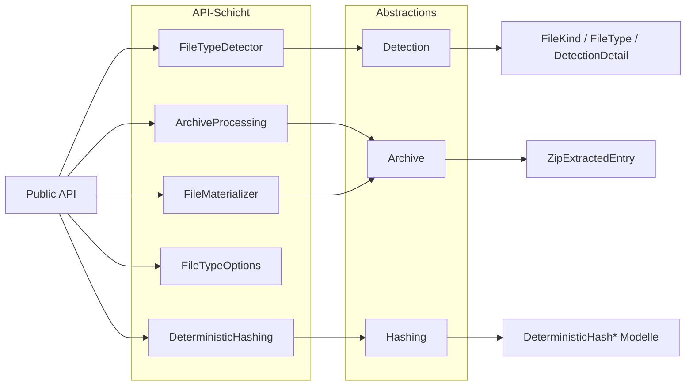

# FileClassifier

## 1. Einstieg
Dieses Dokument ist der zentrale Einstiegspunkt für Nutzer und Entwickler.

## 2. Zielbild
FileClassifier liefert deterministische Dateityperkennung, sichere Archivverarbeitung und reproduzierbare Nachweise mit fail-closed Semantik.

## 3. Public API Surface
- `FileTypeDetector`: Erkennung aus Pfad/Bytes inklusive Detailbewertung.
- `ArchiveProcessing`: statische Fassade für Archiv-Validierung und sichere Extraktion.
- `FileMaterializer`: sichere Persistenz und optionale Archiv-Materialisierung.
- `FileTypeOptions`: Laden und Auslesen globaler Laufzeitoptionen.
- `DeterministicHashing`: Physical/Logical Hash-Evidence und RoundTrip-Report.

## 4. Architekturüberblick



## 5. Dokumentationspfad
- [Dokumentationsindex](https://github.com/tomtastisch/FileClassifier/blob/90a2825/docs/001_INDEX_CORE.MD)
- [API-Kernübersicht](https://github.com/tomtastisch/FileClassifier/blob/90a2825/docs/010_API_CORE.MD)
- [Architektur und Flows](https://github.com/tomtastisch/FileClassifier/blob/90a2825/docs/020_ARCH_CORE.MD)
- [Governance und Policies](https://github.com/tomtastisch/FileClassifier/blob/90a2825/docs/governance/001_POLICY_CI.MD)
- [Versioning-Policy](https://github.com/tomtastisch/FileClassifier/blob/90a2825/docs/versioning/001_POLICY_VERSIONING.MD)

## 6. Modul-READMEs
- [Bibliotheksmodul Index](https://github.com/tomtastisch/FileClassifier/blob/90a2825/src/FileTypeDetection/README.md)
- [Detektion](https://github.com/tomtastisch/FileClassifier/blob/90a2825/src/FileTypeDetection/Detection/README.md)
- [Infrastruktur](https://github.com/tomtastisch/FileClassifier/blob/90a2825/src/FileTypeDetection/Infrastructure/README.md)
- [Konfiguration](https://github.com/tomtastisch/FileClassifier/blob/90a2825/src/FileTypeDetection/Configuration/README.md)
- [Abstractions](https://github.com/tomtastisch/FileClassifier/blob/90a2825/src/FileTypeDetection/Abstractions/README.md)

## 7. Verifikation
```bash
python3 tools/check-docs.py
python3 tools/check-policy-roc.py --out artifacts/policy_roc_matrix.tsv
bash tools/versioning/check-versioning.sh
node tools/versioning/test-compute-pr-labels.js
```
