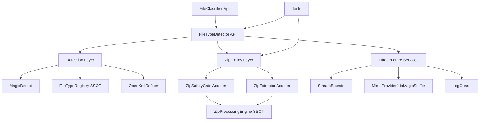

# D0) TARGET_ARCHITECTURE.md

## Zielmodell (kanonisch)

## Architekturprinzipien
1. **Facade only**: Oeffentliche API bleibt `FileTypeDetector`.
2. **SSOT fuer ZIP-Iteration**: genau eine Entry-Loop-Engine (`ZipProcessingEngine`).
3. **Adapter-Trennung**:
   - `ZipSafetyGate`: nur validieren
   - `ZipExtractor`: nur entpacken
4. **Fail-closed by default** in allen Schichten.
5. **Portable Sync**: `src` ist source-of-truth; `portable` wird generiert.

## Warum diese Struktur?
- Erhoehte Wartbarkeit ohne Redundanzverlust.
- Hoehere Testbarkeit auf Modulgrenzen.
- Deterministische Abhaengigkeitsrichtung (API -> Policies -> Infra).
