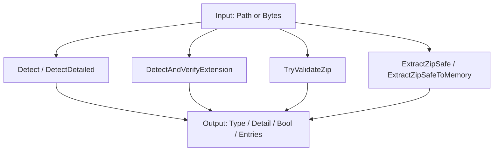
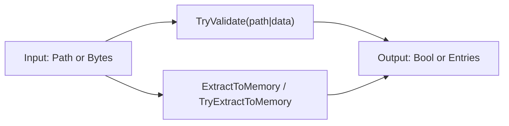
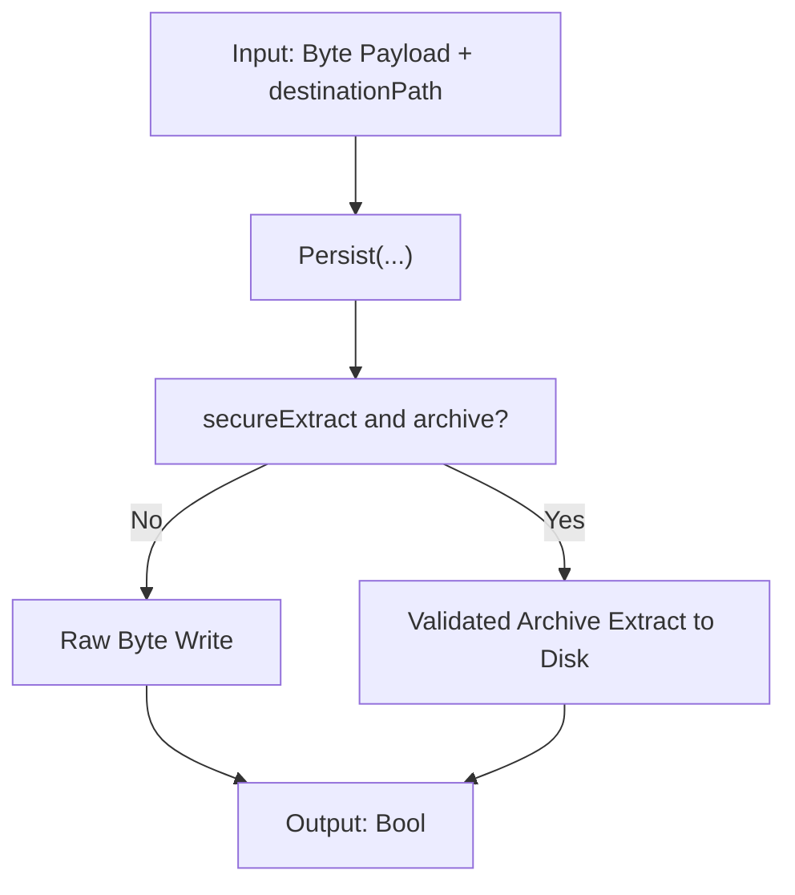
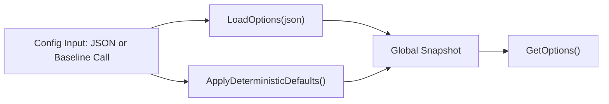

# 01 - Funktionen

## 1. Zweck & Scope
Dieses Dokument beschreibt alle oeffentlichen Einstiegspunkte der API mit Signaturen, Einsatzfall, Seiteneffekten und minimalen Aufrufbeispielen.

## 2. Definitionen
- Fail-closed: Fehlerpfade liefern nur sichere Rueckgaben (`Unknown`, `False`, leere Liste).
- Side-Effects: Dateisystemschreibvorgaenge oder globale Optionsaenderungen.
- Flow-ID: Verweis auf Architekturablaeufe in `02_ARCHITECTURE_AND_FLOWS.md`.

## 2.1 API-Wahrheit vs. historischer Name (prominent)
- `TryValidateZip(...)` ist ein **historischer Kompatibilitaetsname**; die Signatur bleibt stabil.
- Heutige Semantik: Die Methode validiert **alle intern unterstuetzten Archivcontainer** fail-closed (ZIP/TAR/GZIP/7z/RAR), nicht nur PKZIP.
- Warum historisch: Das Public Surface blieb absichtlich unveraendert, um API-Breaks zu vermeiden.
- Technisch passiert die Typfeststellung ueber `ArchiveTypeResolver` + `ArchiveSafetyGate`; nur OOXML-Refinement bleibt ZIP-spezifisch.

## 2.2 Weiterfuehrende Detailquellen pro Familie
| API-Familie | Detailquelle | Zweck |
|---|---|---|
| `FileTypeDetector` / `ZipProcessing` | [`../src/FileTypeDetection/Detection/README.md`](../src/FileTypeDetection/Detection/README.md) | SSOT-Detektion, Header-Magic, Aliaslogik |
| `FileTypeDetector` / `ZipProcessing` / `FileMaterializer` | [`../src/FileTypeDetection/Infrastructure/README.md`](../src/FileTypeDetection/Infrastructure/README.md) | Archive-Gate, Guards, Extraktions-Engine |
| `FileTypeOptions` / `FileTypeSecurityBaseline` | [`../src/FileTypeDetection/Configuration/README.md`](../src/FileTypeDetection/Configuration/README.md) | globale Optionen und Baseline |
| Rueckgabemodelle (`FileType`, `DetectionDetail`, `ZipExtractedEntry`) | [`../src/FileTypeDetection/Abstractions/README.md`](../src/FileTypeDetection/Abstractions/README.md) | Modellvertraege der Public API |
| Modulnavigation | [`../src/FileTypeDetection/README.md`](../src/FileTypeDetection/README.md) | Uebersicht und Einstieg je Leserrolle |

## 3. Vollstaendige Methodenmatrix (Public API)
| Familie | Methode | Input | Output | Side-Effects | Primarer Flow |
|---|---|---|---|---|---|
| `FileTypeDetector` | `ReadFileSafe(path)` | Datei-Pfad | `Byte()` | keine (read-only) | `F0` |
| `FileTypeDetector` | `Detect(path)` | Datei-Pfad | `FileType` | keine | `F1` |
| `FileTypeDetector` | `Detect(path, verifyExtension)` | Datei-Pfad + Bool | `FileType` | keine | `F1` |
| `FileTypeDetector` | `DetectDetailed(path)` | Datei-Pfad | `DetectionDetail` | keine | `F1` |
| `FileTypeDetector` | `DetectDetailed(path, verifyExtension)` | Datei-Pfad + Bool | `DetectionDetail` | keine | `F1` |
| `FileTypeDetector` | `DetectAndVerifyExtension(path)` | Datei-Pfad | `Boolean` | keine | `F8` |
| `FileTypeDetector` | `TryValidateZip(path)` | Datei-Pfad | `Boolean` | keine | `F3` |
| `FileTypeDetector` | `Detect(data)` | `Byte()` | `FileType` | keine | `F2` |
| `FileTypeDetector` | `IsOfType(data, kind)` | `Byte()` + `FileKind` | `Boolean` | keine | `F2` |
| `FileTypeDetector` | `ExtractZipSafe(path, destination, verifyBeforeExtract)` | Pfad + Ziel + Bool | `Boolean` | schreibt auf Disk | `F5` |
| `FileTypeDetector` | `ExtractZipSafeToMemory(path, verifyBeforeExtract)` | Pfad + Bool | `IReadOnlyList(Of ZipExtractedEntry)` | keine | `F4` |
| `ZipProcessing` | `TryValidate(path)` | Datei-Pfad | `Boolean` | keine | `F3` |
| `ZipProcessing` | `TryValidate(data)` | `Byte()` | `Boolean` | keine | `F3` |
| `ZipProcessing` | `ExtractToMemory(path, verifyBeforeExtract)` | Pfad + Bool | `IReadOnlyList(Of ZipExtractedEntry)` | keine | `F4` |
| `ZipProcessing` | `TryExtractToMemory(data)` | `Byte()` | `IReadOnlyList(Of ZipExtractedEntry)` | keine | `F4` |
| `FileMaterializer` | `Persist(data, destinationPath)` | `Byte()` + Zielpfad | `Boolean` | schreibt auf Disk | `F6` |
| `FileMaterializer` | `Persist(data, destinationPath, overwrite)` | `Byte()` + Zielpfad + Bool | `Boolean` | schreibt auf Disk | `F6` |
| `FileMaterializer` | `Persist(data, destinationPath, overwrite, secureExtract)` | `Byte()` + Zielpfad + 2 Bool | `Boolean` | schreibt auf Disk | `F5`/`F6` |
| `FileTypeOptions` | `LoadOptions(json)` | JSON | `Boolean` | aendert globale Optionen | `F7` |
| `FileTypeOptions` | `GetOptions()` | - | `String` (JSON) | keine | `F7` |
| `FileTypeSecurityBaseline` | `ApplyDeterministicDefaults()` | - | `Void` | aendert globale Optionen | `F7` |

## 4. Methodenfamilien
### 4.1 FileTypeDetector
Details: [`../src/FileTypeDetection/README.md`](../src/FileTypeDetection/README.md), [`../src/FileTypeDetection/Detection/README.md`](../src/FileTypeDetection/Detection/README.md), [`../src/FileTypeDetection/Infrastructure/README.md`](../src/FileTypeDetection/Infrastructure/README.md).

**Wichtiger Semantikhinweis:** `TryValidateZip(path)` validiert heute generische Archivcontainer (historischer Methodenname bleibt aus Kompatibilitaetsgruenden bestehen).



```csharp
using FileTypeDetection;

var detector = new FileTypeDetector();
var t = detector.Detect("/data/invoice.pdf", verifyExtension: true);
var d = detector.DetectDetailed("/data/archive.docx", verifyExtension: true);
bool zipOk = detector.TryValidateZip("/data/archive.zip");
var entries = detector.ExtractZipSafeToMemory("/data/archive.zip", verifyBeforeExtract: true);

Console.WriteLine($"{t.Kind} / {d.ReasonCode} / {zipOk} / {entries.Count}");
```

### 4.2 ZipProcessing
API-Name bleibt aus Kompatibilitaetsgruenden erhalten; intern werden Archivcontainer einheitlich behandelt.
Details: [`../src/FileTypeDetection/README.md`](../src/FileTypeDetection/README.md), [`../src/FileTypeDetection/Infrastructure/README.md`](../src/FileTypeDetection/Infrastructure/README.md).



```csharp
using FileTypeDetection;

bool okPath = ZipProcessing.TryValidate("/data/archive.zip");
bool okBytes = ZipProcessing.TryValidate(File.ReadAllBytes("/data/archive.zip"));
var entriesPath = ZipProcessing.ExtractToMemory("/data/archive.zip", verifyBeforeExtract: true);
var entriesBytes = ZipProcessing.TryExtractToMemory(File.ReadAllBytes("/data/archive.zip"));
```

### 4.3 FileMaterializer
Details: [`../src/FileTypeDetection/README.md`](../src/FileTypeDetection/README.md), [`../src/FileTypeDetection/Infrastructure/README.md`](../src/FileTypeDetection/Infrastructure/README.md).



```csharp
using FileTypeDetection;

byte[] payload = File.ReadAllBytes("/data/input.bin");
byte[] zipPayload = File.ReadAllBytes("/data/archive.zip");

bool rawOk = FileMaterializer.Persist(payload, "/data/out/input.bin", overwrite: false, secureExtract: false);
bool zipOk = FileMaterializer.Persist(zipPayload, "/data/out/unpacked", overwrite: false, secureExtract: true);
```

### 4.4 FileTypeOptions + FileTypeSecurityBaseline
Details: [`../src/FileTypeDetection/README.md`](../src/FileTypeDetection/README.md), [`../src/FileTypeDetection/Configuration/README.md`](../src/FileTypeDetection/Configuration/README.md).



```csharp
using FileTypeDetection;

FileTypeSecurityBaseline.ApplyDeterministicDefaults();
bool loaded = FileTypeOptions.LoadOptions("{\"maxBytes\":134217728}");
string snapshot = FileTypeOptions.GetOptions();
Console.WriteLine($"Loaded={loaded}; Snapshot={snapshot}");
```

## 5. Nicht-Ziele
- Keine interne Low-Level-Implementierung im Detail (siehe `03_REFERENCES.md`).
- Keine Norm/Compliance-Herleitung (siehe `DIN_SPECIFICATION_DE.md`).

## 6. Security-Gate Mini-Contract (neutral)
Die folgenden Regeln gelten fuer `ArchiveSafetyGate` + `ArchiveExtractor`:

| Regel | Default | Vertrag |
|---|---|---|
| Link-Entries (`symlink`/`hardlink`) | `RejectArchiveLinks = true` | Link-Targets werden fail-closed verworfen. Override nur per explizitem Opt-In (`false`) und eigener Risikoentscheidung des Consumers. |
| Unknown Entry Size | `AllowUnknownArchiveEntrySize = false` | "Unknown" bedeutet `Size` nicht vorhanden oder negativ. Dann wird fail-closed geblockt bzw. per bounded Streaming gemessen; bei Grenzverletzung -> `False`. |
| Path-Sicherheit | aktiv | Entry-Name wird normalisiert (`\\` -> `/`), root/traversal/leer werden verworfen, Zielpfad muss Prefix-Check bestehen. |
| Grenzen | aktiv | Entry-Anzahl, per-Entry-Bytes, Gesamtbytes, Rekursionstiefe und (ZIP-spezifisch) Ratio/Nested-Regeln bleiben fail-closed. |

## 7. Formatmatrix (implementierte Semantik)
Implementiert bedeutet hier: Container wird geoeffnet, Gate angewendet und Extraktion ueber dieselbe Pipeline ausgefuehrt.

| Format | Detection (`Detect`) | Validate (`TryValidateZip` / `ZipProcessing.TryValidate`) | Extract-to-Memory (`ZipProcessing.TryExtractToMemory`) | Extract-to-Disk (`FileMaterializer.Persist(..., secureExtract:=True)`) |
|---|---|---|---|---|
| ZIP | Ja (Magic + Gate + optional OOXML-Refinement) | Ja | Ja | Ja |
| TAR | Ja (Container-Erkennung + Gate, logisches `FileKind.Zip`) | Ja | Ja | Ja |
| TAR.GZ | Ja (GZIP-Container, Nested-Archive-Pfad) | Ja | Ja | Ja |
| 7z | Ja (Container-Erkennung + Gate, logisches `FileKind.Zip`) | Ja | Ja | Ja |
| RAR | Ja (Container-Erkennung + Gate, logisches `FileKind.Zip`) | Ja | Ja | Ja |

Hinweis zur Typausgabe: In Phase 1 bleibt der oeffentliche Rueckgabetyp kompatibel; erkannte Archive werden als logischer `FileKind.Zip` gemeldet.

## 8. Nachweis Umwandlung/Absicherung + Testabdeckung
Die Byte-Pfade (Detect/Validate/Extract/Persist) sind auf die gleiche Gate-Pipeline gelegt.

| Format | Detection | Validate | Extract Memory | Extract Disk | Testnachweis |
|---|---|---|---|---|---|
| ZIP | abgedeckt | abgedeckt | abgedeckt | abgedeckt | `tests/FileTypeDetectionLib.Tests/Unit/ZipProcessingFacadeUnitTests.cs`, `tests/FileTypeDetectionLib.Tests/Unit/ZipExtractionUnitTests.cs`, `tests/FileTypeDetectionLib.Tests/Unit/FileMaterializerUnitTests.cs` |
| TAR | abgedeckt | indirekt ueber unified validate | implizit ueber Backend-Pfad | implizit ueber Backend-Pfad | `tests/FileTypeDetectionLib.Tests/Unit/UnifiedArchiveBackendUnitTests.cs` |
| TAR.GZ | abgedeckt | abgedeckt | abgedeckt | abgedeckt | `tests/FileTypeDetectionLib.Tests/Unit/UnifiedArchiveBackendUnitTests.cs` |
| 7z | abgedeckt | abgedeckt | abgedeckt | abgedeckt | `tests/FileTypeDetectionLib.Tests/Features/FTD_BDD_040_ARCHIVE_TYPEN_BYTEARRAY_UND_MATERIALISIERUNG.feature` |
| RAR | abgedeckt | abgedeckt | abgedeckt | abgedeckt | `tests/FileTypeDetectionLib.Tests/Features/FTD_BDD_040_ARCHIVE_TYPEN_BYTEARRAY_UND_MATERIALISIERUNG.feature` |

Zusatznachweis Security:
- Link-Entry fail-closed (`RejectArchiveLinks=true`): `tests/FileTypeDetectionLib.Tests/Unit/UnifiedArchiveBackendUnitTests.cs`.
- ZIP-Fail-closed Regressionen (Traversal, malformed Header, Overwrite/Target-Guards): `tests/FileTypeDetectionLib.Tests/Unit/FileMaterializerUnitTests.cs`.

Portabilitaet/Struktur:
- Public API bleibt stabil; interne Verantwortungen sind getrennt (`Detection` SSOT, `Infrastructure` Gate/Backend/Extractor, `Configuration` Policies, `Abstractions` Rueckgabemodelle).
- Wiederverwendung erfolgt ueber ein neutrales Entry-Modell + einheitliche Gate- und Extractor-Pfade.
