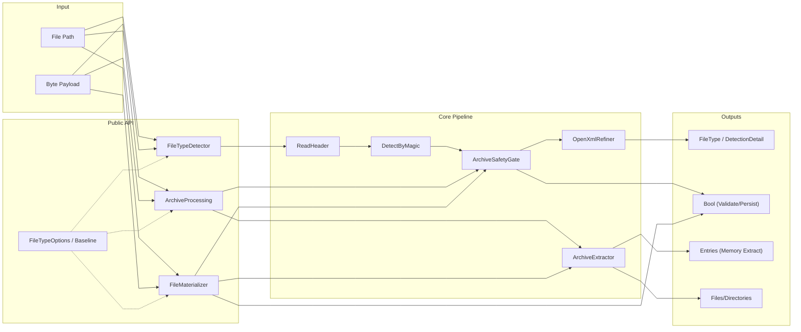
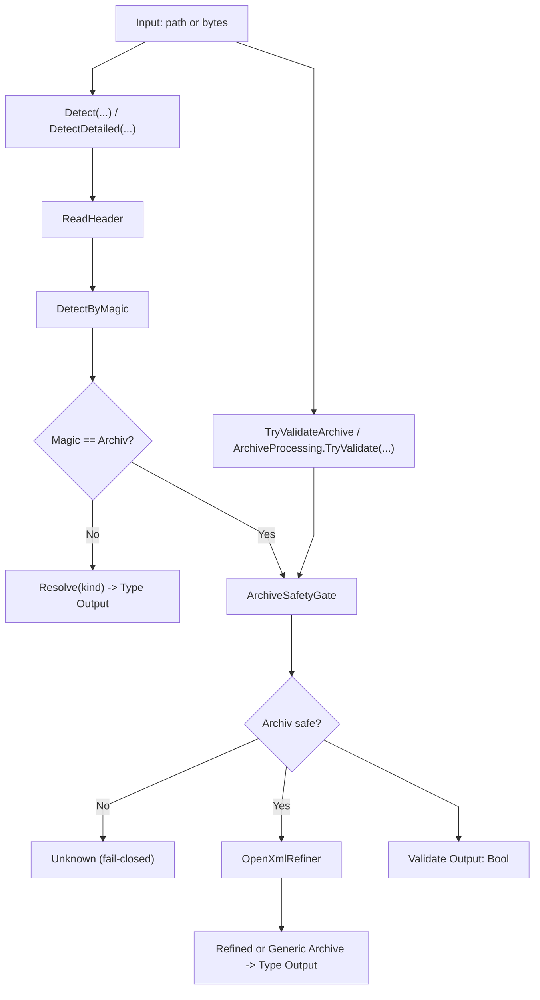
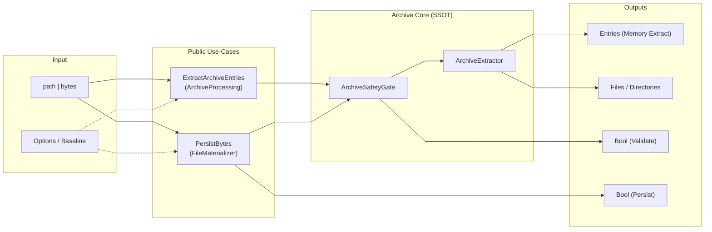
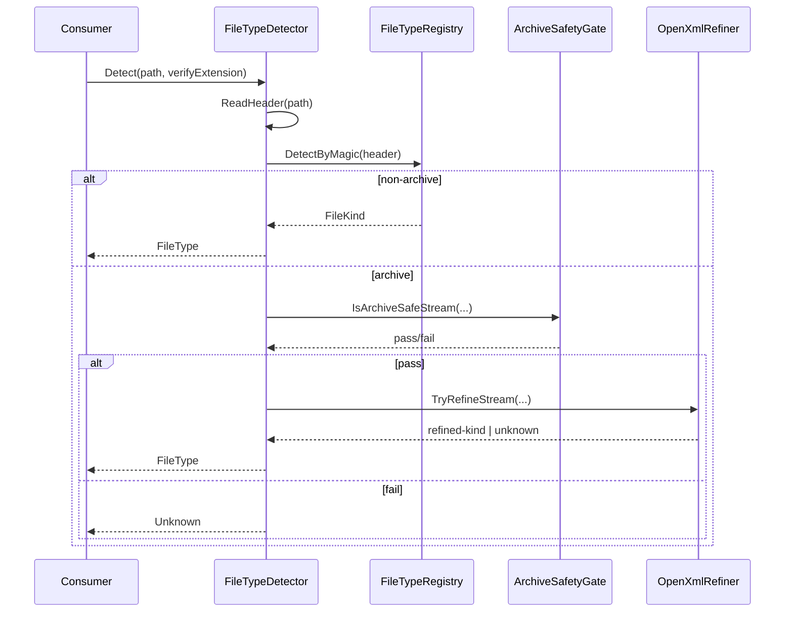
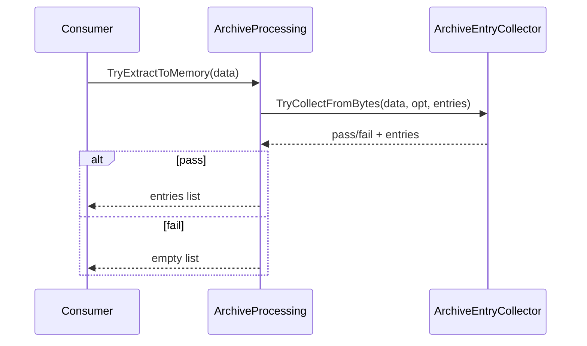
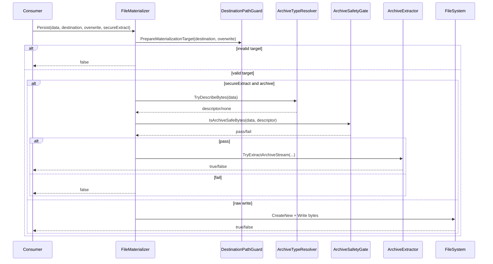
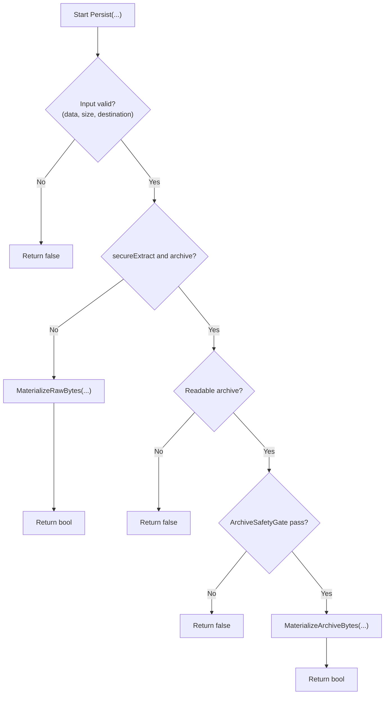
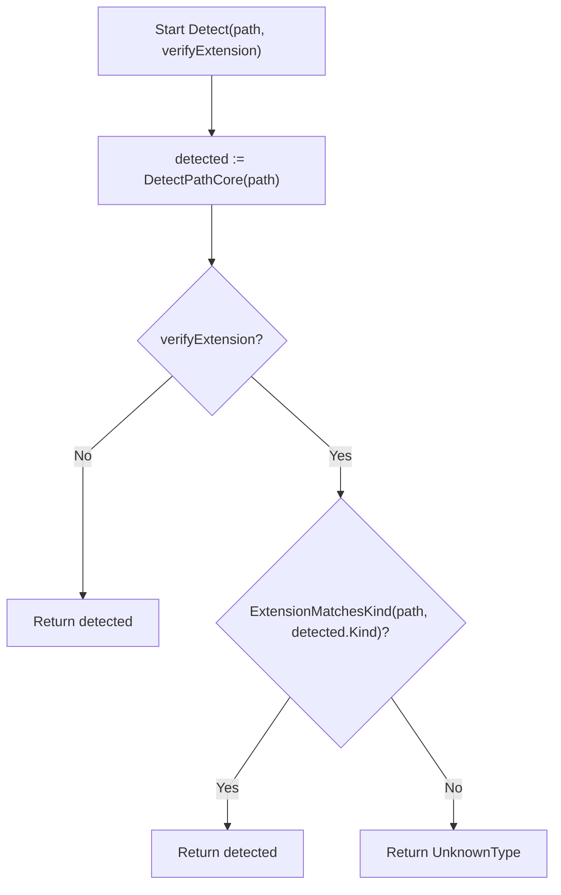

# 02 - Gesamtarchitektur und Ablaufflüsse

## 1. Zweck und Scope
Dieses Dokument beschreibt die öffentliche API (Use-Cases), die interne Kernpipeline sowie die wesentlichen Laufzeitflüsse (Detektion, Archiv-Validierung, Extraktion, Persistenz).
Es dient als Architektur- und Ablaufreferenz auf Dokumentationsebene und ersetzt keine Code-Reviews der Guards.

## 2. Begriffe und Notation
### 2.1 Konventionen
- Knoten = Verantwortungsbereich, Komponente oder Artefakt.
- Pfeil = Datenfluss oder Aufrufpfad (je nach Diagrammtyp).
- fail-closed = bei Unsicherheit oder Verstoss: `Unknown`, `false` oder leere Liste.

### 2.2 Flow-IDs (Legende)
- `F0`: ReadFileSafe Utility
- `F1`: Detect (Path)
- `F2`: Detect (Bytes)
- `F3`: Archive Validate
- `F4`: Archive Extract to Memory
- `F5`: Archive Extract to Disk
- `F6`: Raw Byte Materialize (Persist)
- `F7`: Global Options/Baseline
- `F8`: Extension Policy Check
- `F9`: Deterministic Hashing / h1-h4 RoundTrip

### 2.3 Mermaid-Layout (global)
Hinweis: Diese `init`-Konfiguration reduziert Kreuzungen und erhöht Lesbarkeit.
Sie kann pro Diagramm überschrieben werden, sollte aber konsistent bleiben.

### 2.4 Detailquellen für tieferes Drill-Down
- Detection-Details: [Detection Modul](https://github.com/tomtastisch/FileClassifier/blob/241c6d4/src/FileTypeDetection/Detection/README.md)
- Infrastructure-Details (Guards/Archive internals): [Infrastructure Modul](https://github.com/tomtastisch/FileClassifier/blob/241c6d4/src/FileTypeDetection/Infrastructure/README.md)
- Konfigurationsdetails: [Configuration Modul](https://github.com/tomtastisch/FileClassifier/blob/241c6d4/src/FileTypeDetection/Configuration/README.md)
- Rückgabemodelle: [Abstractions Modul](https://github.com/tomtastisch/FileClassifier/blob/241c6d4/src/FileTypeDetection/Abstractions/README.md)
- Rückgabemodelle Detection: [Abstractions Detection Modul](https://github.com/tomtastisch/FileClassifier/blob/241c6d4/src/FileTypeDetection/Abstractions/Detection/README.md)
- Rückgabemodelle Archive: [Abstractions Archive Modul](https://github.com/tomtastisch/FileClassifier/blob/241c6d4/src/FileTypeDetection/Abstractions/Archive/README.md)
- Rückgabemodelle Hashing: [Abstractions Hashing Modul](https://github.com/tomtastisch/FileClassifier/blob/241c6d4/src/FileTypeDetection/Abstractions/Hashing/README.md)
- Funktionskatalog mit Beispielen: [01 - Funktionen](https://github.com/tomtastisch/FileClassifier/blob/241c6d4/docs/010_API_CORE.MD)

## 3. Architekturübersicht (Systemkontext)
### 3.1 E2E-Systemkontext (kompakt)
Dieses Diagramm zeigt nur Verantwortungsbereiche und Hauptdatenflüsse:
Input -> Public API -> Core Pipeline -> Outputs.
Detailentscheidungen (Archivfall, Refinement, Persistenzzweig) folgen in Abschnitt 4.

Kurzlesehilfe:
- `FileTypeOptions/Baseline` ist Konfigurationskontext (gestrichelt), kein Datenfluss.
- `ArchiveSafetyGate` ist das zentrale fail-closed-Gate für archivbezogene Pfade.

## 4. Flussdiagramme (entscheidungsrelevante Abläufe)
### 4.1 Ablauf A: Detektion und Archiv-Validierung
Dieses Diagramm zeigt die Kernentscheidung: `Magic == Archiv?` sowie die fail-closed-Kaskade über `ArchiveSafetyGate`.
Oben: Typdetektion (`FileType`/`DetectionDetail`).
Unten: reine Archiv-Validierung (`bool`) über denselben Gate-Knoten.

Kurzlesehilfe:
- `ArchiveSafetyGate` ist SSOT für Archiv-Sicherheit in den gezeigten Pfaden.
- `OpenXmlRefiner` läuft nur im Archiv-OK-Fall.

### 4.2 Ablauf B: Extraktion (Memory) vs. Persistenz (Disk)
Dieses Diagramm zeigt zwei Archiv-Use-Cases:
(1) sichere In-Memory-Extraktion (Entries-Liste)
(2) Persistenz auf Disk (Raw Write oder Archiv-Extract), jeweils mit fail-closed Ergebnissen.

Kurzlesehilfe:
- Memory-Extraktion und Persistenz teilen sich Gate/Extractor.
- Persistenz liefert immer `Bool` als Rückgabekontrakt.

## 5. Sequenzflüsse (Runtime-Interaktionen)
### 5.1 Detect(path) mit Archivfall
Dieser Sequenzfluss zeigt den Archivfall im Detektor:
Detektion -> Gate -> optionales Refinement -> Rückgabe.
Der fail-closed-Pfad liefert `Unknown`.

### 5.2 Validate + Extract (Memory)
Fokus: Byte-Pfad über `ArchiveProcessing`.
Fail-closed endet mit leerer Liste.

### 5.3 Materializer: Branching (Persist)
Fokus: Zielpfadprüfung, danach entweder sicherer Archiv-Zweig oder Raw-Write.
Rückgabe ist immer boolesch.

## 6. NSD-Sichten (strukturierter Kontrollfluss)
### 6.1 NSD: FileMaterializer.Persist(...)
Diese Sicht reduziert verschachtelte Bedingungen auf strukturierten Kontrollfluss.
Jeder negative Prüfpfad endet sofort fail-closed mit `false`.

### 6.2 NSD: FileTypeDetector.Detect(path, verifyExtension)
Die Endungsprüfung ist ein nachgelagerter Policy-Filter.
Bei Mismatch wird fail-closed `UnknownType` zurückgegeben.

## 7. Zuordnung Public API -> Flows
| Methode | Flow-ID |
|---|---|
| `ReadFileSafe(path)` | `F0` |
| `Detect(path)` / `DetectDetailed(path)` | `F1` |
| `Detect(data)` / `IsOfType(data, kind)` | `F2` |
| `TryValidateArchive(path)` / `ArchiveProcessing.TryValidate(path|data)` | `F3` |
| `ExtractArchiveSafeToMemory(path, ...)` / `ArchiveProcessing.ExtractToMemory(...)` / `ArchiveProcessing.TryExtractToMemory(data)` | `F4` |
| `ExtractArchiveSafe(path, destination, ...)` | `F5` |
| `FileMaterializer.Persist(..., secureExtract:=False)` | `F6` |
| `FileTypeOptions.LoadOptions/GetOptions` / `FileTypeProjectBaseline.ApplyDeterministicDefaults` | `F7` |
| `DetectAndVerifyExtension(path)` / `Detect(..., verifyExtension)` | `F8` |
| `DeterministicHashing.HashFile/HashBytes/HashEntries/VerifyRoundTrip` | `F9` |

## 8. Grenzen und Nicht-Ziele
- Kein Ersatz für Quellcode-Reviews interner Guards (z. B. Payload-/Path-Guards).
- Keine Policy-Festlegung für konkrete Grenzwerte; diese kommen aus `FileTypeProjectOptions` und der Baseline.
- Keine Aussage über konkrete Threat-Model-Abdeckung ausserhalb der beschriebenen fail-closed-Semantik.

## Dokumentpflege-Checkliste
- [ ] Inhalt auf aktuellen Code-Stand geprüft.
- [ ] Links und Anker mit `python3 tools/check-docs.py` geprüft.
- [ ] Beispiele/Kommandos lokal verifiziert.
- [ ] Begriffe mit `docs/010_API_CORE.MD` abgeglichen.
