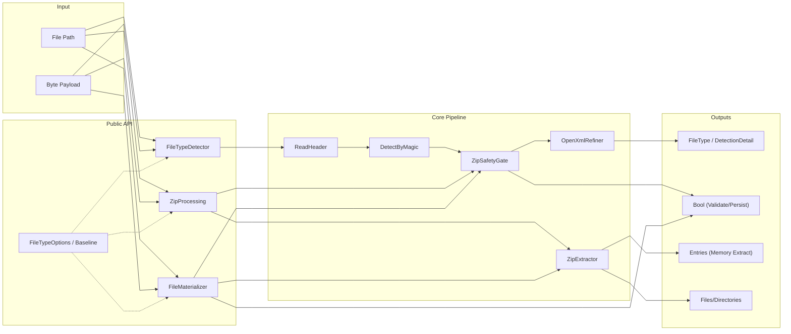
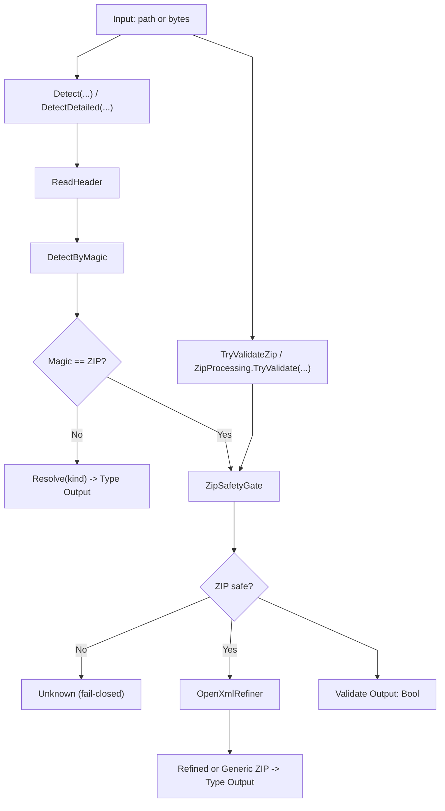
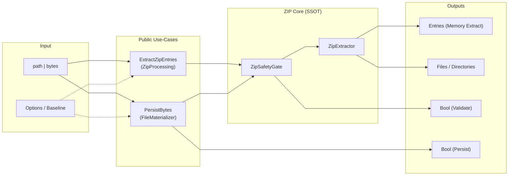
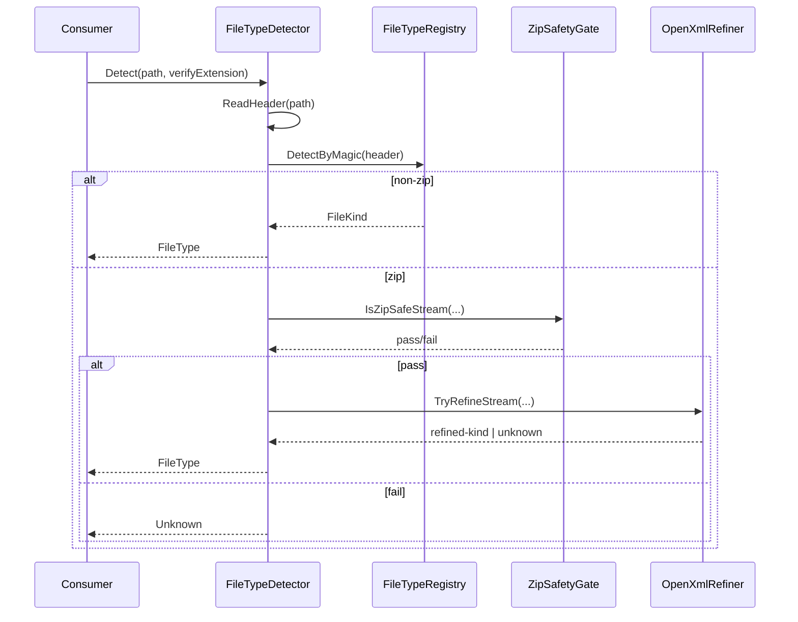
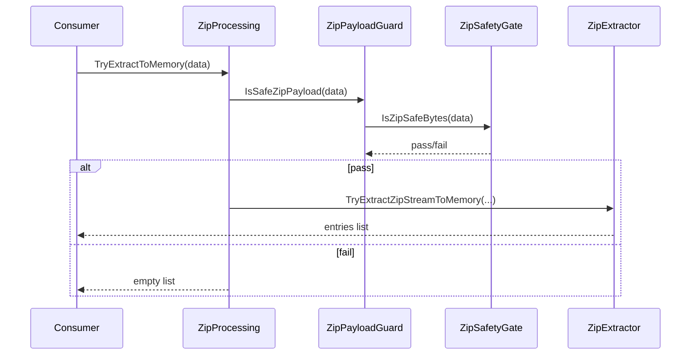
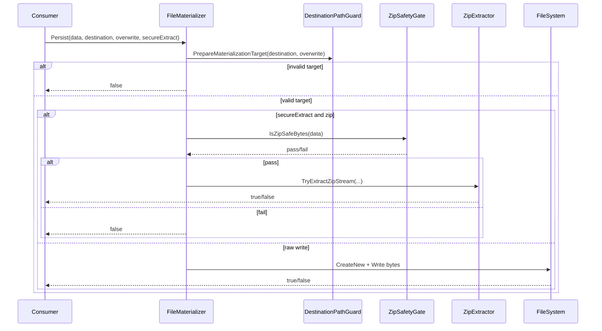
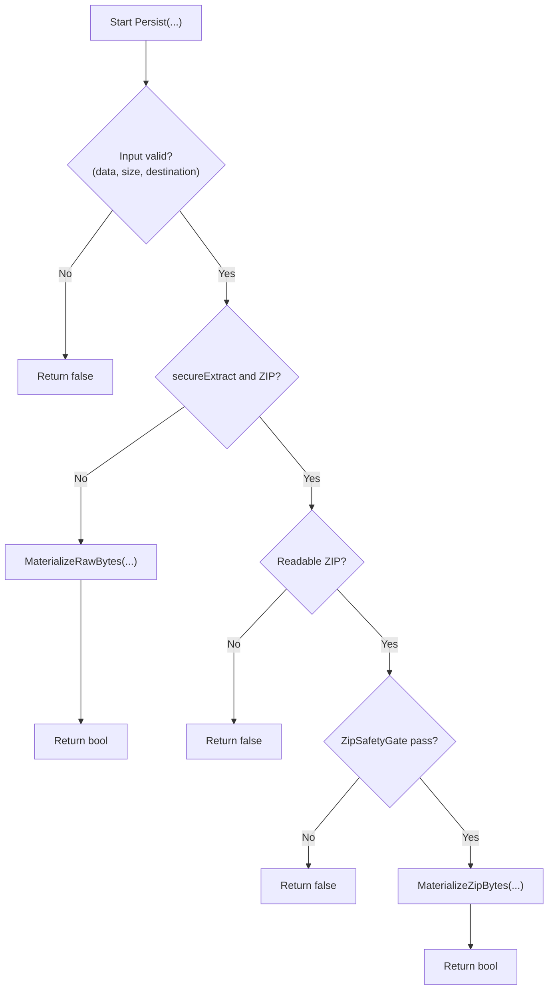
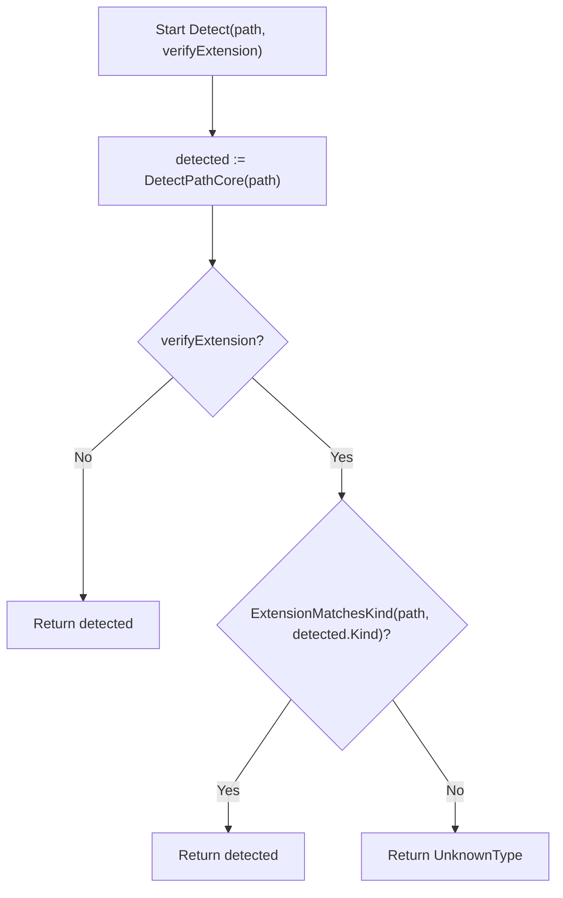

# 02 - Gesamtarchitektur und Ablauffluesse

## 1. Zweck und Scope
Dieses Dokument beschreibt die oeffentliche API (Use-Cases), die interne Kernpipeline sowie die wesentlichen Laufzeitfluesse (Detektion, ZIP-Validierung, Extraktion, Persistenz).
Es dient als Architektur- und Ablaufreferenz auf Dokumentationsebene und ersetzt keine Code-Reviews der Guards.

## 2. Begriffe und Notation
### 2.1 Konventionen
- Knoten = Verantwortungsbereich, Komponente oder Artefakt.
- Pfeil = Datenfluss oder Aufrufpfad (je nach Diagrammtyp).
- fail-closed = bei Unsicherheit oder Verstoss: `Unknown`, `false` oder leere Liste.

### 2.2 Flow-IDs (Legende)
- `F0`: ReadFileSafe Utility
- `F1`: Detect (Path)
- `F2`: Detect (Bytes)
- `F3`: ZIP Validate
- `F4`: ZIP Extract to Memory
- `F5`: ZIP Extract to Disk
- `F6`: Raw Byte Materialize (Persist)
- `F7`: Global Options/Baseline
- `F8`: Extension Policy Check
- `F9`: Deterministic Hashing / h1-h4 RoundTrip

### 2.3 Mermaid-Layout (global)
Hinweis: Diese `init`-Konfiguration reduziert Kreuzungen und erhoeht Lesbarkeit.
Sie kann pro Diagramm ueberschrieben werden, sollte aber konsistent bleiben.

### 2.4 Detailquellen fuer tieferes Drill-Down
- Detection-Details: [`../src/FileTypeDetection/Detection/README.md`](../src/FileTypeDetection/Detection/README.md)
- Infrastructure-Details (Guards/ZIP internals): [`../src/FileTypeDetection/Infrastructure/README.md`](../src/FileTypeDetection/Infrastructure/README.md)
- Konfigurationsdetails: [`../src/FileTypeDetection/Configuration/README.md`](../src/FileTypeDetection/Configuration/README.md)
- Rueckgabemodelle: [`../src/FileTypeDetection/Abstractions/README.md`](../src/FileTypeDetection/Abstractions/README.md)
- Funktionskatalog mit Beispielen: [`./01_FUNCTIONS.md`](./01_FUNCTIONS.md)

## 3. Architekturuebersicht (Systemkontext)
### 3.1 E2E-Systemkontext (kompakt)
Dieses Diagramm zeigt nur Verantwortungsbereiche und Hauptdatenfluesse:
Input -> Public API -> Core Pipeline -> Outputs.
Detailentscheidungen (ZIP-Fall, Refinement, Persistenzzweig) folgen in Abschnitt 4.

Kurzlesehilfe:
- `FileTypeOptions/Baseline` ist Konfigurationskontext (gestrichelt), kein Datenfluss.
- `ZipSafetyGate` ist das zentrale fail-closed-Gate fuer ZIP-bezogene Pfade.

## 4. Flussdiagramme (entscheidungsrelevante Ablaeufe)
### 4.1 Ablauf A: Detektion und ZIP-Validierung
Dieses Diagramm zeigt die Kernentscheidung: `Magic == ZIP?` sowie die fail-closed-Kaskade ueber `ZipSafetyGate`.
Oben: Typdetektion (`FileType`/`DetectionDetail`).
Unten: reine ZIP-Validierung (`bool`) ueber denselben Gate-Knoten.

Kurzlesehilfe:
- `ZipSafetyGate` ist SSOT fuer ZIP-Sicherheit in den gezeigten Pfaden.
- `OpenXmlRefiner` laeuft nur im ZIP-OK-Fall.

### 4.2 Ablauf B: Extraktion (Memory) vs. Persistenz (Disk)
Dieses Diagramm zeigt zwei ZIP-Use-Cases:
(1) sichere In-Memory-Extraktion (Entries-Liste)
(2) Persistenz auf Disk (Raw Write oder ZIP-Extract), jeweils mit fail-closed Ergebnissen.

Kurzlesehilfe:
- Memory-Extraktion und Persistenz teilen sich Gate/Extractor.
- Persistenz liefert immer `Bool` als Rueckgabekontrakt.

## 5. Sequenzfluesse (Runtime-Interaktionen)
### 5.1 Detect(path) mit ZIP-Fall
Dieser Sequenzfluss zeigt den ZIP-Fall im Detektor:
Detektion -> Gate -> optionales Refinement -> Rueckgabe.
Der fail-closed-Pfad liefert `Unknown`.

### 5.2 Validate + Extract (Memory)
Fokus: Byte-Pfad ueber `ZipProcessing`.
Fail-closed endet mit leerer Liste.

### 5.3 Materializer: Branching (Persist)
Fokus: Zielpfadpruefung, danach entweder sicherer ZIP-Zweig oder Raw-Write.
Rueckgabe ist immer boolesch.

## 6. NSD-Sichten (strukturierter Kontrollfluss)
### 6.1 NSD: FileMaterializer.Persist(...)
Diese Sicht reduziert verschachtelte Bedingungen auf strukturierten Kontrollfluss.
Jeder negative Pruefpfad endet sofort fail-closed mit `false`.

### 6.2 NSD: FileTypeDetector.Detect(path, verifyExtension)
Die Endungspruefung ist ein nachgelagerter Policy-Filter.
Bei Mismatch wird fail-closed `UnknownType` zurueckgegeben.

## 7. Zuordnung Public API -> Flows
| Methode | Flow-ID |
|---|---|
| `ReadFileSafe(path)` | `F0` |
| `Detect(path)` / `DetectDetailed(path)` | `F1` |
| `Detect(data)` / `IsOfType(data, kind)` | `F2` |
| `TryValidateZip(path)` / `ZipProcessing.TryValidate(path|data)` | `F3` |
| `ExtractZipSafeToMemory(path, ...)` / `ZipProcessing.ExtractToMemory(...)` / `ZipProcessing.TryExtractToMemory(data)` | `F4` |
| `ExtractZipSafe(path, destination, ...)` | `F5` |
| `FileMaterializer.Persist(..., secureExtract:=False)` | `F6` |
| `FileTypeOptions.LoadOptions/GetOptions` / `FileTypeSecurityBaseline.ApplyDeterministicDefaults` | `F7` |
| `DetectAndVerifyExtension(path)` / `Detect(..., verifyExtension)` | `F8` |
| `DeterministicHashing.HashFile/HashBytes/HashEntries/VerifyRoundTrip` | `F9` |

## 8. Grenzen und Nicht-Ziele
- Kein Ersatz fuer Quellcode-Reviews interner Guards (z. B. Payload-/Path-Guards).
- Keine Policy-Festlegung fuer konkrete Grenzwerte; diese kommen aus `FileTypeDetectorOptions` und der Baseline.
- Keine Aussage ueber konkrete Threat-Model-Abdeckung ausserhalb der beschriebenen fail-closed-Semantik.
