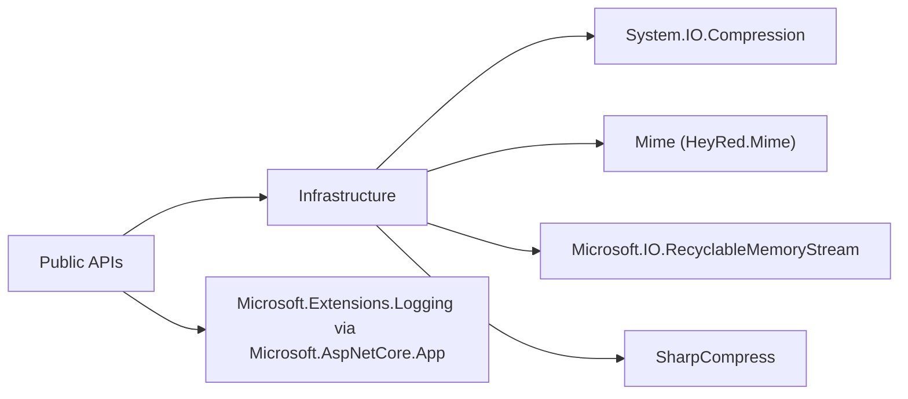

# 03 - Referenzen

## 1. Zweck & Scope
Dieses Dokument sammelt die statischen Referenzen zur API: interne Dateipfade, externe Abhängigkeiten, Rückgabemodelle und ReasonCodes.

## 2. Öffentliche Rückgabemodelle
| Typ | Öffentliche Member | Zweck |
|---|---|---|
| `FileKind` | Enum-Werte (u. a. `Unknown`, `Pdf`, `Zip`, `Docx`) | kanonische Typklassifikation |
| `FileType` | `Kind`, `CanonicalExtension`, `Mime`, `Allowed`, `Aliases` | inhaltsbasierte Typentscheidung |
| `DetectionDetail` | `DetectedType`, `ReasonCode`, `UsedZipContentCheck`, `UsedStructuredRefinement`, `ExtensionVerified` | auditierbares Detailergebnis |
| `ZipExtractedEntry` | `RelativePath`, `Content`, `Size`, `OpenReadOnlyStream()` | sicherer In-Memory-Extrakteintrag |
| `FileTypeProjectOptions` | `HeaderOnlyNonZip`, `MaxBytes`, `SniffBytes`, `MaxZipEntries`, `MaxZipTotalUncompressedBytes`, `MaxZipEntryUncompressedBytes`, `MaxZipCompressionRatio`, `MaxZipNestingDepth`, `MaxZipNestedBytes`, `RejectArchiveLinks`, `AllowUnknownArchiveEntrySize`, `DeterministicHash`, `Logger` | globales Optionsmodell |

## 2.1 Modellpfade im Repository (abstractions split)
| Bereich | README | Datei(en) |
|---|---|---|
| Detection | `src/FileTypeDetection/Abstractions/Detection/README.md` | `src/FileTypeDetection/Abstractions/Detection/FileKind.vb`, `src/FileTypeDetection/Abstractions/Detection/FileType.vb`, `src/FileTypeDetection/Abstractions/Detection/DetectionDetail.vb` |
| Archive | `src/FileTypeDetection/Abstractions/Archive/README.md` | `src/FileTypeDetection/Abstractions/Archive/ZipExtractedEntry.vb` |
| Hashing | `src/FileTypeDetection/Abstractions/Hashing/README.md` | `src/FileTypeDetection/Abstractions/Hashing/DeterministicHashSourceType.vb`, `src/FileTypeDetection/Abstractions/Hashing/DeterministicHashDigestSet.vb`, `src/FileTypeDetection/Abstractions/Hashing/DeterministicHashEvidence.vb`, `src/FileTypeDetection/Abstractions/Hashing/DeterministicHashRoundTripReport.vb`, `src/FileTypeDetection/Abstractions/Hashing/DeterministicHashOptions.vb` |

## 3. ReasonCode-Referenz (DetectDetailed)
Quelle: `FileTypeDetector.vb`.

| ReasonCode | Bedeutung |
|---|---|
| `Unknown` | keine belastbare Erkennung |
| `FileNotFound` | Eingabedatei fehlt |
| `InvalidLength` | Dateilänge ist ungültig |
| `FileTooLarge` | `MaxBytes` wurde überschritten |
| `Exception` | Ausnahme im Detektionspfad |
| `ExtensionMismatch` | Endung passt nicht zum erkannten Typ |
| `HeaderUnknown` | Header-Magic unzureichend/unbekannt |
| `HeaderMatch` | Header-Magic hat Typ direkt erkannt |
| `ArchiveGateFailed` | Archiv-Sicherheitsprüfung fehlgeschlagen |
| `ArchiveStructuredRefined` | Archiv wurde strukturiert (z. B. OOXML) verfeinert |
| `ArchiveRefined` | Archivtyp wurde inhaltlich verfeinert |
| `ArchiveGeneric` | Archiv blieb generisch |

## 4. Interne Kernpfade (Leseführung)
| Interner Pfad | Datei | Bedeutung | Detail-README |
|---|---|---|---|
| Header/Typ-SSOT | `Detection/FileTypeRegistry.vb` | Header-Magic, Aliase, Canonical Extensions | [`../src/FileTypeDetection/Detection/README.md`](../src/FileTypeDetection/Detection/README.md) |
| Core Guards | `Infrastructure/CoreInternals.vb` | Bounds, Security Gates, Path Guards | [`../src/FileTypeDetection/Infrastructure/README.md`](../src/FileTypeDetection/Infrastructure/README.md) |
| Managed archive internals | `Infrastructure/ArchiveManagedInternals.vb` | archivbasierte Iteration und Managed-Backend-Adapter (inkl. ZIP) | [`../src/FileTypeDetection/Infrastructure/README.md`](../src/FileTypeDetection/Infrastructure/README.md) |
| Archive internals | `Infrastructure/ArchiveInternals.vb` | Archiv-Dispatch, Entry-Adapter, Generic Extractor | [`../src/FileTypeDetection/Infrastructure/README.md`](../src/FileTypeDetection/Infrastructure/README.md) |
| MIME Auflösung | `Infrastructure/MimeProvider.vb` | MIME-Mapping | [`../src/FileTypeDetection/Infrastructure/README.md`](../src/FileTypeDetection/Infrastructure/README.md) |

## 5. Externe Abhängigkeiten
### 5.1 Diagramm


### 5.2 Tabelle
| Paket/Framework | Verwendet in | Zweck |
|---|---|---|
| `System.IO.Compression` (BCL) | `Infrastructure/CoreInternals.vb`, `Infrastructure/ArchiveManagedInternals.vb` | Archivdaten lesen/iterieren (ZIP-Backend via BCL) |
| `Mime` | `Infrastructure/MimeProvider.vb` | MIME-Auflösung aus Extension |
| `Microsoft.IO.RecyclableMemoryStream` | `Infrastructure/ArchiveManagedInternals.vb` | kontrollierte Memory-Streams |
| `SharpCompress` | `Infrastructure/ArchiveInternals.vb`, `FileMaterializer.vb` | Archive-Type-Erkennung, generische Archiv-Iteration, defensiver Lesbarkeits-Check |
| `Microsoft.AspNetCore.App` (FrameworkReference) | Logging via `Microsoft.Extensions.Logging` | optionale Diagnostik |

## 6. Referenz-Index (wo finde ich was?)
| Thema | Primardokument |
|---|---|
| Public Signaturen + Beispiele | `01_FUNCTIONS.md` |
| E2E-Architektur + Sequenzen | `02_ARCHITECTURE_AND_FLOWS.md` |
| Normative Anforderungen | `DIN_SPECIFICATION_DE.md` |
| Modul-Übersicht | `../src/FileTypeDetection/README.md` |
| Unterordner-Details | `../src/FileTypeDetection/Detection/README.md`, `../src/FileTypeDetection/Infrastructure/README.md`, `../src/FileTypeDetection/Configuration/README.md`, `../src/FileTypeDetection/Abstractions/README.md`, `../src/FileTypeDetection/Abstractions/Detection/README.md`, `../src/FileTypeDetection/Abstractions/Archive/README.md`, `../src/FileTypeDetection/Abstractions/Hashing/README.md`, `../src/FileClassifier.App/README.md` |

## 6.1 Change Playbooks
| Thema | Guide |
|---|---|
| Optionen anlegen/anpassen | `guides/OPTIONS_CHANGE_GUIDE.md` |
| Neue Datatypes/API-Modelle erweitern | `guides/DATATYPE_EXTENSION_GUIDE.md` |
| Guide-Index | `guides/README.md` |

## 7. Verifikationsreferenzen
Empfohlene Freigabe-Checks:
```bash
dotnet restore FileClassifier.sln -v minimal
dotnet build FileClassifier.sln --no-restore -v minimal
dotnet test tests/FileTypeDetectionLib.Tests/FileTypeDetectionLib.Tests.csproj --no-build -v minimal
```

## Dokumentpflege-Checkliste
- [ ] Inhalt auf aktuellen Code-Stand geprüft.
- [ ] Links und Anker mit `python3 tools/check-markdown-links.py` geprüft.
- [ ] Beispiele/Kommandos lokal verifiziert.
- [ ] Begriffe mit `docs/01_FUNCTIONS.md` abgeglichen.
