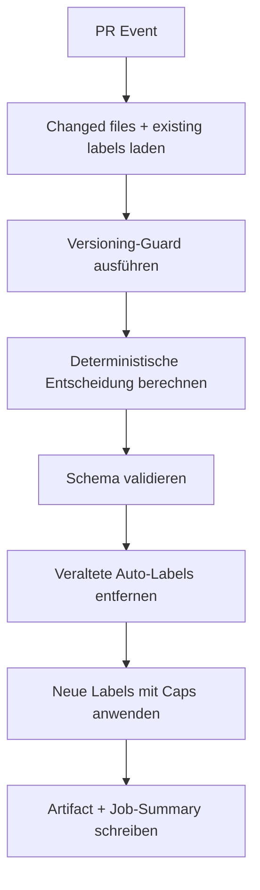
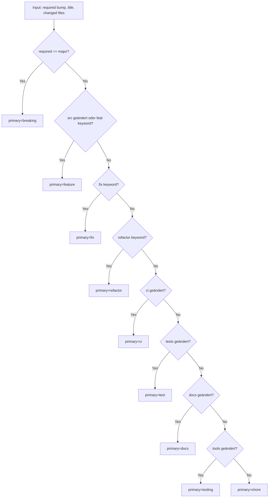
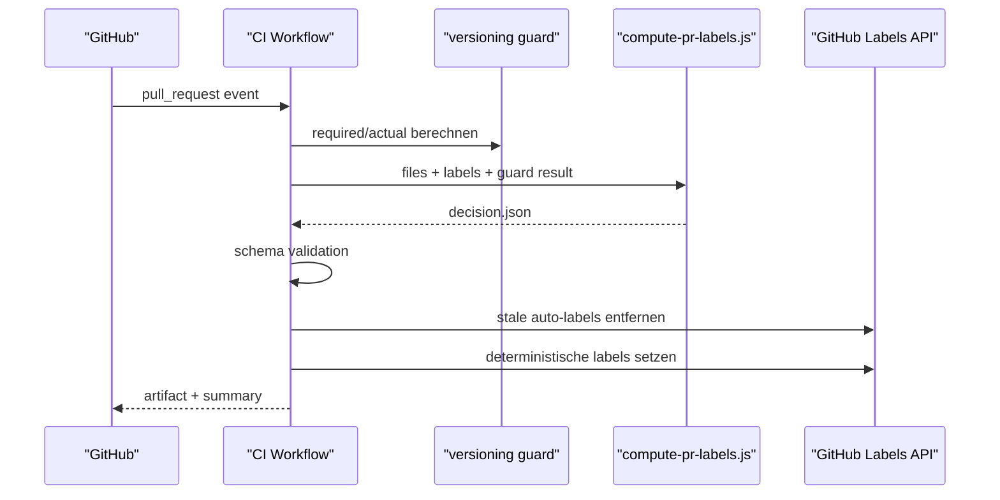
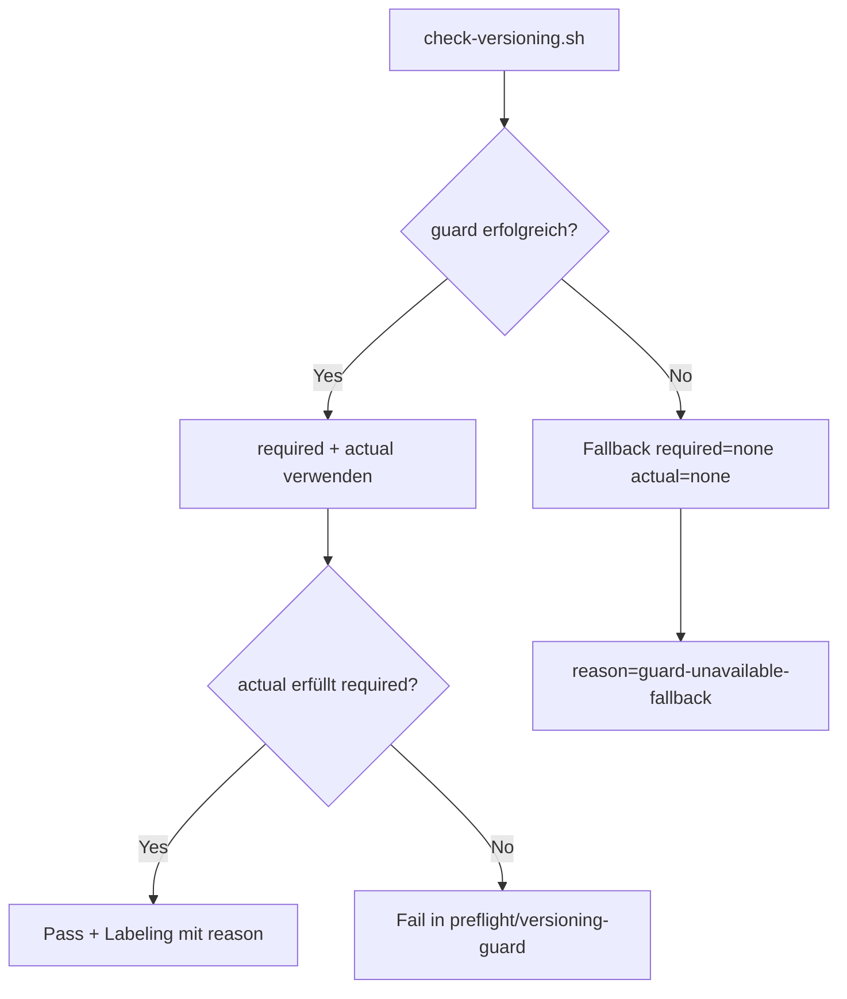

<!-- LANG_SWITCH:BEGIN -->
[DE](004_POLICY_LABELING.MD) | [EN](../../1_en/versioning/004_POLICY_LABELING.MD)
<!-- LANG_SWITCH:END -->

# Auto-Labeling und Auto-Versionierung (SSOT)

## 1. Zweck
Diese Spezifikation definiert den deterministischen Entscheidungsfluss für PR-Labeling und Versionierungsnachweise.

## 2. Verbindliche Caps
Pro PR-Lauf erzwingt der Auto-Labeler:
- genau ein `version:*`
- genau ein Primary-Label aus `breaking|feature|fix|refactor|ci|test|docs|tooling|chore`
- maximal ein `impl:*`
- maximal zwei `area:*`

Es gibt keine zusätzliche Keyword-Labelgruppe.

## 3. Versioning-SSOT
`tools/versioning/check-versioning.sh` liefert die SemVer-Entscheidung.
Im CI-Nachweis müssen enthalten sein:
- `required=<major|minor|patch|none>`
- `actual=<major|minor|patch|none>`
- `reason=<deterministic-reason>`

## 4. Prioritätsregel
Feste Reihenfolge:
`breaking > feature > fix > refactor > ci > test > docs > tooling > chore`

## 5. Mapping-Regeln
### 5.1 `impl:*` (max 1)
- `impl:security` für Security-/Vuln-Änderungen
- `impl:docs` für reine Dokumentationsumsetzung
- `impl:config` für CI/Tooling/Config/Versioning-Mechanik
- `impl:quality` für Code-/Test-Qualitätsarbeit

### 5.2 `area:*` (max 2)
- `area:pipeline` -> `.github/workflows/**`
- `area:qodana` -> `qodana.yaml`, `.qodana/**`
- `area:archive` -> Archiv-Internals/Processing
- `area:hashing` -> Deterministic Hashing
- `area:detection` -> Detection Engine
- `area:materializer` -> Materializer-Flows
- `area:versioning` -> `docs/versioning/**`, `Directory.Build.props`
- `area:tests` -> `tests/**`
- `area:docs` -> `docs/**`, `README.md`
- `area:tooling` -> `tools/**`

## 6. End-to-End-Flow

## 7. Primary-Entscheidungsfluss

## 8. Sequenzdiagramm

## 9. Version-Guard-Flow

## 10. Regressionssicherheit
Golden-Testdaten:
- `tools/versioning/testcases/*.json`

Validierung:
- `tools/versioning/test-compute-pr-labels.js`
- `tools/versioning/validate-label-decision.js`

## 11. Verlinkte SSOT-Quellen
- `docs/versioning/001_POLICY_VERSIONING.MD`
- `docs/ci/001_PIPELINE_CI.MD`
- `docs/governance/002_POLICY_LABELING.MD`
- `docs/governance/004_POLICY_DOCUMENTATION.MD`

## RoC-Bezug
- [Artifact-Contract-Regel](https://github.com/tomtastisch/FileClassifier/blob/main/tools/ci/policies/rules/artifact_contract.yaml)
- [Docs-Drift-Regel](https://github.com/tomtastisch/FileClassifier/blob/main/tools/ci/policies/rules/docs_drift.yaml)
- [Shell-Safety-Regeln](https://github.com/tomtastisch/FileClassifier/blob/main/tools/ci/policies/rules/shell_safety.yaml)
