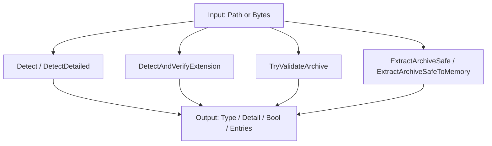
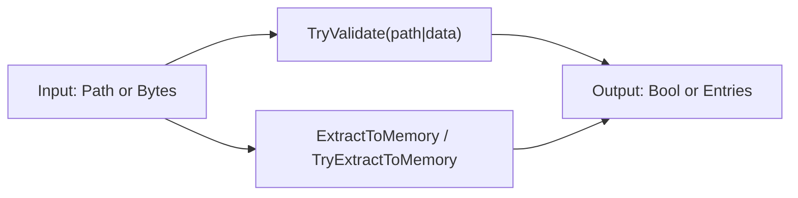
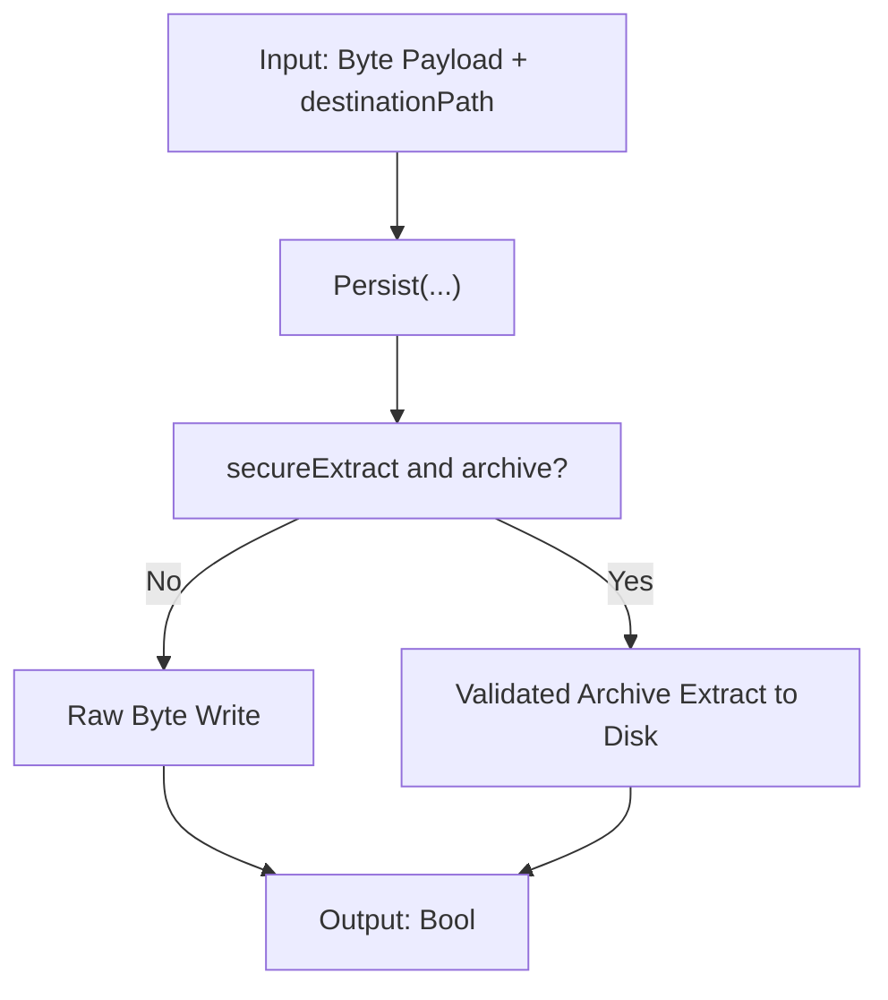
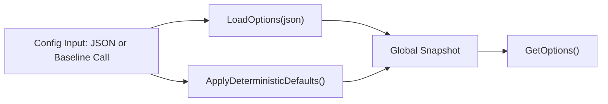
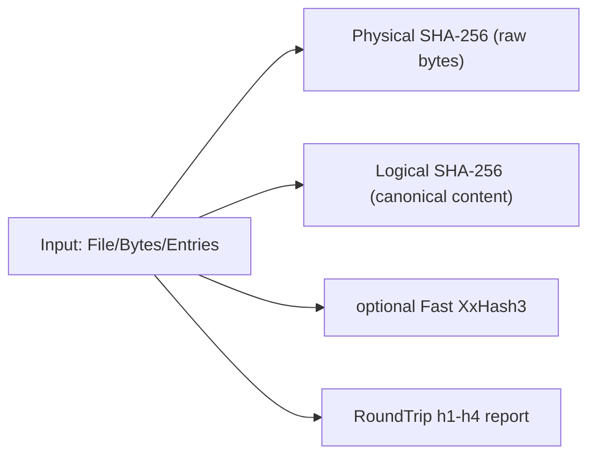

# 01 - API Functions

## 1. Purpose & Scope
This document describes all public API entry points with signatures, use cases, side effects, and minimal call examples.

## 2. Definitions
- Fail-closed: error paths return only safe outputs (`Unknown`, `False`, empty list).
- Side effects: filesystem writes or global option changes.
- Flow ID: reference to architecture flows in `docs/120_ARCH_CORE.MD`.

## 2.1 API Semantics (prominent)
- `TryValidateArchive(...)` is the canonical validation API.
- The method validates **all internally supported archive formats** fail-closed (e.g., ZIP/TAR/GZIP/7z/RAR).
- Technically, type resolution happens via `ArchiveTypeResolver` + `ArchiveSafetyGate`; OOXML refinement stays container-specific for ZIP-based OOXML files.
- Terminology: `ContainerType` denotes the **physical archive format** (e.g., ZIP/TAR/GZIP/7z/RAR). Generic archives are returned compatibly as `FileKind.Zip`; ZIP-based OOXML containers can be refined to `Docx`/`Xlsx`/`Pptx`.

## 2.2 Further Detail Sources per Family
| API family | Detail source | Purpose |
|---|---|---|
| `FileTypeDetector` / `ArchiveProcessing` | [Detection module](https://github.com/tomtastisch/FileClassifier/blob/main/src/FileTypeDetection/Detection/README.md) | SSOT detection, header magic, alias logic |
| `FileTypeDetector` / `ArchiveProcessing` / `FileMaterializer` | [Infrastructure module](https://github.com/tomtastisch/FileClassifier/blob/main/src/FileTypeDetection/Infrastructure/README.md) | archive gate, guards, extraction engine |
| `FileTypeOptions` / `FileTypeProjectBaseline` | [Configuration module](https://github.com/tomtastisch/FileClassifier/blob/main/src/FileTypeDetection/Configuration/README.md) | global options and baseline |
| Return models (`FileType`, `DetectionDetail`, `ZipExtractedEntry`, `Hash*`) | [Abstractions module](https://github.com/tomtastisch/FileClassifier/blob/main/src/FileTypeDetection/Abstractions/README.md) | public API model contracts |
| Module navigation | [FileClassifier module](https://github.com/tomtastisch/FileClassifier/blob/main/src/FileTypeDetection/README.md) | overview and reader-role entry points |

## 2.2.1 Physical Model Storage (no behavioral change)
Return models are split into subfolders purely for organization; API semantics stay unchanged:
- Detection models: [Abstractions Detection module](https://github.com/tomtastisch/FileClassifier/blob/main/src/FileTypeDetection/Abstractions/Detection/README.md)
- Archive models: [Abstractions Archive module](https://github.com/tomtastisch/FileClassifier/blob/main/src/FileTypeDetection/Abstractions/Archive/README.md)
- Hashing models: [Abstractions Hashing module](https://github.com/tomtastisch/FileClassifier/blob/main/src/FileTypeDetection/Abstractions/Hashing/README.md)

## 2.3 Glossary (canonical terms)
| Term | Meaning |
|---|---|
| Archive format | Physical container such as ZIP, TAR, TAR.GZ, 7z, or RAR. |
| ContainerType | Internal technical type for the physical archive format. |
| FileKind.Zip | Public, compatible logical return kind for generic archives (e.g., TAR/TAR.GZ/7z/RAR). |
| PhysicalHash | SHA-256 over the unmodified raw bytes of a file or byte array. |
| LogicalHash | SHA-256 over canonicalized content state (entry path + content), independent of container details. |
| FastHash | Optional, non-cryptographic comparison digest (`XxHash3`) for performance shortcuts. |
| SecureHash | Optional keyed digest (`HMAC-SHA256`) for authenticity/tamper-evidence (via `FILECLASSIFIER_HMAC_KEY_B64`). |
| Fail-closed | Unsafe or invalid inputs return only safe outputs (`Unknown`, `False`, empty list). |

## 3. Complete Method Matrix (Public API)
| Family | Method | Input | Output | Side effects | Primary flow |
|---|---|---|---|---|---|
| `FileTypeDetector` | `ReadFileSafe(path)` | file path | `Byte()` | none (read-only) | `F0` |
| `FileTypeDetector` | `Detect(path)` | file path | `FileType` | none | `F1` |
| `FileTypeDetector` | `Detect(path, verifyExtension)` | file path + bool | `FileType` | none | `F1` |
| `FileTypeDetector` | `DetectDetailed(path)` | file path | `DetectionDetail` | none | `F1` |
| `FileTypeDetector` | `DetectDetailed(path, verifyExtension)` | file path + bool | `DetectionDetail` | none | `F1` |
| `FileTypeDetector` | `DetectAndVerifyExtension(path)` | file path | `Boolean` | none | `F8` |
| `FileTypeDetector` | `TryValidateArchive(path)` | file path | `Boolean` | none | `F3` |
| `FileTypeDetector` | `Detect(data)` | `Byte()` | `FileType` | none | `F2` |
| `FileTypeDetector` | `IsOfType(data, kind)` | `Byte()` + `FileKind` | `Boolean` | none | `F2` |
| `FileTypeDetector` | `ExtractArchiveSafe(path, destination, verifyBeforeExtract)` | path + destination + bool | `Boolean` | writes to disk | `F5` |
| `FileTypeDetector` | `ExtractArchiveSafeToMemory(path, verifyBeforeExtract)` | path + bool | `IReadOnlyList(Of ZipExtractedEntry)` | none | `F4` |
| `ArchiveProcessing` | `TryValidate(path)` | file path | `Boolean` | none | `F3` |
| `ArchiveProcessing` | `TryValidate(data)` | `Byte()` | `Boolean` | none | `F3` |
| `ArchiveProcessing` | `ExtractToMemory(path, verifyBeforeExtract)` | path + bool | `IReadOnlyList(Of ZipExtractedEntry)` | none | `F4` |
| `ArchiveProcessing` | `TryExtractToMemory(data)` | `Byte()` | `IReadOnlyList(Of ZipExtractedEntry)` | none | `F4` |
| `FileMaterializer` | `Persist(data, destinationPath)` | `Byte()` + destination path | `Boolean` | writes to disk | `F6` |
| `FileMaterializer` | `Persist(data, destinationPath, overwrite)` | `Byte()` + destination path + bool | `Boolean` | writes to disk | `F6` |
| `FileMaterializer` | `Persist(data, destinationPath, overwrite, secureExtract)` | `Byte()` + destination path + 2 bool | `Boolean` | writes to disk | `F5`/`F6` |
| `EvidenceHashing` | `HashFile(path)` | file path | `HashEvidence` | none | `F9` |
| `EvidenceHashing` | `HashFile(path, options)` | file path + options | `HashEvidence` | none | `F9` |
| `EvidenceHashing` | `HashBytes(data)` | `Byte()` | `HashEvidence` | none | `F9` |
| `EvidenceHashing` | `HashBytes(data, label)` | `Byte()` + label | `HashEvidence` | none | `F9` |
| `EvidenceHashing` | `HashBytes(data, label, options)` | `Byte()` + label + options | `HashEvidence` | none | `F9` |
| `EvidenceHashing` | `HashEntries(entries)` | `IReadOnlyList(Of ZipExtractedEntry)` | `HashEvidence` | none | `F9` |
| `EvidenceHashing` | `HashEntries(entries, label)` | entries + label | `HashEvidence` | none | `F9` |
| `EvidenceHashing` | `HashEntries(entries, label, options)` | entries + label + options | `HashEvidence` | none | `F9` |
| `EvidenceHashing` | `VerifyRoundTrip(path)` | file path | `HashRoundTripReport` | writes temp file internally and cleans up | `F9` |
| `EvidenceHashing` | `VerifyRoundTrip(path, options)` | file path + options | `HashRoundTripReport` | writes temp file internally and cleans up | `F9` |
| `FileTypeOptions` | `LoadOptions(json)` | JSON | `Boolean` | changes global options | `F7` |
| `FileTypeOptions` | `GetOptions()` | - | `String` (JSON) | none | `F7` |
| `FileTypeProjectBaseline` | `ApplyDeterministicDefaults()` | - | `Void` | changes global options | `F7` |

## 4. Method Families
### 4.1 FileTypeDetector
Details: [FileClassifier module](https://github.com/tomtastisch/FileClassifier/blob/main/src/FileTypeDetection/README.md), [Detection module](https://github.com/tomtastisch/FileClassifier/blob/main/src/FileTypeDetection/Detection/README.md), [Infrastructure module](https://github.com/tomtastisch/FileClassifier/blob/main/src/FileTypeDetection/Infrastructure/README.md).

**Important semantic note:** `TryValidateArchive(path)` validates generic archive containers via the same fail-closed pipeline as extraction and materialization.



```csharp
using Tomtastisch.FileClassifier;

var detector = new FileTypeDetector();
var t = detector.Detect("/data/invoice.pdf", verifyExtension: true);
var d = detector.DetectDetailed("/data/archive.docx", verifyExtension: true);
bool archiveOk = FileTypeDetector.TryValidateArchive("/data/archive.zip");
var entries = detector.ExtractArchiveSafeToMemory("/data/archive.zip", verifyBeforeExtract: true);

Console.WriteLine($"{t.Kind} / {d.ReasonCode} / {archiveOk} / {entries.Count}");
```

### 4.2 ArchiveProcessing
The API name is kept for compatibility reasons; internally, archive containers are handled uniformly.
Details: [FileClassifier module](https://github.com/tomtastisch/FileClassifier/blob/main/src/FileTypeDetection/README.md), [Infrastructure module](https://github.com/tomtastisch/FileClassifier/blob/main/src/FileTypeDetection/Infrastructure/README.md).



```csharp
using Tomtastisch.FileClassifier;

bool okPath = ArchiveProcessing.TryValidate("/data/archive.zip");
bool okBytes = ArchiveProcessing.TryValidate(File.ReadAllBytes("/data/archive.zip"));
var entriesPath = ArchiveProcessing.ExtractToMemory("/data/archive.zip", verifyBeforeExtract: true);
var entriesBytes = ArchiveProcessing.TryExtractToMemory(File.ReadAllBytes("/data/archive.zip"));
```

### 4.3 FileMaterializer
Details: [FileClassifier module](https://github.com/tomtastisch/FileClassifier/blob/main/src/FileTypeDetection/README.md), [Infrastructure module](https://github.com/tomtastisch/FileClassifier/blob/main/src/FileTypeDetection/Infrastructure/README.md).



```csharp
using Tomtastisch.FileClassifier;

byte[] payload = File.ReadAllBytes("/data/input.bin");
byte[] archivePayload = File.ReadAllBytes("/data/archive.zip");

bool rawOk = FileMaterializer.Persist(payload, "/data/out/input.bin", overwrite: false, secureExtract: false);
bool archiveExtractOk = FileMaterializer.Persist(archivePayload, "/data/out/unpacked", overwrite: false, secureExtract: true);
```

### 4.4 FileTypeOptions + FileTypeProjectBaseline
Details: [FileClassifier module](https://github.com/tomtastisch/FileClassifier/blob/main/src/FileTypeDetection/README.md), [Configuration module](https://github.com/tomtastisch/FileClassifier/blob/main/src/FileTypeDetection/Configuration/README.md).



```csharp
using Tomtastisch.FileClassifier;

FileTypeProjectBaseline.ApplyDeterministicDefaults();
bool loaded = FileTypeOptions.LoadOptions("{\"maxBytes\":134217728}");
string snapshot = FileTypeOptions.GetOptions();
Console.WriteLine($"Loaded={loaded}; Snapshot={snapshot}");
```

### 4.5 EvidenceHashing
Details: [FileClassifier module](https://github.com/tomtastisch/FileClassifier/blob/main/src/FileTypeDetection/README.md), [Abstractions module](https://github.com/tomtastisch/FileClassifier/blob/main/src/FileTypeDetection/Abstractions/README.md).
Formal API contract: [04 - EvidenceHashing API Contract](https://github.com/tomtastisch/FileClassifier/blob/main/docs/contracts/101_CONTRACT_HASHING.MD).



```csharp
using Tomtastisch.FileClassifier;

var evidence = EvidenceHashing.HashFile("/data/archive.zip");
var report = EvidenceHashing.VerifyRoundTrip("/data/archive.zip");

Console.WriteLine($"{evidence.Digests.PhysicalSha256} / {evidence.Digests.LogicalSha256}");
Console.WriteLine($"LogicalConsistent={report.LogicalConsistent}");
```

Note:
- `PhysicalSha256` and `LogicalSha256` are Security SSOT.
- `Fast*XxHash3` is an optional performance digest and not a cryptographic integrity proof.
- Overloads without `options` use the global policy `FileTypeOptions.GetSnapshot().DeterministicHash`.

## 5. Non-Goals
- No detailed discussion of internal low-level implementation (see `docs/references/101_REFERENCES_CORE.MD`).
- No norm/compliance derivation (see `docs/specs/101_SPEC_DIN.MD`).

## 6. Security Gate Mini-Contract (neutral)
The following rules apply to `ArchiveSafetyGate` + `ArchiveExtractor`:

| Rule | Default | Contract |
|---|---|---|
| Link entries (`symlink`/`hardlink`) | `RejectArchiveLinks = true` | Link targets are rejected fail-closed. Override only via explicit opt-in (`false`) and the consumer's own risk decision. |
| Unknown entry size | `AllowUnknownArchiveEntrySize = false` | \"Unknown\" means `Size` is missing or negative. In that case validation is fail-closed blocked or measured via bounded streaming; if limits are violated -> `False`. |
| Path safety | enabled | Entry name is normalized (`\\` -> `/`), root/traversal/empty are rejected, destination path must pass a prefix check. |
| Limits | enabled | Entry count, per-entry bytes, total bytes, recursion depth, and archive-specific ratio/nested rules remain fail-closed. |

## 7. Format Matrix (implemented semantics)
\"Implemented\" means: the archive format is opened, the gate is applied, and extraction is executed through the same pipeline.

| Format | Detection (`Detect`) | Validate (`TryValidateArchive` / `ArchiveProcessing.TryValidate`) | Extract-to-memory (`ArchiveProcessing.TryExtractToMemory`) | Extract-to-disk (`FileMaterializer.Persist(..., secureExtract:=True)`) |
|---|---|---|---|---|
| ZIP | Yes (magic + gate + optional OOXML refinement) | Yes | Yes | Yes |
| TAR | Yes (container detection + gate, logical `FileKind.Zip`) | Yes | Yes | Yes |
| TAR.GZ | Yes (GZIP container, nested archive path) | Yes | Yes | Yes |
| 7z | Yes (container detection + gate, logical `FileKind.Zip`) | Yes | Yes | Yes |
| RAR | Yes (container detection + gate, logical `FileKind.Zip`) | Yes | Yes | Yes |

Note on type output: for generic archives the public return kind stays compatible (`FileKind.Zip`); ZIP-based OOXML containers can be refined to `Docx`/`Xlsx`/`Pptx`.

## 8. Evidence for Unification/Hardening + Test Coverage
The byte paths (Detect/Validate/Extract/Persist) are wired to the same gate pipeline.

| Format | Detection | Validate | Extract memory | Extract disk | Test evidence |
|---|---|---|---|---|---|
| ZIP | covered | covered | covered | covered | `tests/FileTypeDetectionLib.Tests/Unit/ArchiveProcessingFacadeUnitTests.cs`, `tests/FileTypeDetectionLib.Tests/Unit/ArchiveExtractionUnitTests.cs`, `tests/FileTypeDetectionLib.Tests/Unit/FileMaterializerUnitTests.cs` |
| TAR | covered | indirectly via unified validate | implicitly via backend path | implicitly via backend path | `tests/FileTypeDetectionLib.Tests/Unit/UnifiedArchiveBackendUnitTests.cs` |
| TAR.GZ | covered | covered | covered | covered | `tests/FileTypeDetectionLib.Tests/Unit/UnifiedArchiveBackendUnitTests.cs` |
| 7z | covered | covered | covered | covered | `tests/FileTypeDetectionLib.Tests/Features/FTD_BDD_040_ARCHIVE_TYPEN_BYTEARRAY_UND_MATERIALISIERUNG.feature` |
| RAR | covered | covered | covered | covered | `tests/FileTypeDetectionLib.Tests/Features/FTD_BDD_040_ARCHIVE_TYPEN_BYTEARRAY_UND_MATERIALISIERUNG.feature` |

Additional security evidence:
- Link entry fail-closed (`RejectArchiveLinks=true`): `tests/FileTypeDetectionLib.Tests/Unit/UnifiedArchiveBackendUnitTests.cs`.
- Archive fail-closed regressions (traversal, malformed header, overwrite/target guards): `tests/FileTypeDetectionLib.Tests/Unit/FileMaterializerUnitTests.cs`.

Portability/structure:
- Public API remains stable; internal responsibilities are separated (`Detection` SSOT, `Infrastructure` gate/backend/extractor, `Configuration` policies, `Abstractions` return models).
- Reuse happens via a neutral entry model and unified gate/extractor paths.

## Documentation Maintenance Checklist
- [ ] Content verified against current code state.
- [ ] Links and anchors checked with `python3 tools/check-docs.py`.
- [ ] Examples/commands verified locally.
- [ ] Terminology aligned with `docs/110_API_CORE.MD`.
