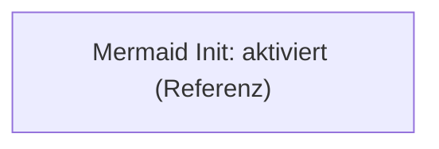
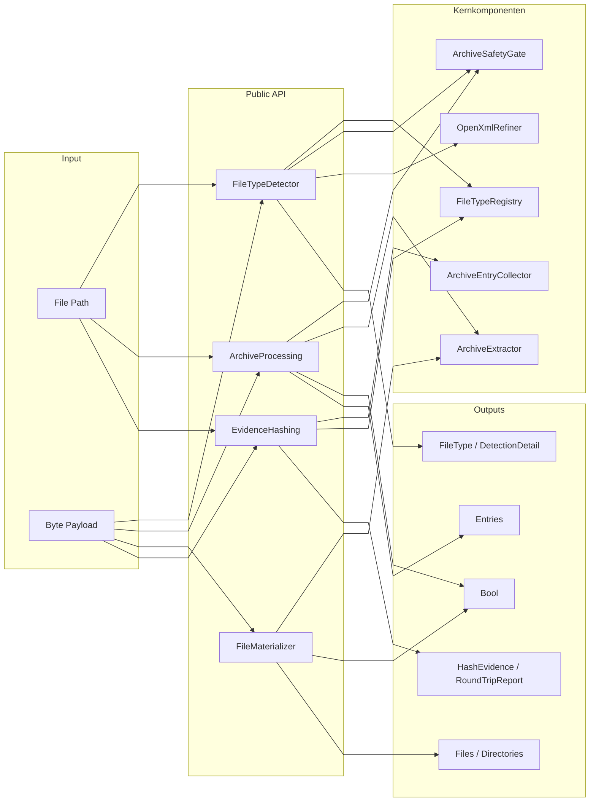
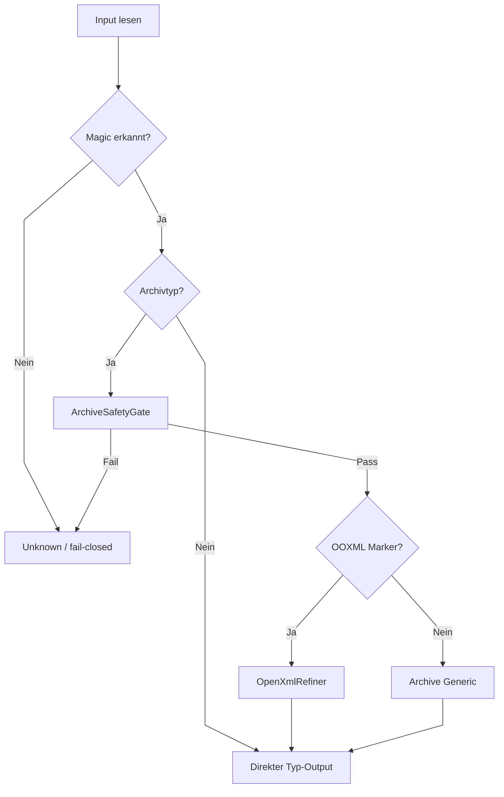
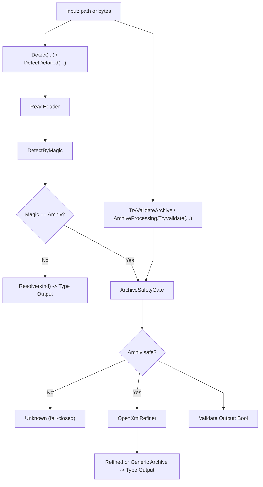
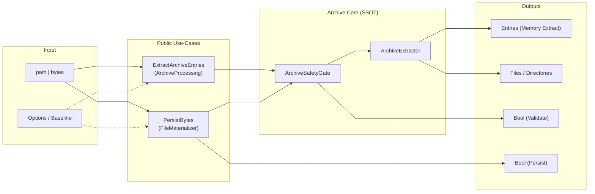
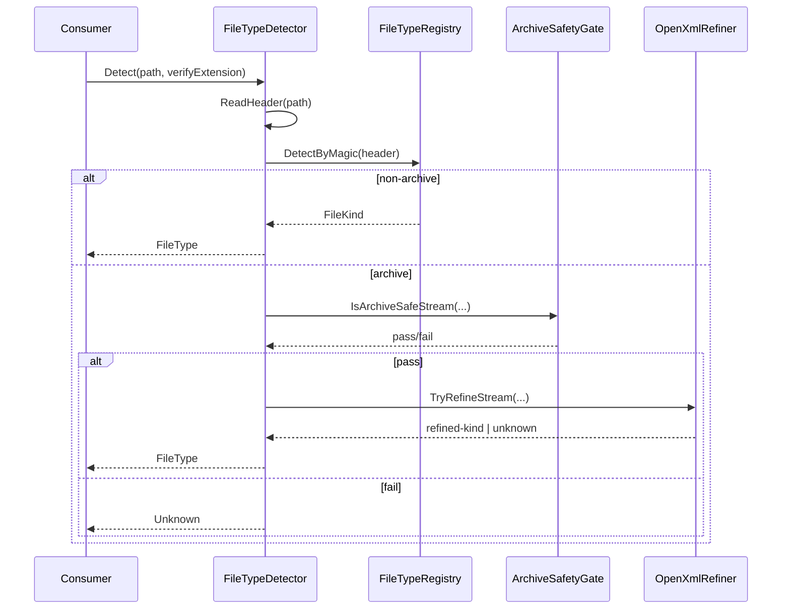
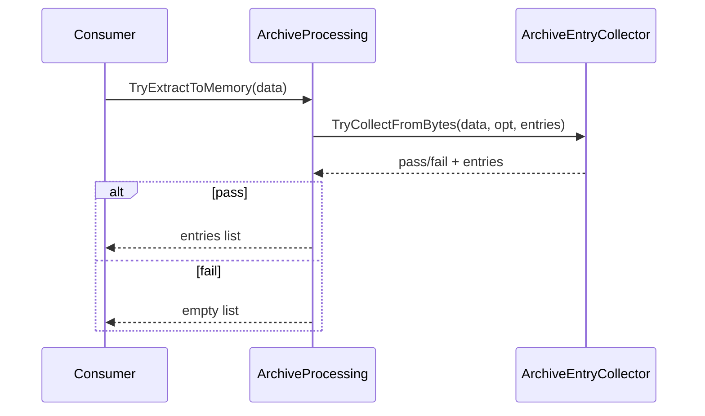
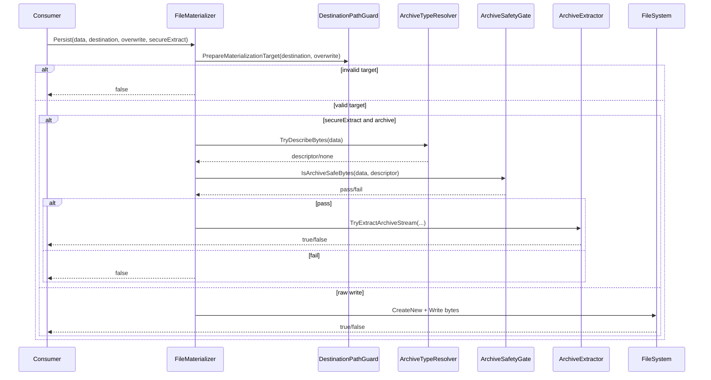
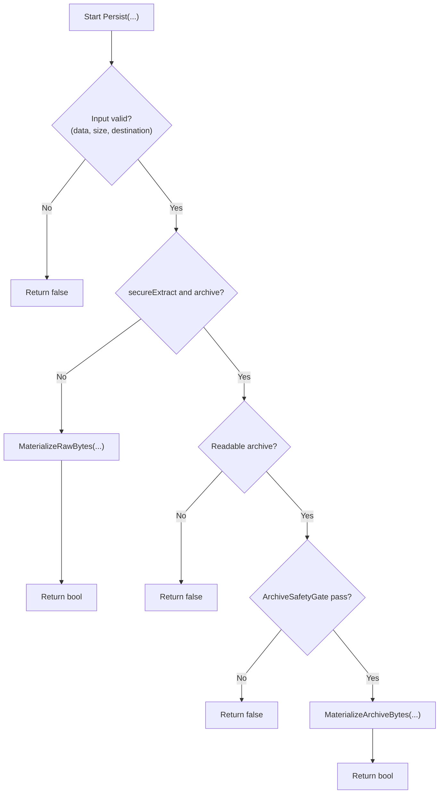
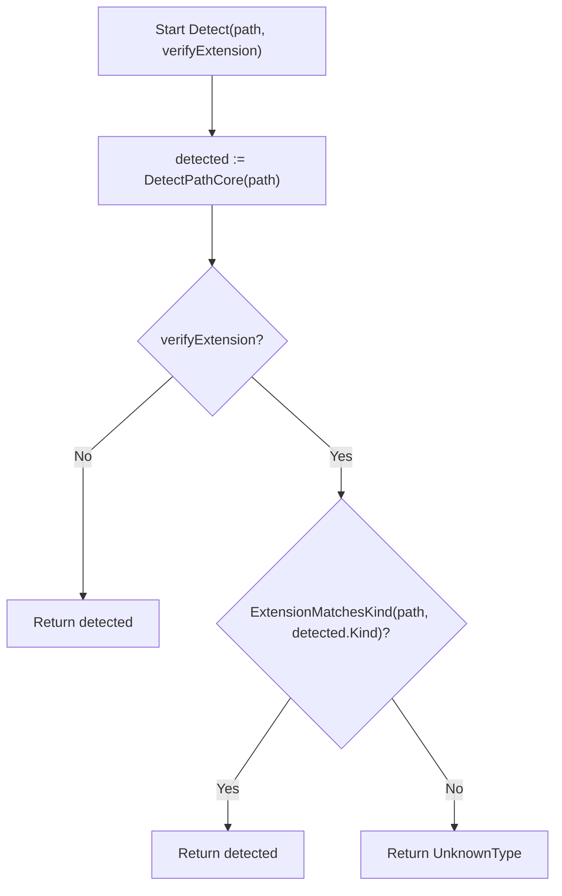

# 02 - Overall Architecture and Execution Flows

## 1. Purpose and Scope
This document describes the public API (use cases), the internal core pipeline, and the main runtime flows (detection, archive validation, extraction, persistence).
It serves as an architecture and flow reference at documentation level and is not a replacement for code reviews of internal guards.

## 2. Terms and Notation
### 2.1 Conventions
- node = responsibility, component, or artifact.
- arrow = dataflow or call path (depending on diagram type).
- fail-closed = on uncertainty or violation: `Unknown`, `false`, or an empty list.

### 2.2 Flow IDs (legend)
- `F0`: ReadFileSafe Utility
- `F1`: Detect (Path)
- `F2`: Detect (Bytes)
- `F3`: Archive Validate
- `F4`: Archive Extract to Memory
- `F5`: Archive Extract to Disk
- `F6`: Raw Byte Materialize (Persist)
- `F7`: Global Options/Baseline
- `F8`: Extension Policy Check
- `F9`: Deterministic Hashing / h1-h4 RoundTrip

### 2.3 Mermaid layout (global)
Note: This `init` configuration reduces crossings and improves readability.
It can be overridden per diagram, but should remain consistent.

### 2.4 Detail sources for deeper drill-down
- Detection details: [Detection module](https://github.com/tomtastisch/FileClassifier/blob/main/src/FileTypeDetection/Detection/README.md)
- Infrastructure details (guards/archive internals): [Infrastructure module](https://github.com/tomtastisch/FileClassifier/blob/main/src/FileTypeDetection/Infrastructure/README.md)
- Configuration details: [Configuration module](https://github.com/tomtastisch/FileClassifier/blob/main/src/FileTypeDetection/Configuration/README.md)
- Return models: [Abstractions module](https://github.com/tomtastisch/FileClassifier/blob/main/src/FileTypeDetection/Abstractions/README.md)
- Return models (detection): [Abstractions Detection module](https://github.com/tomtastisch/FileClassifier/blob/main/src/FileTypeDetection/Abstractions/Detection/README.md)
- Return models (archive): [Abstractions Archive module](https://github.com/tomtastisch/FileClassifier/blob/main/src/FileTypeDetection/Abstractions/Archive/README.md)
- Return models (hashing): [Abstractions Hashing module](https://github.com/tomtastisch/FileClassifier/blob/main/src/FileTypeDetection/Abstractions/Hashing/README.md)
- Function catalog with examples: [01 - Functions](https://github.com/tomtastisch/FileClassifier/blob/main/docs/110_API_CORE.MD)

## 3. Architecture Overview (System Context)
### 3.1 E2E system context (compact)
This diagram shows the layers of the runtime flow:
inputs -> public API -> core components -> outputs.
Branching decisions (archive case, refinement, persistence branch) follow in 3.2 and section 4.

Quick reading guide:
- layer view only, no branch details.
- branching and security decisions are covered in section 4.

### 3.2 Decision overview (compact)
This diagram shows the core decision logic in a single vertical reading path.

## 4. Flowcharts (decision-relevant flows)
### 4.1 Flow A: Detection and archive validation
This diagram shows the key decision: `magic == archive?` and the fail-closed cascade via `ArchiveSafetyGate`.
Top: type detection (`FileType`/`DetectionDetail`).
Bottom: pure archive validation (`bool`) via the same gate node.

Quick reading guide:
- `ArchiveSafetyGate` is the SSOT for archive safety on the shown paths.
- `OpenXmlRefiner` runs only when the archive passes the gate.

### 4.2 Flow B: Extraction (memory) vs. persistence (disk)
This diagram shows two archive use cases:
(1) safe in-memory extraction (entries list)
(2) persistence to disk (raw write or archive extract), each with fail-closed results.

Quick reading guide:
- memory extraction and persistence share the gate/extractor.
- persistence always returns `Bool` as the contract.

## 5. Sequence flows (runtime interactions)
### 5.1 Detect(path) with archive case
This sequence flow shows the archive case in the detector:
detection -> gate -> optional refinement -> return value.
The fail-closed path returns `Unknown`.

### 5.2 Validate + extract (memory)
Focus: byte path via `ArchiveProcessing`.
Fail-closed ends with an empty list.

### 5.3 Materializer: branching (persist)
Focus: destination-path validation, then either the secure archive branch or raw write.
The return type is always boolean.

## 6. NSD views (structured control flow)
### 6.1 NSD: FileMaterializer.Persist(...)
This view reduces nested conditions to structured control flow.
Every negative check path ends immediately fail-closed with `false`.

### 6.2 NSD: FileTypeDetector.Detect(path, verifyExtension)
The extension check is a downstream policy filter.
On mismatch, `UnknownType` is returned fail-closed.

## 7. Public API to flow mapping
| Method | Flow ID |
|---|---|
| `ReadFileSafe(path)` | `F0` |
| `Detect(path)` / `DetectDetailed(path)` | `F1` |
| `Detect(data)` / `IsOfType(data, kind)` | `F2` |
| `TryValidateArchive(path)` / `ArchiveProcessing.TryValidate(path|data)` | `F3` |
| `ExtractArchiveSafeToMemory(path, ...)` / `ArchiveProcessing.ExtractToMemory(...)` / `ArchiveProcessing.TryExtractToMemory(data)` | `F4` |
| `ExtractArchiveSafe(path, destination, ...)` | `F5` |
| `FileMaterializer.Persist(..., secureExtract:=False)` | `F6` |
| `FileTypeOptions.LoadOptions/GetOptions` / `FileTypeProjectBaseline.ApplyDeterministicDefaults` | `F7` |
| `DetectAndVerifyExtension(path)` / `Detect(..., verifyExtension)` | `F8` |
| `EvidenceHashing.HashFile/HashBytes/HashEntries/VerifyRoundTrip` | `F9` |

## 8. Boundaries and non-goals
- not a replacement for source-code reviews of internal guards (e.g., payload/path guards).
- no policy decision for specific thresholds; these come from `FileTypeProjectOptions` and the baseline.
- no claim about threat-model coverage beyond the described fail-closed semantics.

## Documentation maintenance checklist
- [ ] Content reviewed against current code state.
- [ ] Links and anchors checked via `python3 tools/check-docs.py`.
- [ ] Examples/commands verified locally.
- [ ] Terminology aligned with `docs/110_API_CORE.MD`.
