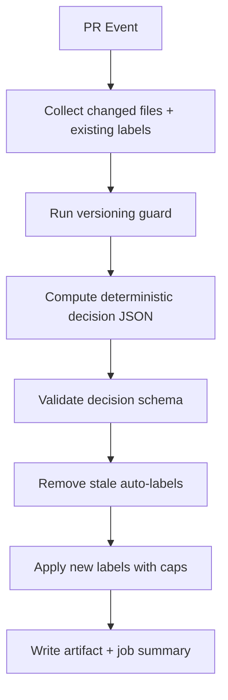
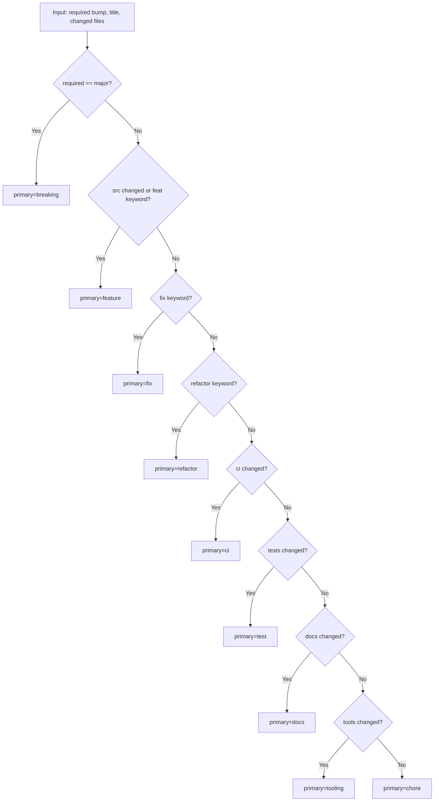
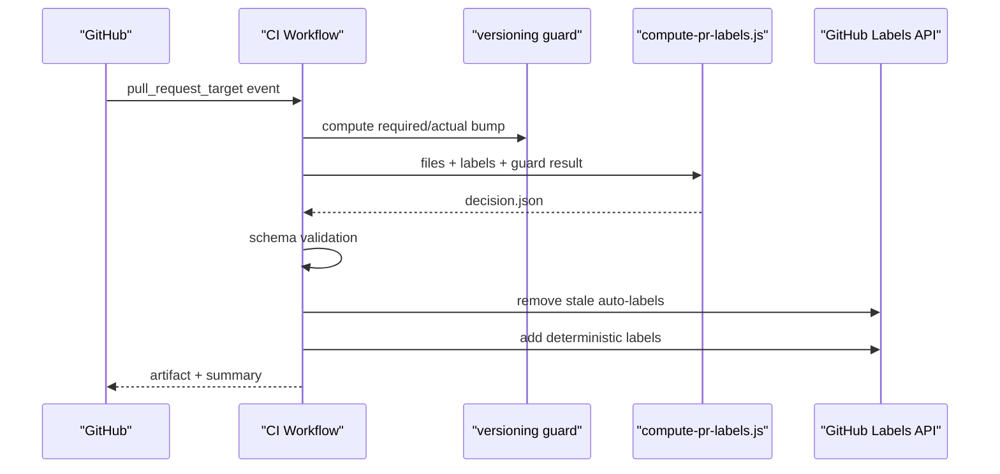
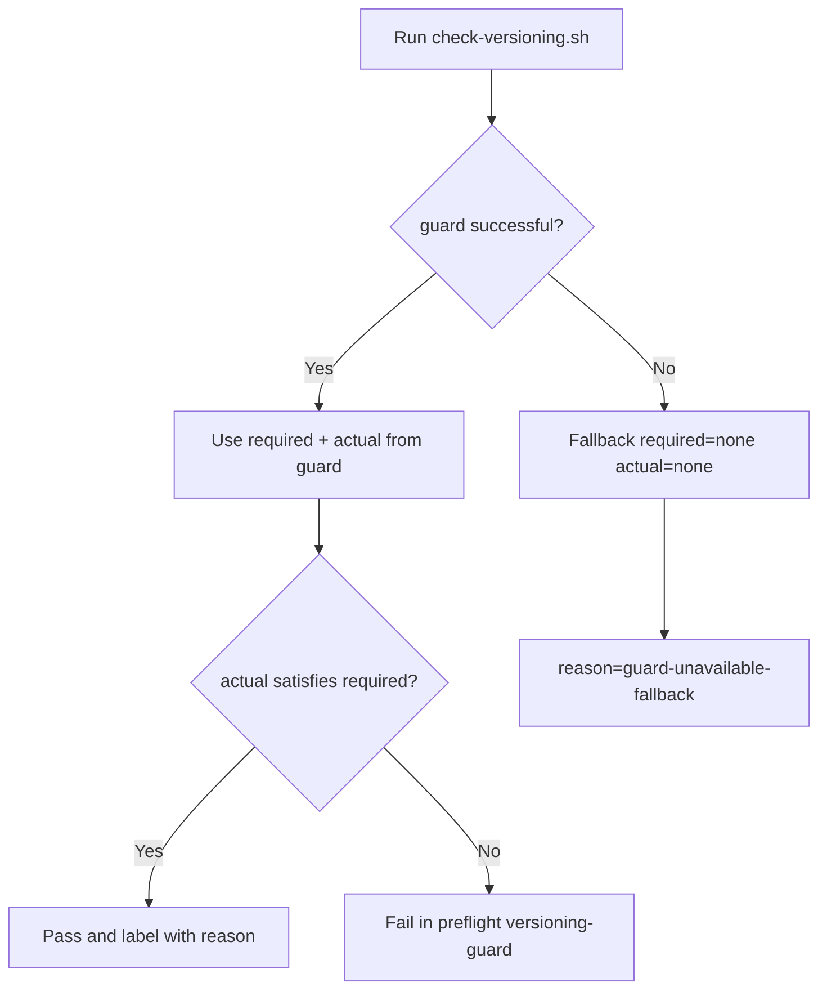

# Auto-Labeling And Auto-Versioning

## 1. Purpose
This document defines the deterministic PR labeling and versioning decision flow.
It is the SSOT for label taxonomy, caps, priority, and CI integration.

## 2. Deterministic Label Caps
Per PR run, the auto-labeler enforces:
- Exactly one `version:*` label
- Exactly one primary label: `breaking|feature|fix|refactor|ci|test|docs|tooling|chore`
- At most one `impl:*` label
- At most two `area:*` labels

No additional keyword label group is used.

## 3. Versioning Source Of Truth
`tools/versioning/check-versioning.sh` determines required bump semantics.

Console and summary outputs include:
- `required=<major|minor|patch|none>`
- `actual=<major|minor|patch|none>`
- `reason=<deterministic-reason>`

## 4. Priority Rules
Primary label priority is fixed:
`breaking > feature > fix > refactor > ci > test > docs > tooling > chore`

## 5. Mapping Rules
### 5.1 impl:* (max 1)
- `impl:security` -> security/vuln focused changes
- `impl:docs` -> docs-only implementation focus
- `impl:config` -> CI/config/tooling/versioning mechanics
- `impl:quality` -> source/tests quality/refactoring focus

### 5.2 area:* (max 2)
- `area:pipeline` -> `.github/workflows/**`
- `area:qodana` -> `qodana.yaml`, `.qodana/**`
- `area:archive` -> archive internals/processing
- `area:hashing` -> deterministic hashing
- `area:detection` -> detection engine
- `area:materializer` -> materialization flow
- `area:versioning` -> `docs/versioning/**`, `Directory.Build.props`
- `area:tests` -> `tests/**`
- `area:docs` -> `docs/**`, `README.md`
- `area:tooling` -> `tools/**`

## 6. End-To-End Flow

## 7. Primary Decision Flow

## 8. Sequence Diagram

## 9. Version Guard Decision Flow

## 10. Examples
### Docs-only PR
- `version:none`, `primary=docs`, optional `impl:docs`, `area:docs`

### CI-only PR
- `version:patch`, `primary=ci`, `impl:config`, `area:pipeline`

### Source + tests + docs PR
- `version:minor` (or `major` if breaking), single primary by priority, capped area labels

## 11. Regression Safety
Golden testcases live in:
- `tools/versioning/testcases/*.json`

Validation scripts:
- `tools/versioning/test-compute-pr-labels.js`
- `tools/versioning/validate-label-decision.js`
