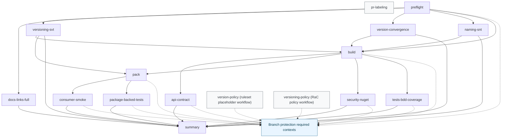

<!-- LANG_SWITCH:BEGIN -->
[DE](001_PIPELINE_CI.MD) | [EN](101_PIPELINE_CI.MD)
<!-- LANG_SWITCH:END -->

# CI-Pipeline (SSOT)

## Zweck und Geltungsbereich
Dieses Dokument beschreibt die ausfuehrbare CI-Topologie und den Artefaktvertrag.
Normative Policy-Schwellenwerte und Regelparameter liegen in `tools/ci/policies/rules/` und `docs/governance/001_POLICY_CI.MD`.

## Erforderliche Status-Contexts
Die Branch-Protection auf `main` verlangt exakt diese Contexts (`strict: true`): `preflight`, `version-policy`, `build`, `api-contract`, `pack`, `consumer-smoke`, `package-backed-tests`, `security-nuget`, `tests-bdd-coverage`.
Nachweis: Branch-Protection-API-Ausgabe (`required_status_checks.contexts`), `.github/workflows/ci.yml:59-347` und `.github/workflows/ruleset-placeholders.yml` (Context `version-policy`).
Hinweis: Die normative Versionierungsentscheidung (RaC) wird zusaetzlich durch `.github/workflows/version-policy.yml` als Check `versioning-policy` ausgewertet (nicht Teil der Branch-Protection-Contexts).

## Workflow-Topologie
- `pr-labeling` laeuft nur auf `pull_request` und ist getrennt vom erforderlichen technischen Gate-Pfad (`.github/workflows/ci.yml:22-58`).
- Der technische Gate-Pfad startet bei `preflight` und faechert in Downstream-Jobs ueber `needs` auf (`.github/workflows/ci.yml:89-427`).
- `summary` aggregiert Downstream-Artefakte und fuehrt Contract-Checks aus (`.github/workflows/ci.yml:349-427`, `tools/ci/bin/run.sh:446`).

## Artefaktvertrag
Jeder Aufruf `tools/ci/bin/run.sh <check_id>` initialisiert und finalisiert ein fixes Artefakt-Set:
- `raw.log`
- `summary.md`
- `result.json`
- `diag.json`

Nachweis:
- Artefaktpfad-Initialisierung: `tools/ci/lib/result.sh:12-20`.
- File-Materialisierung: `tools/ci/lib/result.sh:28-34`.
- Finale `result.json` Komposition: `tools/ci/lib/result.sh:78-112`.
- Universelles Runner-Wiring: `tools/ci/bin/run.sh:16-28`.

## Vertragsmatrix
| Job | Entrypoint | Artefaktpfad | Vertragsvalidierung | Evidence |
|---|---|---|---|---|
| `preflight` | `bash tools/ci/bin/run.sh preflight` | `artifacts/ci/preflight/` | Result contract + policy bridge | `.github/workflows/ci.yml:77-87`, `tools/ci/bin/run.sh:159-171` |
| `version-policy` | `.github/workflows/ruleset-placeholders.yml` | N/A | N/A (placeholder required context) | `.github/workflows/ruleset-placeholders.yml:20-24` |
| `versioning-policy` | `bash tools/versioning/run-versioning-policy.sh` | `artifacts/policy/` | RaC policy evaluation | `.github/workflows/version-policy.yml:25-37` |
| `build` | `bash tools/ci/bin/run.sh build` | `artifacts/ci/build/` | Result contract | `.github/workflows/ci.yml:177-187`, `tools/ci/bin/run.sh:179-183` |
| `api-contract` | `bash tools/ci/bin/run.sh api-contract` | `artifacts/ci/api-contract/` | Result contract | `.github/workflows/ci.yml:202-212`, `tools/ci/bin/run.sh:185-189` |
| `pack` | `bash tools/ci/bin/run.sh pack` | `artifacts/ci/pack/` | Result contract + package metadata checks | `.github/workflows/ci.yml:227-237`, `tools/ci/bin/run.sh:191-230` |
| `consumer-smoke` | `bash tools/ci/bin/run.sh consumer-smoke` | `artifacts/ci/consumer-smoke/` | Result contract + package-consumer execution | `.github/workflows/ci.yml:257-267`, `tools/ci/bin/run.sh:252-283` |
| `package-backed-tests` | `bash tools/ci/bin/run.sh package-backed-tests` | `artifacts/ci/package-backed-tests/` | Result contract + package-backed tests | `.github/workflows/ci.yml:287-297`, `tools/ci/bin/run.sh:285-315` |
| `security-nuget` | `bash tools/ci/bin/run.sh security-nuget` | `artifacts/ci/security-nuget/` | Result contract + High/Critical fail-close | `.github/workflows/ci.yml:312-322`, `tools/ci/bin/run.sh:317-329` |
| `tests-bdd-coverage` | `bash tools/ci/bin/run.sh tests-bdd-coverage` | `artifacts/ci/tests-bdd-coverage/` | Result contract + coverage threshold execution | `.github/workflows/ci.yml:337-347`, `tools/ci/bin/run.sh:331-348` |
| `version-convergence` | `bash tools/ci/bin/run.sh version-convergence` | `artifacts/ci/version-convergence/` | Result contract + convergence script | `.github/workflows/ci.yml:142-162`, `tools/versioning/verify-version-convergence.sh` |
| `summary` | `bash tools/ci/bin/run.sh summary` | `artifacts/ci/summary/` | Policy contract aggregation | `.github/workflows/ci.yml:417-427`, `tools/ci/bin/run.sh:424-430` |
| `pr-labeling` | `bash tools/ci/bin/run.sh pr-labeling` | `artifacts/ci/pr-labeling/` | Label decision schema + apply+verify | `.github/workflows/ci.yml:45-57`, `tools/ci/bin/run.sh:350-400` |

## Labeling- und Versionierungsentscheidungs-Pfad
- Entscheidungs-Generierung: `compute-pr-labels.js` schreibt `decision.json` (`tools/ci/bin/run.sh:371-372`).
- Schema-Validierung: `validate-label-decision.js` (`tools/ci/bin/run.sh:374`).
- Label-Anwendung und Post-Apply-Verifikation: deterministischer GitHub-API-PUT (curl-backed) und anschliessender Re-Read (`tools/ci/bin/run.sh:375-399`, `tools/ci/bin/github_api.py`).
- Workflow-Token-Quelle: `GH_TOKEN: ${{ github.token }}` (`.github/workflows/ci.yml:46-50`).

## Qodana: Vertragsposition
Qodana laeuft in einem separaten Workflow und wird durch `run.sh qodana` validiert:
- Qodana-Action-Ausfuehrung und SARIF-Ausgabepfad (`.github/workflows/qodana.yml:34-40`, `.github/workflows/qodana.yml:59`).
- Vertragscheck-Aufruf (`.github/workflows/qodana.yml:47-48`, `tools/ci/bin/run.sh:402-422`).
- Qodana-Artefakt-Upload (`.github/workflows/qodana.yml:54-60`).
