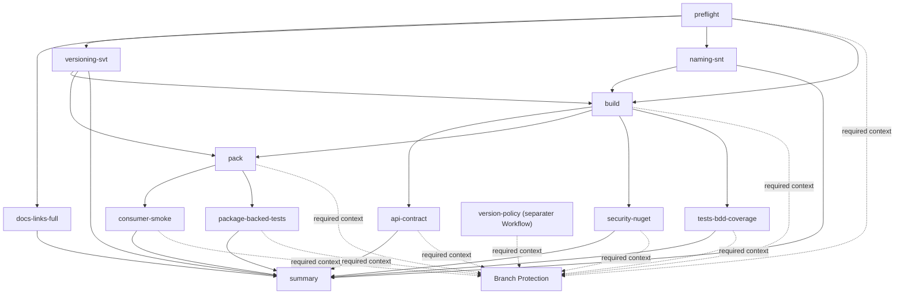

# CI-Pipeline (SSOT)

## 1. Zweck
Diese Pipeline liefert auditierbare Nachweise für Produktionsreife:
- Konsistenz/Format
- Build-Korrektheit (`--warnaserror`)
- Paket-Sicherheit (NuGet-Vulnerabilities)
- BDD-Readable-Tests mit Coverage-Gate
- Doku-Konsistenz
- deterministisches PR-Labeling und Versionierungs-Nachweise

## 2. Workflow-Struktur
Der Workflow `CI` hat zwei klar getrennte Verantwortungswege:
- `pull_request`: `pr-labeling` (Governance, nicht-gating)
- `pull_request`/`push`: technische Qualitätsjobs (`preflight`, `versioning-svt`, `build`, `api-contract`, `pack`, `consumer-smoke`, `package-backed-tests`, `security-nuget`, `tests-bdd-coverage`, `summary`)

## 2.1 Required Status Checks (exakte Context-Namen)
- `preflight`
- `version-policy`
- `build`
- `api-contract`
- `pack`
- `consumer-smoke`
- `package-backed-tests`
- `security-nuget`
- `tests-bdd-coverage`

Hinweis:
- `version-policy` ist ein separater Workflow-Job (`.github/workflows/version-policy.yml`), ruft intern aber `bash tools/ci/bin/run.sh versioning-svt` auf.

## 2.2 Job-DAG (CI + externer Gate)


## 3. Jobs (1 Job = 1 Verantwortung)
### Job: pr-labeling (Governance)
- geänderte Dateien und aktuelle PR-Labels erfassen
- `required/actual/reason` aus Versioning-Guard ableiten
- deterministische Label-Entscheidung berechnen (`decision.json`)
- Schema validieren
- veraltete Auto-Labels entfernen und neue setzen
- Artefakte hochladen

### Job: preflight (fail-fast)
1. Label-Engine Golden-Tests
2. Doc-Consistency-Drift-Guard
3. Format-Check

### Job: versioning-svt (fail-closed)
1. Erzwingt Tag-SSOT (keine statischen Versionfelder im Repository)
2. Blockiert Build/Test bei Policy-Verletzung

### Job: build
1. Restore
2. Build (`--warnaserror`)

### Job: api-contract
1. Public-API-Snapshot-Gate (`Category=ApiContract`)
2. Fail-closed bei unbeabsichtigter API-Drift

### Job: pack
1. `dotnet pack` erzeugt `.nupkg` (Artefakt)
2. Paket-Metadaten (`id`, `version`) werden verifiziert

### Job: consumer-smoke
1. Restore/Build/Run eines externen Consumers gegen das gepackte Paket
2. Harte Regel: kein `ProjectReference` zur Source-Library

### Job: package-backed-tests
1. Definierter Kern-Test-Satz laeuft gegen das gepackte Paket
2. Beweist Verhaltensidentitaet package-basiert (nicht Source-basiert)

### Job: security-nuget
1. Vulnerability-Scan (`--include-transitive`)
2. Deprecated-Packages-Report

### Job: tests-bdd-coverage
1. Single-Run BDD-Tests + Coverage-Gate (`Line >= 85`, `Branch >= 69`)
2. Runner-Stack: Reqnroll + `Reqnroll.xunit.v3` (xUnit v3)

### Job: summary
- Coverage- und Security-Zusammenfassung (nur Reporting)

## 4. Required vs. Non-Required Checks
Required in Branch-Protection:
- `preflight`
- `version-policy`
- `build`
- `api-contract`
- `pack`
- `consumer-smoke`
- `package-backed-tests`
- `security-nuget`
- `tests-bdd-coverage`
- optional: `qodana` (policy-abhängig)

Nicht required:
- `pr-labeling` (Governance-Automation, fail-open)
Wenn Label-API-Aufrufe fehlschlagen, wird dies als Artefakt protokolliert, ohne technische Quality-Gates zu brechen.

## 5. CI-Job-Vertragsmatrix
| Job (Context) | Zweck | Script-Entrypoint | Artefaktpfad | `result.json` | Schema-Validierung |
|---|---|---|---|---|---|
| `preflight` | fail-fast Setup/Policy/Graph | `bash tools/ci/bin/run.sh preflight` | `artifacts/ci/preflight/` | ja | ja (`summary`/`artifact_contract` via PolicyRunner) |
| `version-policy` | externer Required Gate fuer SVT | `bash tools/ci/bin/run.sh versioning-svt` | `artifacts/ci/versioning-svt/` | ja | ja (`summary`/`artifact_contract` via PolicyRunner) |
| `build` | Restore + Build | `bash tools/ci/bin/run.sh build` | `artifacts/ci/build/` | ja | ja (`summary`/`artifact_contract` via PolicyRunner) |
| `api-contract` | API-Contract Tests | `bash tools/ci/bin/run.sh api-contract` | `artifacts/ci/api-contract/` | ja | ja (`summary`/`artifact_contract` via PolicyRunner) |
| `pack` | NuGet pack + Metadata Checks | `bash tools/ci/bin/run.sh pack` | `artifacts/ci/pack/` | ja | ja (`summary`/`artifact_contract` via PolicyRunner) |
| `consumer-smoke` | Consumer gegen Paket | `bash tools/ci/bin/run.sh consumer-smoke` | `artifacts/ci/consumer-smoke/` | ja | ja (`summary`/`artifact_contract` via PolicyRunner) |
| `package-backed-tests` | Tests gegen Paket | `bash tools/ci/bin/run.sh package-backed-tests` | `artifacts/ci/package-backed-tests/` | ja | ja (`summary`/`artifact_contract` via PolicyRunner) |
| `security-nuget` | Vulnerability/Deprecated Check | `bash tools/ci/bin/run.sh security-nuget` | `artifacts/ci/security-nuget/` | ja | ja (`summary`/`artifact_contract` via PolicyRunner) |
| `tests-bdd-coverage` | BDD + Coverage Gate | `bash tools/ci/bin/run.sh tests-bdd-coverage` | `artifacts/ci/tests-bdd-coverage/` | ja | ja (`summary`/`artifact_contract` via PolicyRunner) |

## 6. Labeling- und Versioning-SSOT
- Policy: `docs/versioning/001_POLICY_VERSIONING.MD`
- Verhalten + Diagramme: `docs/versioning/004_POLICY_LABELING.MD`
- Ownership: `docs/governance/002_POLICY_LABELING.MD`

## 7. Qodana
Qodana bleibt ein separater Workflow und ergänzt die CI-Qualitätsgates.
Coverage-SSOT bleibt CI (Coverage-Artefakte + Gate-Enforcement).
Für `pull_request` wird SARIF als Workflow-Artefakt veröffentlicht.
Code-Scanning-SARIF-Upload erfolgt nur auf non-PR-Runs, um PR-Noise zu vermeiden.
Profil-Hinweis: In `.qodana/profiles/fileclassifier.yaml` sind nur testpfad-spezifische Excludes für reine Redundanz-Inspections gesetzt (`tests/**`), Produktionscode bleibt unverändert streng.

### 7.1 Qodana Ergebnisse & Artefakte
- Wenn `QODANA_TOKEN` fehlt, wird Qodana im Workflow übersprungen.
- Qodana schreibt Ergebnisse in `artifacts/ci/qodana/` (inkl. `qodana.sarif.json`).
- Für `pull_request`-Runs wird das Verzeichnis als Artefakt veröffentlicht.
- Für non-PR-Runs wird `artifacts/ci/qodana/qodana.sarif.json` in GitHub Code Scanning hochgeladen.
- Artefakte:
  - `artifacts/ci/qodana/qodana.sarif.json`
  - Verzeichnis `artifacts/ci/qodana/`

Branch-Protection-Hinweis:
- Der Workflow-Status `qodana` muss in GitHub als Required Check konfiguriert werden, damit PR-Merges blockiert werden.

## 8. Lokale Reproduktion
```bash
node tools/versioning/test-compute-pr-labels.js
python3 tools/check-doc-consistency.py
python3 tools/check-docs.py
bash tools/versioning/check-versioning-svt.sh
dotnet test tests/FileTypeDetectionLib.Tests/FileTypeDetectionLib.Tests.csproj -c Release --filter "Category=ApiContract" -v minimal
dotnet pack src/FileTypeDetection/FileTypeDetectionLib.vbproj -c Release -o artifacts/nuget -v minimal
dotnet restore samples/PortableConsumer/PortableConsumer.csproj --configfile samples/PortableConsumer/NuGet.config -p:PortableConsumerPackageVersion=1.0.0 -v minimal
dotnet build samples/PortableConsumer/PortableConsumer.csproj -c Release --no-restore -p:PortableConsumerPackageVersion=1.0.0 -v minimal
dotnet restore tests/PackageBacked.Tests/PackageBacked.Tests.csproj --configfile tests/PackageBacked.Tests/NuGet.config -p:PackageBackedVersion=1.0.0 -v minimal
dotnet test tests/PackageBacked.Tests/PackageBacked.Tests.csproj -c Release --no-restore -p:PackageBackedVersion=1.0.0 -v minimal
dotnet format FileClassifier.sln --verify-no-changes
dotnet restore FileClassifier.sln -v minimal
dotnet build FileClassifier.sln --no-restore -warnaserror -v minimal

dotnet list FileClassifier.sln package --vulnerable --include-transitive
dotnet list FileClassifier.sln package --deprecated

TEST_BDD_OUTPUT_DIR=artifacts/tests bash tools/test-bdd-readable.sh -- \
  /p:CollectCoverage=true \
  /p:Include="[FileTypeDetectionLib]*" \
  /p:CoverletOutputFormat=cobertura \
  /p:CoverletOutput="$(pwd)/artifacts/coverage/coverage" \
  /p:Threshold=85%2c69 \
  /p:ThresholdType=line%2cbranch \
  /p:ThresholdStat=total
```
