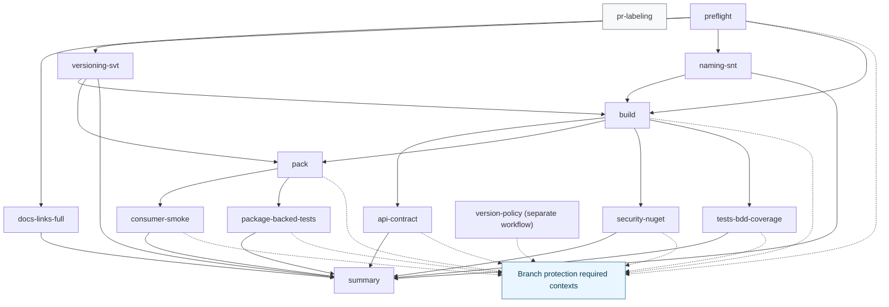

# CI Pipeline (SSOT)

## Scope
This document describes the executable CI topology and artifact contract.
Normative policy thresholds and rule parameters stay in `tools/ci/policies/rules/` and `docs/governance/001_POLICY_CI.MD`.

## Required Status Contexts
Main branch protection requires exactly these contexts (`strict: true`): `preflight`, `version-policy`, `build`, `api-contract`, `pack`, `consumer-smoke`, `package-backed-tests`, `security-nuget`, `tests-bdd-coverage`.
Evidence: branch protection API output (`required_status_checks.contexts`) and `.github/workflows/ci.yml:59-347` plus `.github/workflows/version-policy.yml`.

## Workflow Topology
- `pr-labeling` runs only on `pull_request` and is separate from the required technical gate path (`.github/workflows/ci.yml:22-58`).
- The technical gate path starts at `preflight` and fans into downstream jobs via `needs` (`.github/workflows/ci.yml:89-427`).
- `summary` aggregates downstream artifacts and runs contract checks (`.github/workflows/ci.yml:349-427`, `tools/ci/bin/run.sh:446`).

## Artifact Contract
Each `tools/ci/bin/run.sh <check_id>` invocation initializes and finalizes a fixed artifact set:
- `raw.log`
- `summary.md`
- `result.json`
- `diag.json`

Evidence:
- Artifact path initialization in `tools/ci/lib/result.sh:12-20`.
- File materialization in `tools/ci/lib/result.sh:28-34`.
- Final `result.json` composition in `tools/ci/lib/result.sh:78-112`.
- Universal runner wiring in `tools/ci/bin/run.sh:16-28`.

## Contract Matrix
| Job | Entrypoint | Artifact path | Contract validation path | Evidence |
|---|---|---|---|---|
| `preflight` | `bash tools/ci/bin/run.sh preflight` | `artifacts/ci/preflight/` | Result contract + policy bridge | `.github/workflows/ci.yml:77-87`, `tools/ci/bin/run.sh:159-171` |
| `version-policy` | `bash tools/ci/bin/run.sh versioning-svt` | `artifacts/ci/versioning-svt/` | Result contract + policy bridge | `tools/ci/bin/run.sh:242-250` |
| `build` | `bash tools/ci/bin/run.sh build` | `artifacts/ci/build/` | Result contract | `.github/workflows/ci.yml:177-187`, `tools/ci/bin/run.sh:179-183` |
| `api-contract` | `bash tools/ci/bin/run.sh api-contract` | `artifacts/ci/api-contract/` | Result contract | `.github/workflows/ci.yml:202-212`, `tools/ci/bin/run.sh:185-189` |
| `pack` | `bash tools/ci/bin/run.sh pack` | `artifacts/ci/pack/` | Result contract + package metadata checks | `.github/workflows/ci.yml:227-237`, `tools/ci/bin/run.sh:191-230` |
| `consumer-smoke` | `bash tools/ci/bin/run.sh consumer-smoke` | `artifacts/ci/consumer-smoke/` | Result contract + package-consumer execution | `.github/workflows/ci.yml:257-267`, `tools/ci/bin/run.sh:252-283` |
| `package-backed-tests` | `bash tools/ci/bin/run.sh package-backed-tests` | `artifacts/ci/package-backed-tests/` | Result contract + package-backed tests | `.github/workflows/ci.yml:287-297`, `tools/ci/bin/run.sh:285-315` |
| `security-nuget` | `bash tools/ci/bin/run.sh security-nuget` | `artifacts/ci/security-nuget/` | Result contract + High/Critical fail-close | `.github/workflows/ci.yml:312-322`, `tools/ci/bin/run.sh:317-329` |
| `tests-bdd-coverage` | `bash tools/ci/bin/run.sh tests-bdd-coverage` | `artifacts/ci/tests-bdd-coverage/` | Result contract + coverage threshold execution | `.github/workflows/ci.yml:337-347`, `tools/ci/bin/run.sh:331-348` |
| `summary` | `bash tools/ci/bin/run.sh summary` | `artifacts/ci/summary/` | Policy contract aggregation | `.github/workflows/ci.yml:417-427`, `tools/ci/bin/run.sh:424-430` |
| `pr-labeling` | `bash tools/ci/bin/run.sh pr-labeling` | `artifacts/ci/pr-labeling/` | Label decision schema + apply+verify | `.github/workflows/ci.yml:45-57`, `tools/ci/bin/run.sh:350-400` |

## Labeling and Versioning Decision Path
- Decision generation: `compute-pr-labels.js` writes `decision.json` (`tools/ci/bin/run.sh:371-372`).
- Schema validation: `validate-label-decision.js` (`tools/ci/bin/run.sh:374`).
- Label application and post-apply verification: deterministic GitHub API PUT (curl-backed) and post-apply re-read (`tools/ci/bin/run.sh:375-399`, `tools/ci/bin/github_api.py`).
- Workflow token source: `GH_TOKEN: ${{ github.token }}` (`.github/workflows/ci.yml:46-50`).

## Qodana Contract Position
Qodana runs in a separate workflow and is validated by `run.sh qodana`:
- Qodana action execution and SARIF output path (`.github/workflows/qodana.yml:34-40`, `.github/workflows/qodana.yml:59`).
- Contract check invocation (`.github/workflows/qodana.yml:47-48`, `tools/ci/bin/run.sh:402-422`).
- Qodana artifact upload (`.github/workflows/qodana.yml:54-60`).
