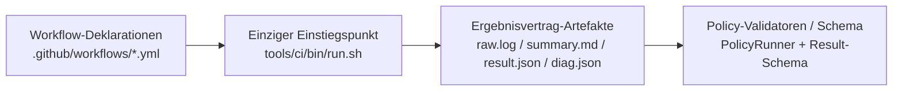

<!-- LANG_SWITCH:BEGIN -->
[DE](001_POLICY_CI.MD) | [EN](101_POLICY_CI.MD)
<!-- LANG_SWITCH:END -->

# CI-Richtlinie (SSOT)

## Geltungsbereich
Dieses Dokument definiert Richtlinienprinzipien, Severity-Behandlung und Exit-Code-Politik für die CI.
Normative Richtliniendefinitionen liegen in:
- `tools/ci/policies/schema/rules.schema.json`
- `tools/ci/policies/rules/`
Einstiegsindex:
- `docs/governance/006_INDEX_CI_RULES.MD`

## Globale Regeln
- Fail-closed: keine stillen Bypass-Pfade.
- Workflow-YAML ruft nur Entry-Skripte unter `tools/ci/bin/` auf.
- Erforderliche Branch-Protection-Contexts bleiben fix: `preflight`, `version-policy`, `build`, `api-contract`, `pack`, `consumer-smoke`, `package-backed-tests`, `security-nuget`, `tests-bdd-coverage`.
  Nachweis: Branch-Protection-API (`required_status_checks.contexts`) und `.github/workflows/ci.yml:59-347`.

## Ergebnisvertrag
Alle erforderlichen Checks MUESSEN schreiben:
- `artifacts/ci/<check_id>/raw.log`
- `artifacts/ci/<check_id>/summary.md`
- `artifacts/ci/<check_id>/result.json`

`result.json` muss `tools/ci/schema/result.schema.json` entsprechen.
Implementierungsnachweis: `tools/ci/lib/result.sh:12-20`, `tools/ci/lib/result.sh:28-34`, `tools/ci/lib/result.sh:78-112`.

## Governance-Sicht (Ausführungsgrenze)

Der detaillierte Job-DAG und die Vertragsmatrix liegen in `docs/ci/001_PIPELINE_CI.MD`, um Duplikate zu vermeiden.

## Regelkatalog
- Rule-IDs und Datei-Zuordnung sind in `docs/governance/006_INDEX_CI_RULES.MD` indexiert.
- Auswertungsdetails und Schwellwerte sind ausschliesslich in `tools/ci/policies/rules/` definiert.

## Severity-Regeln
- `warn`: sichtbar, nicht blockierend.
- `fail`: blockierend, Exit-Code ungleich Null.

## Exit-Code-Matrix
- `0`: Erfolg (`pass` oder `warn`)
- `1`: Richtlinien-/Vertrags-/Check-Fehler (`fail`)
- `2`: ungültiger Aufruf oder fehlende Voraussetzungen

## Allow-Lists
Allow-List-Definitionen werden in Regelparametern unter `tools/ci/policies/rules/` gepflegt.

## RoC-Bezug
- [Artifact-Contract-Regel](https://github.com/tomtastisch/FileClassifier/blob/main/tools/ci/policies/rules/artifact_contract.yaml)
- [Docs-Drift-Regel](https://github.com/tomtastisch/FileClassifier/blob/main/tools/ci/policies/rules/docs_drift.yaml)
- [Shell-Safety-Regeln](https://github.com/tomtastisch/FileClassifier/blob/main/tools/ci/policies/rules/shell_safety.yaml)
- Naming-SNT-Regel: `tools/ci/policies/rules/naming_snt.yaml`
