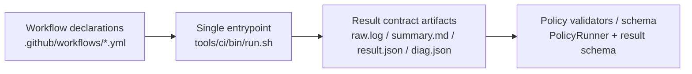

# CI Policy (SSOT)

## Scope
This document defines policy principles, severity handling, and exit code policy.
Normative policy definitions live in:
- `tools/ci/policies/schema/rules.schema.json`
- `tools/ci/policies/rules/`
Entry index:
- `docs/governance/006_INDEX_CI_RULES.MD`

## Global Rules
- Fail-closed: no silent bypass paths.
- Workflow YAML only calls entry scripts under `tools/ci/bin/`.
- Required branch-protection contexts remain fixed: `preflight`, `version-policy`, `build`, `api-contract`, `pack`, `consumer-smoke`, `package-backed-tests`, `security-nuget`, `tests-bdd-coverage`.
  Evidence: branch protection API (`required_status_checks.contexts`) and `.github/workflows/ci.yml:59-347`.

## Result Contract
All required checks MUST write:
- `artifacts/ci/<check_id>/raw.log`
- `artifacts/ci/<check_id>/summary.md`
- `artifacts/ci/<check_id>/result.json`

`result.json` must comply with `tools/ci/schema/result.schema.json`.
Implementation evidence: `tools/ci/lib/result.sh:12-20`, `tools/ci/lib/result.sh:28-34`, `tools/ci/lib/result.sh:78-112`.

## Governance View (Execution Boundary)

The detailed job DAG and contract matrix are maintained in `docs/ci/001_PIPELINE_CI.MD` to avoid duplication.

## Rule Catalog
- Rule IDs and file ownership are indexed in `docs/governance/006_INDEX_CI_RULES.MD`.
- Evaluation details and thresholds are defined only in `tools/ci/policies/rules/`.

## Severity Rules
- `warn`: visible, non-blocking.
- `fail`: blocking, exit code non-zero.

## Exit Code Matrix
- `0`: success (`pass` or `warn`)
- `1`: policy/contract/check failure (`fail`)
- `2`: invalid invocation or missing prerequisites

## Allow-lists
Allow-list definitions are managed in rule parameters under `tools/ci/policies/rules/`.

## RoC-Bezug
- [Artifact-Contract-Regel](https://github.com/tomtastisch/FileClassifier/blob/main/tools/ci/policies/rules/artifact_contract.yaml)
- [Docs-Drift-Regel](https://github.com/tomtastisch/FileClassifier/blob/main/tools/ci/policies/rules/docs_drift.yaml)
- [Shell-Safety-Regeln](https://github.com/tomtastisch/FileClassifier/blob/main/tools/ci/policies/rules/shell_safety.yaml)
- Naming-SNT-Regel: `tools/ci/policies/rules/naming_snt.yaml`
