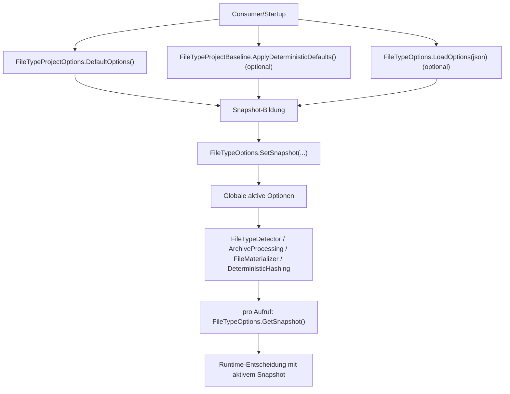
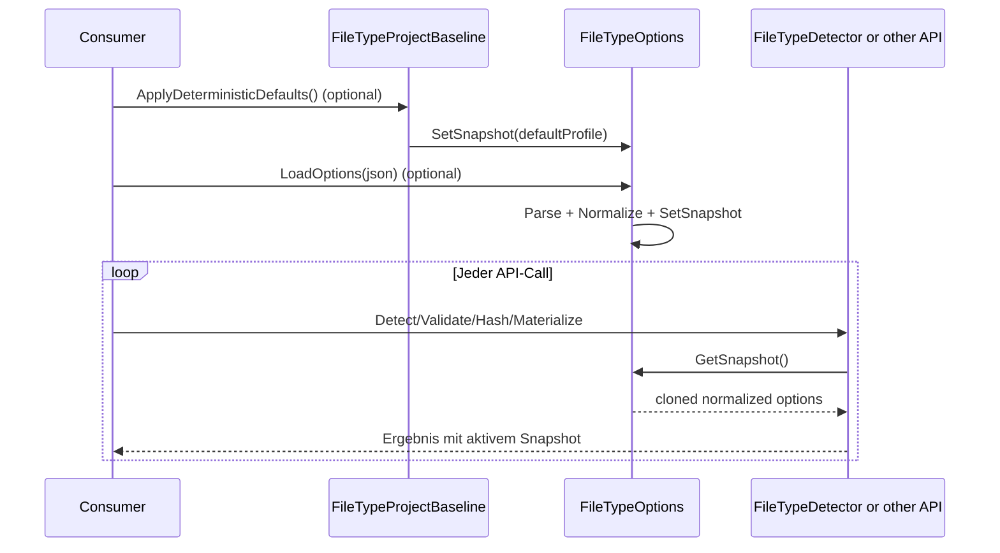

# Playbook: Options anlegen und anpassen

## 1. Zweck und Zielgruppe
Dieses Playbook beschreibt einen einheitlichen, verbindlichen Ablauf für neue oder geänderte Optionen in der FileTypeDetection-API.

Zielgruppe:
- Entwickler, die `FileTypeProjectOptions` oder `FileTypeOptions` erweitern
- Reviewer, die Vollständigkeit und fail-closed Verhalten prüfen
- Verwender, die verstehen wollen, wann Runtime-Konfiguration aktiv wird

## 2. Wann dieses Playbook verwenden?
Verwende dieses Dokument, wenn mindestens einer der folgenden Punkte zutrifft:
- neue Option in `FileTypeProjectOptions`
- Änderung bestehender Default-Werte
- Erweiterung von JSON-Load/Parse oder JSON-Export in `FileTypeOptions`
- Baseline-Entscheidung in `FileTypeProjectBaseline`

## 3. Zentral betroffene Stellen (Datei-Map)
| Bereich | Datei | Muss angepasst werden bei |
|---|---|---|
| Option-Definition und Normalize | [Weiterführende Details](https://github.com/tomtastisch/FileClassifier/blob/241c6d4/src/FileTypeDetection/Configuration/FileTypeProjectOptions.vb) | neue Property, Default, Normalisierungsregel |
| JSON Load/Parse und Snapshot-Set | [Weiterführende Details](https://github.com/tomtastisch/FileClassifier/blob/241c6d4/src/FileTypeDetection/FileTypeOptions.vb) | JSON key mapping, parse guard, `SetSnapshot` |
| JSON Export | [Weiterführende Details](https://github.com/tomtastisch/FileClassifier/blob/241c6d4/src/FileTypeDetection/FileTypeOptions.vb) | `GetOptions()` für Snapshot-Sicht |
| Baseline-Werte | [Weiterführende Details](https://github.com/tomtastisch/FileClassifier/blob/241c6d4/src/FileTypeDetection/Configuration/FileTypeProjectBaseline.vb) | produktive Defaults (`ApplyDeterministicDefaults`) |
| Unit Tests (Options) | [Weiterführende Details](https://github.com/tomtastisch/FileClassifier/blob/241c6d4/tests/FileTypeDetectionLib.Tests/Unit/FileTypeOptionsFacadeUnitTests.cs) | parse/export/normalize behavior |
| Unit Tests (Baseline) | [Weiterführende Details](https://github.com/tomtastisch/FileClassifier/blob/241c6d4/tests/FileTypeDetectionLib.Tests/Unit/FileTypeProjectBaselineUnitTests.cs) | Baseline-Defaultwerte |

## 4. Schritt-für-Schritt-Checkliste (Vorgehen)
Arbeite die Schritte in dieser Reihenfolge ab:

- [ ] Schritt 1: Option in `FileTypeProjectOptions` anlegen oder anpassen (inkl. Defaultwert).
- [ ] Schritt 2: `NormalizeInPlace()` für fail-closed Grenzen aktualisieren.
- [ ] Schritt 3: JSON-Parse in `FileTypeOptions.LoadOptions(json)` ergänzen.
- [ ] Schritt 4: JSON-Export in `FileTypeOptions.GetOptions()` ergänzen.
- [ ] Schritt 5: Baseline-Entscheidung in `FileTypeProjectBaseline` treffen.
- [ ] Schritt 6: Unit-Tests in `FileTypeOptionsFacadeUnitTests` und ggf. `FileTypeProjectBaselineUnitTests` aktualisieren.
- [ ] Schritt 7: Doku-Referenzen in `docs/*` und ggf. `src/*/README.md` aktualisieren.
- [ ] Schritt 8: Verifikation laufen lassen (siehe Abschnitt 8).

## 5. Beispiel (konkret)
### Beispiel: Neue Scalar Option `MaxArchiveCommentBytes`
Angenommen, eine neue Long-Option soll Archiv-Kommentargrösse begrenzen.

1. In `FileTypeProjectOptions.vb` Property + Default setzen, z. B. `Public Property MaxArchiveCommentBytes As Long = ...`.
2. In `NormalizeInPlace()` auf Minimum normalisieren (`>= 1`).
3. In `FileTypeOptions.LoadOptions(json)` Key `maxArchiveCommentBytes` parsen.
4. In `FileTypeOptions.GetOptions()` den Wert ins JSON aufnehmen.
5. In `FileTypeProjectBaseline.vb` bewusst entscheiden, ob ein strengerer Baseline-Wert gesetzt wird.
6. In `FileTypeOptionsFacadeUnitTests.cs` Tests für validen/invaliden Wert und JSON-Roundtrip ergänzen.

Beispiel-JSON für Consumer:

```json
{
  "maxArchiveCommentBytes": 8192
}
```

## 6. Aktivierung zur Laufzeit
### 6.1 Flowchart (Aktivierung und Einlesen)


### 6.2 Sequence (Runtime-Leseverhalten)


## 7. Implementierungs-Checklist und Done-Kriterien
### 7.1 Implementierungs-Checklist
- [ ] Option in `FileTypeProjectOptions` inkl. Default und Typ hinzugefügt.
- [ ] `NormalizeInPlace()` für fail-closed Grenzen aktualisiert.
- [ ] `FileTypeOptions.LoadOptions(json)` parse path für neue Option erweitert.
- [ ] `FileTypeOptions.GetOptions()` serialisiert die Option sichtbar.
- [ ] Baseline-Entscheidung (`FileTypeProjectBaseline`) explizit getroffen.
- [ ] Unit-Tests für parse/export/normalize hinzugefügt oder angepasst.
- [ ] Doku-Links in `docs/*` und ggf. `src/*/README.md` aktualisiert.

### 7.2 Done-Kriterien
Eine Optionsänderung ist nur dann fertig, wenn:
1. Werte deterministisch und fail-closed normalisiert werden.
2. JSON-Load und JSON-Export konsistent sind.
3. Baseline-Intent dokumentiert ist.
4. Tests die Änderung abdecken (Happy Path + Invalid Input).
5. Markdown-Links gültig sind.

## 8. Verifikation (Kommandos)
```bash
python3 tools/check-docs.py
dotnet test tests/FileTypeDetectionLib.Tests/FileTypeDetectionLib.Tests.csproj --filter "FullyQualifiedName~FileTypeOptionsFacadeUnitTests|FullyQualifiedName~FileTypeProjectBaselineUnitTests" -v minimal
```

## 9. Typische Fehlerbilder und fail-closed Hinweise
| Fehlerbild | Auswirkung | Gegenmassnahme |
|---|---|---|
| Property in `FileTypeProjectOptions`, aber kein Parse in `LoadOptions` | Option bleibt nie per JSON setzbar | parse case + Test ergänzen |
| Parse vorhanden, aber kein Export in `GetOptions` | Snapshot ist intransparent für Verwender | `GetOptions` + JsonDocument-Test ergänzen |
| Kein Normalize-Guard für numerische Grenzen | undefiniertes Runtime-Verhalten bei invalid valüs | `NormalizeInPlace` + invalid-valü Tests |
| Baseline-Wert vergessen | Produktionsprofil inkonsistent | `FileTypeProjectBaseline` + Baseline-Test updaten |
| Nested-Objekt nur flach kopiert | Seiteneffekte/Lecks über Snapshots | `Clone`/`Normalize` für nested options absichern |

## 10. Nicht-Ziele
- Keine Änderung der API-Semantik ohne begleitende Contract-Dokumentation.
- Keine stillen Sicherheitslockerungen ohne explizite Risikoentscheidung.

## Dokumentpflege-Checkliste
- [ ] Inhalt auf aktuellen Code-Stand geprüft.
- [ ] Links und Anker mit `python3 tools/check-docs.py` geprüft.
- [ ] Beispiele/Kommandos lokal verifiziert.
- [ ] Begriffe mit `docs/010_API_CORE.MD` abgeglichen.
