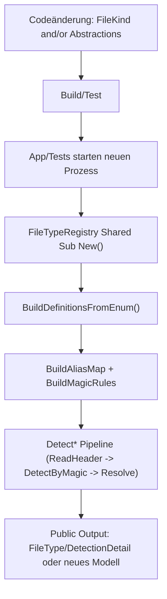
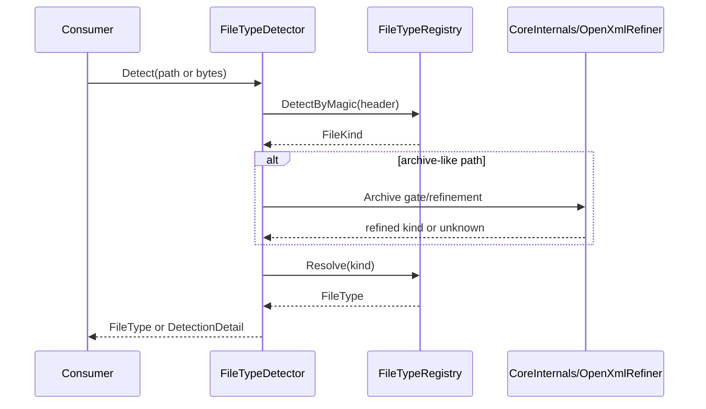

# Playbook: Neue Datatypes und API-Modelle erweitern

## 1. Zweck und Zielgruppe
Dieses Playbook beschreibt einen einheitlichen, verbindlichen Ablauf für:
1. neue erkennbare Formate über `FileKind` + `FileTypeRegistry`
2. neue API-Modelle unter `Abstractions/*`

Zielgruppe:
- Entwickler, die Detection/Registry/Abstractions erweitern
- Reviewer, die Konsistenz und fail-closed Verhalten absichern
- Verwender, die Auswirkungen auf API-Outputs verstehen müssen

## 2. Wann dieses Playbook verwenden?
| Vorhaben | Relevanter Abschnitt |
|---|---|
| Neuer Dateityp (z. B. neue Magic-Signatur) | Abschnitt 3 und 4 |
| Neues Rückgabemodell für Public API | Abschnitt 5 und 6 |
| Neues Format plus neues Modell | Abschnitte 3 bis 6 |

## 3. Neue `FileKind`-Formate: zentrale Stellen
### 3.1 Pflichtdateien
| Bereich | Datei | Aufgabe |
|---|---|---|
| Öffentliche Typliste | [Weiterführende Details](https://github.com/tomtastisch/FileClassifier/blob/main/src/FileTypeDetection/Abstractions/Detection/FileKind.vb) | Enum-Wert ergänzen |
| SSOT Metadaten und Magic | [Weiterführende Details](https://github.com/tomtastisch/FileClassifier/blob/main/src/FileTypeDetection/Detection/FileTypeRegistry.vb) | Extension/Alias/Magic und Resolve-Verhalten |
| Detection-Details | [Detection Modul](https://github.com/tomtastisch/FileClassifier/blob/main/src/FileTypeDetection/Detection/README.md) | fachliche Erklärung nachziehen |
| Registry-Tests | [Weiterführende Details](https://github.com/tomtastisch/FileClassifier/blob/main/tests/FileTypeDetectionLib.Tests/Unit/FileTypeRegistryUnitTests.cs) | Resolve/Alias/Magic validieren |

### 3.2 Registry-Punkte, die geprüft werden müssen
- `ExtensionOverrides` (nur falls CanonicalExtension vom Enum-Namen abweicht)
- `AliasOverrides` (Legacy-/Kompatibilitäts-Aliase)
- `BuildMagicPatternCatalog()` (Magic-Pattern Aufnahme)
- `HasStructuredContainerDetection()` (falls neuer Typ strukturierte Verfeinerung braucht)
- indirekte Auswirkungen auf `KindsWithoutDirectContentDetection()`

### 3.3 Bei neuen Containerarten zusätzlich
- [Infrastructure Modul](https://github.com/tomtastisch/FileClassifier/blob/main/src/FileTypeDetection/Infrastructure/README.md) prüfen, ob Gate/Extractor den Container bereits trägt.
- Falls nein: Infrastrukturpfad erweitern und Security-Gates (Depth, Size, Traversal, Links) mitziehen.

## 4. Schritt-für-Schritt-Checkliste für neue `FileKind`
- [ ] Schritt 1: Enum-Wert in `FileKind.vb` anlegen.
- [ ] Schritt 2: `FileTypeRegistry.vb` (Extension/Alias/Magic) aktualisieren.
- [ ] Schritt 3: Bei Bedarf `HasStructuredContainerDetection()` erweitern.
- [ ] Schritt 4: Tests für Resolve/Alias/Magic/fail-closed ergänzen.
- [ ] Schritt 5: Doku in `docs/010_API_CORE.MD`, `docs/020_ARCH_CORE.MD`, `docs/references/001_REFERENCES_CORE.MD` aktualisieren.
- [ ] Schritt 6: Verifikation laufen lassen (Abschnitt 9).

## 5. Neue API-Modelle (`Abstractions/*`): zentrale Stellen
### 5.1 Pflichtdateien
| Bereich | Datei | Aufgabe |
|---|---|---|
| Modell-Übersicht | [Abstractions Modul](https://github.com/tomtastisch/FileClassifier/blob/main/src/FileTypeDetection/Abstractions/README.md) | passenden Modellbereich bestimmen (`Detection`, `Archive`, `Hashing`) |
| Modellklasse/enum | `src/FileTypeDetection/Abstractions/<Bereich>/<Typ>.vb` | neuen Typ definieren |
| Teilbereich README | `src/FileTypeDetection/Abstractions/<Bereich>/README.md` | Typ in Index aufnehmen |
| API-Katalog | [01 - Funktionen](https://github.com/tomtastisch/FileClassifier/blob/main/docs/010_API_CORE.MD) | neue/veränderte Rückgabemodelle eintragen |
| Referenzen | [03 - Referenzen](https://github.com/tomtastisch/FileClassifier/blob/main/docs/references/001_REFERENCES_CORE.MD) | Modell- und Pfadreferenzen aktualisieren |
| Contract-Doku (falls relevant) | `docs/contracts/*.MD` | nur bei Contract-relevanten Signatur-/Vertragsänderungen |

### 5.2 Modellregeln
- Modelle bleiben immutable orientiert und ohne I/O-Logik.
- `Unknown`/fail-closed Semantik darf nicht aufgeweicht werden.
- Bestehende Consumer-Verträge bleiben stabil oder werden als Breaking Change ausgewiesen.

## 6. Schritt-für-Schritt-Checkliste für neue API-Modelle
- [ ] Schritt 1: Modell im passenden Abstractions-Unterordner anlegen.
- [ ] Schritt 2: Teilbereich-README und `Abstractions/README.md` aktualisieren.
- [ ] Schritt 3: Verwendungen in Public API eintragen (`docs/010_API_CORE.MD`, `docs/references/001_REFERENCES_CORE.MD`).
- [ ] Schritt 4: Falls API-Contract betroffen, passende Datei unter `docs/contracts/*.MD` aktualisieren.
- [ ] Schritt 5: Unit-/Integration-Tests für neues Modellverhalten ergänzen.
- [ ] Schritt 6: Verifikation laufen lassen (Abschnitt 9).

## 7. Beispiele (konkret)
### 7.1 Beispiel A: Neuer `FileKind` `Tiff`
1. `FileKind.vb`: Enum-Wert `Tiff` hinzufügen.
2. `FileTypeRegistry.vb`: TIFF-Magic und Alias `tif`/`tiff` aufnehmen.
3. `FileTypeRegistryUnitTests.cs`: neue Assertions für `ResolveByAlias("tif")` und Magic-Match.
4. Doku in `docs/010_API_CORE.MD` und `docs/references/001_REFERENCES_CORE.MD` ergänzen.

### 7.2 Beispiel B: Neues Modell `<NewModel>`
1. Datei `src/FileTypeDetection/Abstractions/Hashing/<NewModel>.vb` anlegen.
2. `src/FileTypeDetection/Abstractions/Hashing/README.md` und `src/FileTypeDetection/Abstractions/README.md` ergänzen.
3. In `docs/010_API_CORE.MD` und `docs/references/001_REFERENCES_CORE.MD` Modell ergänzen.
4. Wenn öffentliche Signaturen betroffen sind: passende Datei unter `docs/contracts/*.MD` aktualisieren.

## 8. Aktivierung und Einlesen
### 8.1 Flowchart (Code -> Runtime)


### 8.2 Sequence (Detect-Pipeline mit Registry)


## 9. Verifikation (Kommandos)
```bash
python3 tools/check-docs.py
dotnet test tests/FileTypeDetectionLib.Tests/FileTypeDetectionLib.Tests.csproj --filter "FullyQualifiedName~FileTypeRegistryUnitTests|FullyQualifiedName~HeaderCoveragePolicyUnitTests" -v minimal
```

Bei Modell- oder Contract-Änderungen zusätzlich:
```bash
dotnet test tests/FileTypeDetectionLib.Tests/FileTypeDetectionLib.Tests.csproj --filter "FullyQualifiedName~HashingEvidenceApiContractTests|FullyQualifiedName~HashingEvidenceRoundTripTests" -v minimal
```

## 10. Implementierungs-Checklist und Done-Kriterien
### 10.1 Implementierungs-Checklist
- [ ] Enum/Registry/Patterns sind konsistent erweitert.
- [ ] Alias-Normalisierung ist eindeutig (keine Konflikte).
- [ ] fail-closed Verhalten bleibt bei ungültigen Eingaben erhalten.
- [ ] Tests decken Resolve, Alias, Magic und Regressionen ab.
- [ ] Doku-Ebenen `01/02/03` und Modul-READMEs sind aktualisiert.

### 10.2 Done-Kriterien
Eine Datatype-/Modelländerung ist nur dann fertig, wenn:
1. Enum/Registry/Patterns konsistent auflösen.
2. Kein mehrdeutiger Alias bestehende Typen überschreibt.
3. fail-closed Verhalten bei ungültigen Eingaben erhalten bleibt.
4. Tests Regressionen für Detection und Mapping abdecken.
5. Doku-Landkarte für Entwickler und Verwender aktualisiert ist.

## 11. Kompatibilitäts- und Breaking-Change-Hinweise
| Änderung | Risiko | Einordnung |
|---|---|---|
| Neuer `FileKind` ohne bestehende Signaturen zu ändern | meist additive Erweiterung | non-breaking, aber Test- und Doku-Pflicht |
| Alias ändert bestehendes Mapping | bestehende Consumer können anderes Ergebnis sehen | potentiell breaking |
| Öffentliche Modellproperties entfernen/umbenennen | Binary/Source-Consumer brechen | breaking |
| Contract-Dokument (`docs/contracts/*.MD`) nicht aktualisiert trotz Surface-Änderung | Drift zwischen Code und Doku/Tests | release-blocking für API-Governance |

## 12. Nicht-Ziele
- Keine stillen API-Surface-Änderungen ohne Contract-Dokumentation.
- Keine Sicherheitslockerung im Archivpfad ohne explizite Risikoentscheidung und Testnachweis.

## Dokumentpflege-Checkliste
- [ ] Inhalt auf aktuellen Code-Stand geprüft.
- [ ] Links und Anker mit `python3 tools/check-docs.py` geprüft.
- [ ] Beispiele/Kommandos lokal verifiziert.
- [ ] Begriffe mit `docs/010_API_CORE.MD` abgeglichen.
