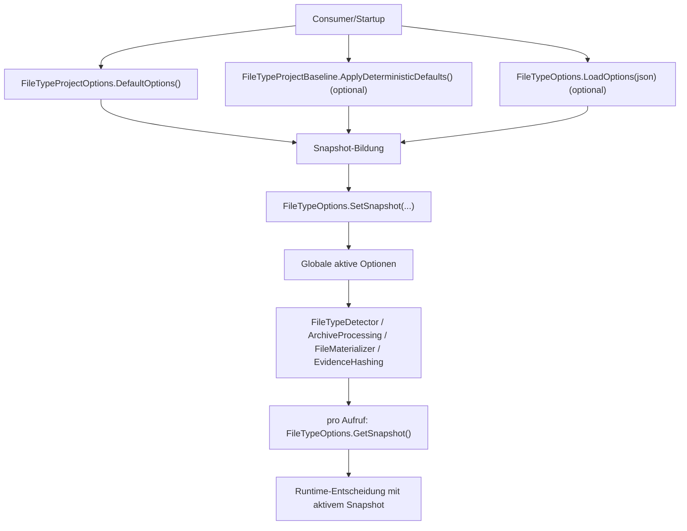
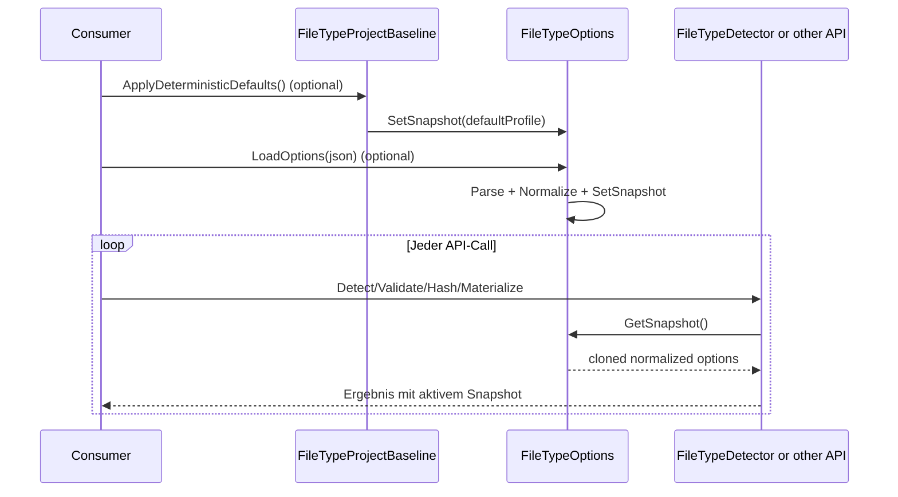

<!-- LANG_SWITCH:BEGIN -->
[DE](001_GUIDE_OPTIONS.MD) | [EN](101_GUIDE_OPTIONS.MD)
<!-- LANG_SWITCH:END -->

# Playbook: Create and Adjust Options

## 1. Purpose and Audience
This playbook describes a unified, binding process for new or changed options in the FileTypeDetection API.

Audience:
- developers extending `FileTypeProjectOptions` or `FileTypeOptions`
- reviewers checking completeness and fail-closed behavior
- consumers who want to understand when runtime configuration becomes active

## 2. When to use this playbook
Use this document if at least one of the following applies:
- a new option in `FileTypeProjectOptions`
- changes to existing default values
- extension of JSON load/parse or JSON export in `FileTypeOptions`
- a baseline decision in `FileTypeProjectBaseline`

## 3. Central impacted locations (file map)
| Area | File | Must be adjusted when |
|---|---|---|
| Option definition and normalize | [Details](https://github.com/tomtastisch/FileClassifier/blob/main/src/FileTypeDetection/Configuration/FileTypeProjectOptions.vb) | new property, default, normalization rule |
| JSON load/parse and snapshot set | [Details](https://github.com/tomtastisch/FileClassifier/blob/main/src/FileTypeDetection/FileTypeOptions.vb) | JSON key mapping, parse guard, `SetSnapshot` |
| JSON export | [Details](https://github.com/tomtastisch/FileClassifier/blob/main/src/FileTypeDetection/FileTypeOptions.vb) | `GetOptions()` for snapshot visibility |
| Baseline values | [Details](https://github.com/tomtastisch/FileClassifier/blob/main/src/FileTypeDetection/Configuration/FileTypeProjectBaseline.vb) | production defaults (`ApplyDeterministicDefaults`) |
| Unit tests (options) | [Details](https://github.com/tomtastisch/FileClassifier/blob/main/tests/FileTypeDetectionLib.Tests/Unit/FileTypeOptionsFacadeUnitTests.cs) | parse/export/normalize behavior |
| Unit tests (baseline) | [Details](https://github.com/tomtastisch/FileClassifier/blob/main/tests/FileTypeDetectionLib.Tests/Unit/FileTypeProjectBaselineUnitTests.cs) | baseline default values |

## 4. Step-by-step checklist (process)
Work through these steps in order:

- [ ] Step 1: Create or adjust the option in `FileTypeProjectOptions` (including default value).
- [ ] Step 2: Update `NormalizeInPlace()` for fail-closed limits.
- [ ] Step 3: Extend JSON parsing in `FileTypeOptions.LoadOptions(json)`.
- [ ] Step 4: Extend JSON export in `FileTypeOptions.GetOptions()`.
- [ ] Step 5: Make a baseline decision in `FileTypeProjectBaseline`.
- [ ] Step 6: Update unit tests in `FileTypeOptionsFacadeUnitTests` and, if needed, `FileTypeProjectBaselineUnitTests`.
- [ ] Step 7: Update doc references in `docs/*` and, if needed, `src/*/README.md`.
- [ ] Step 8: Run verification (see section 8).

## 5. Example (concrete)
### Example: New scalar option `MaxArchiveCommentBytes`
Assume a new long option should bound archive comment size.

1. In `FileTypeProjectOptions.vb`, add property + default, e.g. `Public Property MaxArchiveCommentBytes As Long = ...`.
2. In `NormalizeInPlace()`, normalize to a minimum (`>= 1`).
3. In `FileTypeOptions.LoadOptions(json)`, parse key `maxArchiveCommentBytes`.
4. In `FileTypeOptions.GetOptions()`, include the value in the JSON output.
5. In `FileTypeProjectBaseline.vb`, decide deliberately whether a stricter baseline value is set.
6. In `FileTypeOptionsFacadeUnitTests.cs`, add tests for valid/invalid values and JSON roundtrip.

Example JSON for consumers:

```json
{
  "maxArchiveCommentBytes": 8192
}
```

## 6. Runtime activation
### 6.1 Flowchart (activation and loading)


### 6.2 Sequence (runtime read behavior)


## 7. Implementation checklist and done criteria
### 7.1 Implementation checklist
- [ ] Option added in `FileTypeProjectOptions` including default and type.
- [ ] `NormalizeInPlace()` updated for fail-closed limits.
- [ ] `FileTypeOptions.LoadOptions(json)` parse path extended for the new option.
- [ ] `FileTypeOptions.GetOptions()` serializes the option visibly.
- [ ] Baseline decision (`FileTypeProjectBaseline`) made explicitly.
- [ ] Unit tests for parse/export/normalize added or adjusted.
- [ ] Doc links updated in `docs/*` and, if needed, `src/*/README.md`.

### 7.2 Done criteria
An option change is done only if:
1. values are normalized deterministically and fail-closed,
2. JSON load and JSON export are consistent,
3. baseline intent is documented,
4. tests cover the change (happy path + invalid input),
5. Markdown links are valid.

## 8. Verification (commands)
```bash
python3 tools/check-docs.py
dotnet test tests/FileTypeDetectionLib.Tests/FileTypeDetectionLib.Tests.csproj --filter "FullyQualifiedName~FileTypeOptionsFacadeUnitTests|FullyQualifiedName~FileTypeProjectBaselineUnitTests" -v minimal
```

## 9. Typical failure modes and fail-closed hints
| Failure mode | Effect | Countermeasure |
|---|---|---|
| Property in `FileTypeProjectOptions`, but no parse in `LoadOptions` | option is never configurable via JSON | add parse case + test |
| Parse exists, but no export in `GetOptions` | snapshot is opaque to consumers | add `GetOptions` + JsonDocument test |
| No normalize guard for numeric limits | undefined runtime behavior on invalid values | add `NormalizeInPlace` + invalid-value tests |
| Baseline value forgotten | production profile is inconsistent | update `FileTypeProjectBaseline` + baseline test |
| Nested object is only shallow-copied | side effects/leaks across snapshots | harden `Clone`/`Normalize` for nested options |

## 10. Non-Goals
- No change to API semantics without accompanying contract documentation.
- No silent security relaxations without an explicit risk decision.

## Documentation Maintenance Checklist
- [ ] Content verified against current code state.
- [ ] Links and anchors checked with `python3 tools/check-docs.py`.
- [ ] Examples/commands verified locally.
- [ ] Terminology aligned with `docs/110_API_CORE.MD`.
