<!-- LANG_SWITCH:BEGIN -->
[DE](002_GUIDE_DATATYPE.MD) | [EN](102_GUIDE_DATATYPE.MD)
<!-- LANG_SWITCH:END -->

# Playbook: Extend New Datatypes and API Models

## 1. Purpose and Audience
This playbook describes a unified, binding process for:
1. new detectable formats via `FileKind` + `FileTypeRegistry`
2. new API models under `Abstractions/*`

Audience:
- developers extending detection/registry/abstractions
- reviewers ensuring consistency and fail-closed behavior
- consumers who need to understand effects on API outputs

## 2. When to use this playbook
| Intent | Relevant section |
|---|---|
| New file type (e.g. new magic signature) | sections 3 and 4 |
| New return model for public API | sections 5 and 6 |
| New format plus new model | sections 3 through 6 |

## 3. New `FileKind` formats: central locations
### 3.1 Required files
| Area | File | Task |
|---|---|---|
| Public kind list | [Details](https://github.com/tomtastisch/FileClassifier/blob/main/src/FileTypeDetection/Abstractions/Detection/FileKind.vb) | add enum value |
| SSOT metadata and magic | [Details](https://github.com/tomtastisch/FileClassifier/blob/main/src/FileTypeDetection/Detection/FileTypeRegistry.vb) | extension/alias/magic and resolve behavior |
| Detection details | [Detection module](https://github.com/tomtastisch/FileClassifier/blob/main/src/FileTypeDetection/Detection/README.md) | update domain explanation |
| Registry tests | [Details](https://github.com/tomtastisch/FileClassifier/blob/main/tests/FileTypeDetectionLib.Tests/Unit/FileTypeRegistryUnitTests.cs) | validate resolve/alias/magic |

### 3.2 Registry points that must be checked
- `ExtensionOverrides` (only if `CanonicalExtension` differs from enum name)
- `AliasOverrides` (legacy/compatibility aliases)
- `BuildMagicPatternCatalog()` (magic pattern ingestion)
- `HasStructuredContainerDetection()` (if the new kind needs structured refinement)
- indirect impact on `KindsWithoutDirectContentDetection()`

### 3.3 For new container types additionally
- Check [Infrastructure module](https://github.com/tomtastisch/FileClassifier/blob/main/src/FileTypeDetection/Infrastructure/README.md) whether the gate/extractor already supports the container.
- If not: extend the infrastructure path and carry security gates (depth, size, traversal, links).

## 4. Step-by-step checklist for new `FileKind`
- [ ] Step 1: Add enum value in `FileKind.vb`.
- [ ] Step 2: Update `FileTypeRegistry.vb` (extension/alias/magic).
- [ ] Step 3: If needed, extend `HasStructuredContainerDetection()`.
- [ ] Step 4: Add tests for resolve/alias/magic/fail-closed.
- [ ] Step 5: Update docs in `docs/110_API_CORE.MD`, `docs/120_ARCH_CORE.MD`, `docs/references/101_REFERENCES_CORE.MD`.
- [ ] Step 6: Run verification (section 9).

## 5. New API models (`Abstractions/*`): central locations
### 5.1 Required files
| Area | File | Task |
|---|---|---|
| Model overview | [Abstractions module](https://github.com/tomtastisch/FileClassifier/blob/main/src/FileTypeDetection/Abstractions/README.md) | choose model area (`Detection`, `Archive`, `Hashing`) |
| Model class/enum | `src/FileTypeDetection/Abstractions/<Area>/<Type>.vb` | define new type |
| Area README | `src/FileTypeDetection/Abstractions/<Area>/README.md` | add type to index |
| API catalog | [01 - API functions](https://github.com/tomtastisch/FileClassifier/blob/main/docs/110_API_CORE.MD) | register new/changed return models |
| References | [03 - References](https://github.com/tomtastisch/FileClassifier/blob/main/docs/references/101_REFERENCES_CORE.MD) | update model and path references |
| Contract docs (if relevant) | `docs/contracts/*.MD` | only for contract-relevant signature/contract changes |

### 5.2 Model rules
- Models remain immutable-oriented and contain no I/O logic.
- `Unknown`/fail-closed semantics must not be relaxed.
- Existing consumer contracts stay stable or are flagged as breaking changes.

## 6. Step-by-step checklist for new API models
- [ ] Step 1: Create model in the appropriate abstractions subfolder.
- [ ] Step 2: Update area README and `Abstractions/README.md`.
- [ ] Step 3: Register usage in public API docs (`docs/110_API_CORE.MD`, `docs/references/101_REFERENCES_CORE.MD`).
- [ ] Step 4: If the API contract is affected, update the relevant file under `docs/contracts/*.MD`.
- [ ] Step 5: Add unit/integration tests for the new model behavior.
- [ ] Step 6: Run verification (section 9).

## 7. Examples (concrete)
### 7.1 Example A: New `FileKind` `Tiff`
1. `FileKind.vb`: add enum value `Tiff`.
2. `FileTypeRegistry.vb`: add TIFF magic and alias `tif`/`tiff`.
3. `FileTypeRegistryUnitTests.cs`: add new assertions for `ResolveByAlias("tif")` and magic match.
4. Extend docs in `docs/110_API_CORE.MD` and `docs/references/101_REFERENCES_CORE.MD`.

### 7.2 Example B: New model `<NewModel>`
1. Create file `src/FileTypeDetection/Abstractions/Hashing/<NewModel>.vb`.
2. Update `src/FileTypeDetection/Abstractions/Hashing/README.md` and `src/FileTypeDetection/Abstractions/README.md`.
3. Add model in `docs/110_API_CORE.MD` and `docs/references/101_REFERENCES_CORE.MD`.
4. If public signatures are affected: update the relevant file under `docs/contracts/*.MD`.

## 8. Activation and loading
### 8.1 Flowchart (code -> runtime)

```mermaid
flowchart TD
    A["Codeänderung: FileKind and/or Abstractions"] --> B["Build/Test"]
    B --> C["App/Tests starten neuen Prozess"]
    C --> D["FileTypeRegistry Shared Sub New()"]
    D --> E["BuildDefinitionsFromEnum()"]
    E --> F["BuildAliasMap + BuildMagicRules"]
    F --> G["Detect* Pipeline (ReadHeader -> DetectByMagic -> Resolve)"]
    G --> H["Public Output: FileType/DetectionDetail oder neues Modell"]
```


### 8.2 Sequence (detect pipeline with registry)


## 9. Verification (commands)
```bash
python3 tools/check-docs.py
dotnet test tests/FileTypeDetectionLib.Tests/FileTypeDetectionLib.Tests.csproj --filter "FullyQualifiedName~FileTypeRegistryUnitTests|FullyQualifiedName~HeaderCoveragePolicyUnitTests" -v minimal
```

For model or contract changes additionally:
```bash
dotnet test tests/FileTypeDetectionLib.Tests/FileTypeDetectionLib.Tests.csproj --filter "FullyQualifiedName~HashingEvidenceApiContractTests|FullyQualifiedName~HashingEvidenceRoundTripTests" -v minimal
```

## 10. Implementation checklist and done criteria
### 10.1 Implementation checklist
- [ ] Enum/registry/patterns are extended consistently.
- [ ] Alias normalization is unambiguous (no conflicts).
- [ ] Fail-closed behavior is preserved for invalid inputs.
- [ ] Tests cover resolve, alias, magic, and regressions.
- [ ] Documentation levels `01/02/03` and module READMEs are updated.

### 10.2 Done criteria
A datatype/model change is done only if:
1. enum/registry/patterns resolve consistently,
2. no ambiguous alias overrides existing kinds,
3. fail-closed behavior for invalid inputs is preserved,
4. tests cover regressions for detection and mapping,
5. the documentation map is updated for developers and consumers.

## 11. Compatibility and breaking-change hints
| Change | Risk | Classification |
|---|---|---|
| New `FileKind` without changing existing signatures | usually additive extension | non-breaking, but requires tests and docs |
| Alias changes an existing mapping | existing consumers can see different results | potentially breaking |
| Remove/rename public model properties | binary/source consumers break | breaking |
| Contract doc (`docs/contracts/*.MD`) not updated despite surface change | drift between code and docs/tests | release-blocking for API governance |

## 12. Non-Goals
- No silent API surface changes without contract documentation.
- No security relaxation in archive paths without explicit risk decision and test evidence.

## Documentation Maintenance Checklist
- [ ] Content verified against current code state.
- [ ] Links and anchors checked with `python3 tools/check-docs.py`.
- [ ] Examples/commands verified locally.
- [ ] Terminology aligned with `docs/110_API_CORE.MD`.
