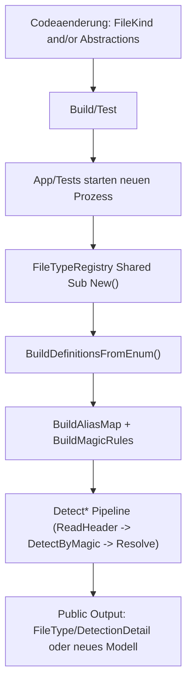
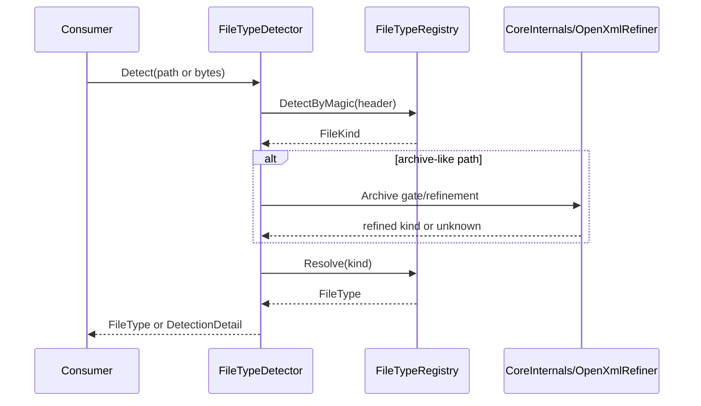

# Playbook: Neue Datatypes und API-Modelle erweitern

## 1. Zweck und Entscheidungsmatrix
Dieses Playbook deckt zwei Aenderungsarten ab:
1. neue erkennbare Formate ueber `FileKind` + `FileTypeRegistry`
2. neue API-Modelle unter `Abstractions/*`

| Vorhaben | Pfad |
|---|---|
| Neuer Dateityp (z. B. neue Magic-Signatur) | Abschnitt 2 |
| Neues Rueckgabemodell fuer Public API | Abschnitt 3 |
| Neues Format plus neues Modell | Abschnitte 2 und 3 in Kombination |

## 2. Neue `FileKind`-Formate: zentrale Stellen
### 2.1 Pflichtdateien
| Bereich | Datei | Aufgabe |
|---|---|---|
| Oeffentliche Typliste | [`../../src/FileTypeDetection/Abstractions/Detection/FileKind.vb`](../../src/FileTypeDetection/Abstractions/Detection/FileKind.vb) | Enum-Wert ergaenzen |
| SSOT Metadaten und Magic | [`../../src/FileTypeDetection/Detection/FileTypeRegistry.vb`](../../src/FileTypeDetection/Detection/FileTypeRegistry.vb) | Extension/Alias/Magic und Resolve-Verhalten |
| Detection-Details | [`../../src/FileTypeDetection/Detection/README.md`](../../src/FileTypeDetection/Detection/README.md) | fachliche Erklaerung nachziehen |

### 2.2 Registry-Punkte, die geprueft werden muessen
- `ExtensionOverrides` (nur falls CanonicalExtension vom Enum-Namen abweicht)
- `AliasOverrides` (Legacy-/Kompatibilitaets-Aliase)
- `BuildMagicPatternCatalog()` (Magic-Pattern Aufnahme)
- `HasStructuredContainerDetection()` (falls neuer Typ strukturierte Verfeinerung braucht)
- indirekte Auswirkungen auf `KindsWithoutDirectContentDetection()`

### 2.3 Bei neuen Containerarten zusaetzlich
- `src/FileTypeDetection/Infrastructure/*` pruefen, ob Gate/Extractor den Container bereits traegt.
- Falls nein: Infrastrukturpfad erweitern und Security-Gates (Depth, Size, Traversal, Links) mitziehen.

## 3. Neue API-Modelle (`Abstractions/*`): zentrale Stellen
### 3.1 Pflichtdateien
| Bereich | Datei | Aufgabe |
|---|---|---|
| Modellklasse/enum | `src/FileTypeDetection/Abstractions/*` | neuen Typ definieren |
| Teilbereich README | `src/FileTypeDetection/Abstractions/*/README.md` | Typ in Index aufnehmen |
| Gesamtindex Modelle | [`../../src/FileTypeDetection/Abstractions/README.md`](../../src/FileTypeDetection/Abstractions/README.md) | Referenzliste aktualisieren |
| API-Katalog | [`../01_FUNCTIONS.md`](../01_FUNCTIONS.md) | neue/veraenderte Rueckgabemodelle eintragen |
| Referenzen | [`../03_REFERENCES.md`](../03_REFERENCES.md) | Modell- und Pfadreferenzen aktualisieren |
| Contract-Doku (falls relevant) | `../04_*.md` | nur bei Contract-relevanten Signatur-/Vertragsaenderungen |

### 3.2 Modellregeln
- Modelle bleiben immutable orientiert und ohne I/O-Logik.
- `Unknown`/fail-closed Semantik darf nicht aufgeweicht werden.
- Bestehende Consumer-Vertraege bleiben stabil oder werden als Breaking Change ausgewiesen.

## 4. Aktivierung und Einlesen
### 4.1 Flowchart (Code -> Runtime)


### 4.2 Sequence (Detect-Pipeline mit Registry)


## 5. Verbindliche Checklist und Done-Kriterien
### 5.1 Implementierungs-Checklist
- [ ] Neuer Enum-Wert in `FileKind.vb` angelegt (falls Format-Erweiterung).
- [ ] Registry um Extension/Alias/Magic erweitert, ohne Alias-Konflikt.
- [ ] Strukturierte Verfeinerung geprueft (`HasStructuredContainerDetection`) falls notwendig.
- [ ] Bei neuer Containerlogik: `Infrastructure/*` und Security-Gates geprueft.
- [ ] Tests fuer Resolve, Alias, Magic und fail-closed Verhalten aktualisiert.
- [ ] Doku-Ebenen `docs/01_FUNCTIONS.md`, `docs/02_ARCHITECTURE_AND_FLOWS.md`, `docs/03_REFERENCES.md` aktualisiert.
- [ ] Modul-READMEs unter `src/FileTypeDetection/*` angepasst.

### 5.2 Done-Kriterien
Eine Datatype-/Modellaenderung ist nur dann fertig, wenn:
1. Enum/Registry/Patterns konsistent aufloesen.
2. Kein mehrdeutiger Alias bestehende Typen ueberschreibt.
3. fail-closed Verhalten bei ungueltigen Eingaben erhalten bleibt.
4. Tests Regressionen fuer Detection und Mapping abdecken.
5. Doku-Landkarte fuer Entwickler und Verwender aktualisiert ist.

## 6. Verifikation (Kommandos)
```bash
python3 tools/check-markdown-links.py
dotnet test tests/FileTypeDetectionLib.Tests/FileTypeDetectionLib.Tests.csproj --filter "FullyQualifiedName~FileTypeRegistryUnitTests|FullyQualifiedName~HeaderCoveragePolicyUnitTests" -v minimal
```

Bei Modell- oder Contract-Aenderungen zusaetzlich:
```bash
dotnet test tests/FileTypeDetectionLib.Tests/FileTypeDetectionLib.Tests.csproj --filter "FullyQualifiedName~DeterministicHashingApiContractUnitTests|FullyQualifiedName~DeterministicHashingIntegrationTests" -v minimal
```

## 7. Kompatibilitaets- und Breaking-Change-Hinweise
| Aenderung | Risiko | Einordnung |
|---|---|---|
| Neuer `FileKind` ohne bestehende Signaturen zu aendern | meist additive Erweiterung | non-breaking, aber Test- und Doku-Pflicht |
| Alias aendert bestehendes Mapping | bestehende Consumer koennen anderes Ergebnis sehen | potentiell breaking |
| Oeffentliche Modellproperties entfernen/umbenennen | Binary/Source-Consumer brechen | breaking |
| Contract-Dokument (`docs/04_*`) nicht aktualisiert trotz Surface-Aenderung | Drift zwischen Code und Doku/Tests | release-blocking fuer API-Governance |

## 8. Nicht-Ziele
- Keine stillen API-Surface-Aenderungen ohne Contract-Dokumentation.
- Keine Sicherheitslockerung im Archivpfad ohne explizite Risikoentscheidung und Testnachweis.
