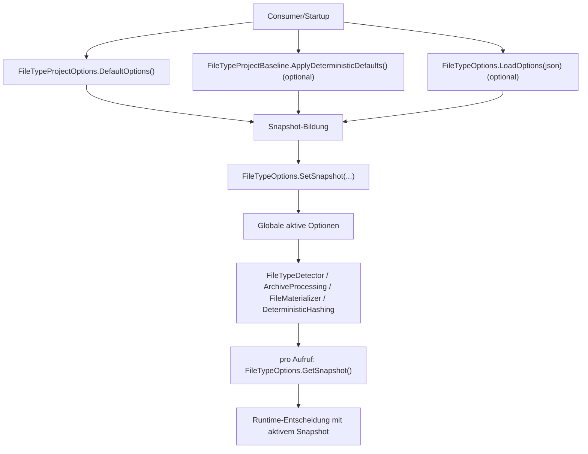
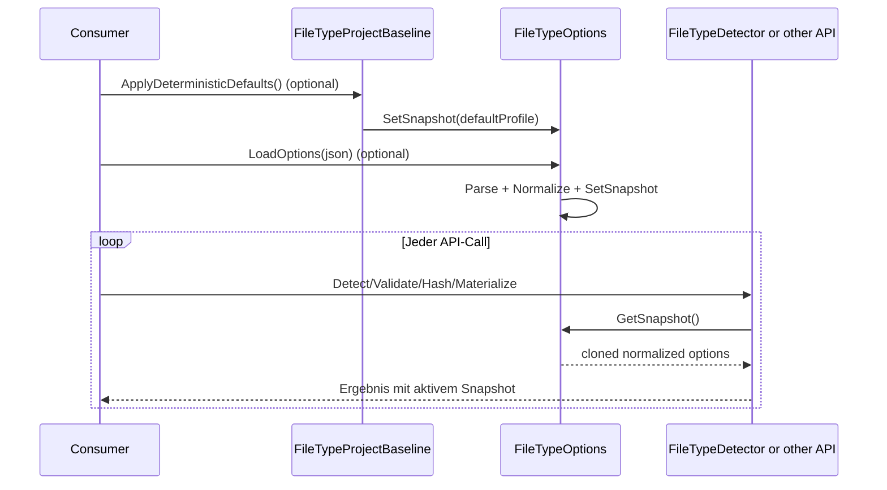

# Playbook: Options anlegen und anpassen

## 1. Zweck und Zielgruppe
Dieses Playbook beschreibt den verbindlichen Ablauf fuer neue oder geaenderte Optionen in der FileTypeDetection-API.

Zielgruppe:
- Entwickler, die `FileTypeProjectOptions` oder `FileTypeOptions` erweitern
- Reviewer, die Vollstaendigkeit und fail-closed Verhalten pruefen
- Verwender, die verstehen wollen, wann Runtime-Konfiguration aktiv wird

## 2. Zentral betroffene Stellen (Datei-Map)
| Bereich | Datei | Muss angepasst werden bei |
|---|---|---|
| Option-Definition und Normalize | [`../../src/FileTypeDetection/Configuration/FileTypeProjectOptions.vb`](../../src/FileTypeDetection/Configuration/FileTypeProjectOptions.vb) | neue Property, Default, Normalisierungsregel |
| JSON Load/Parse und Snapshot-Set | [`../../src/FileTypeDetection/FileTypeOptions.vb`](../../src/FileTypeDetection/FileTypeOptions.vb) | JSON key mapping, parse guard, `SetSnapshot` |
| JSON Export | [`../../src/FileTypeDetection/FileTypeOptions.vb`](../../src/FileTypeDetection/FileTypeOptions.vb) | `GetOptions()` fuer Snapshot-Sicht |
| Baseline-Werte | [`../../src/FileTypeDetection/Configuration/FileTypeProjectBaseline.vb`](../../src/FileTypeDetection/Configuration/FileTypeProjectBaseline.vb) | produktive Defaults (`ApplyDeterministicDefaults`) |
| Unit Tests (Options) | [`../../tests/FileTypeDetectionLib.Tests/Unit/FileTypeOptionsFacadeUnitTests.cs`](../../tests/FileTypeDetectionLib.Tests/Unit/FileTypeOptionsFacadeUnitTests.cs) | parse/export/normalize behavior |
| Unit Tests (Baseline) | [`../../tests/FileTypeDetectionLib.Tests/Unit/FileTypeProjectBaselineUnitTests.cs`](../../tests/FileTypeDetectionLib.Tests/Unit/FileTypeProjectBaselineUnitTests.cs) | Baseline-Defaultwerte |

## 3. Aenderungstypen
### 3.1 Neue Scalar Option
Beispiel: `Integer`, `Long`, `Boolean`.
1. Property in `FileTypeProjectOptions` anlegen (inkl. sinnvollem Default).
2. `NormalizeInPlace()` um fail-closed Guard erweitern.
3. Parse-Pfad in `FileTypeOptions.LoadOptions(json)` erweitern.
4. Export in `FileTypeOptions.GetOptions()` ergaenzen.
5. Baseline-Entscheidung in `FileTypeProjectBaseline` treffen und dokumentieren.
6. Tests fuer gueltige und ungueltige Werte ergaenzen.

### 3.2 Neue Nested Option
Beispiel: Unterobjekt wie `DeterministicHash`.
1. Objekt in `FileTypeProjectOptions` definieren/erweitern.
2. Dedicated parse helper in `FileTypeOptions` nutzen oder erweitern.
3. Objekt in `GetOptions()` vollstaendig serialisieren.
4. `Normalize`/`Clone`-Pfade auf tiefe Kopie und Sanitizing pruefen.
5. Tests fuer nested JSON + unbekannte Keys + invalid values.

### 3.3 Anpassung von Defaults/Normalization
1. Default-Wert in `FileTypeProjectOptions` und ggf. Baseline in `FileTypeProjectBaseline` konsistent halten.
2. Unit-Tests auf neue Grenzwerte aktualisieren.
3. Risikohinweis in Doku ergaenzen, falls strengere Limits zu mehr `Unknown`/`False` fuehren.

## 4. Aktivierung zur Laufzeit
### 4.1 Flowchart (Aktivierung und Einlesen)


### 4.2 Sequence (Runtime-Leseverhalten)


## 5. Verbindliche Checklist und Done-Kriterien
### 5.1 Implementierungs-Checklist
- [ ] Option in `FileTypeProjectOptions` inkl. Default und Typ hinzugefuegt.
- [ ] `NormalizeInPlace()` fuer fail-closed Grenzen aktualisiert.
- [ ] `FileTypeOptions.LoadOptions(json)` parse path fuer neue Option erweitert.
- [ ] `FileTypeOptions.GetOptions()` serialisiert die Option sichtbar.
- [ ] Baseline-Entscheidung (`FileTypeProjectBaseline`) explizit getroffen.
- [ ] Unit-Tests fuer parse/export/normalize hinzugefuegt oder angepasst.
- [ ] Doku-Links in `docs/*` und ggf. `src/*/README.md` aktualisiert.

### 5.2 Done-Kriterien
Eine Optionsaenderung ist nur dann fertig, wenn:
1. Werte deterministisch und fail-closed normalisiert werden.
2. JSON-Load und JSON-Export konsistent sind.
3. Baseline-Intent dokumentiert ist.
4. Tests die Aenderung abdecken (Happy Path + Invalid Input).
5. Markdown-Links gueltig sind.

## 6. Verifikation (Kommandos)
```bash
python3 tools/check-markdown-links.py
dotnet test tests/FileTypeDetectionLib.Tests/FileTypeDetectionLib.Tests.csproj --filter "FullyQualifiedName~FileTypeOptionsFacadeUnitTests|FullyQualifiedName~FileTypeProjectBaselineUnitTests" -v minimal
```

## 7. Typische Fehlerbilder und fail-closed Hinweise
| Fehlerbild | Auswirkung | Gegenmassnahme |
|---|---|---|
| Property in `FileTypeProjectOptions`, aber kein Parse in `LoadOptions` | Option bleibt nie per JSON setzbar | parse case + Test ergaenzen |
| Parse vorhanden, aber kein Export in `GetOptions` | Snapshot ist intransparent fuer Verwender | `GetOptions` + JsonDocument-Test ergaenzen |
| Kein Normalize-Guard fuer numerische Grenzen | undefiniertes Runtime-Verhalten bei invalid values | `NormalizeInPlace` + invalid-value Tests |
| Baseline-Wert vergessen | Produktionsprofil inkonsistent | `FileTypeProjectBaseline` + Baseline-Test updaten |
| Nested-Objekt nur flach kopiert | Seiteneffekte/Lecks ueber Snapshots | `Clone`/`Normalize` fuer nested options absichern |

## 8. Nicht-Ziele
- Keine Aenderung der API-Semantik ohne begleitende Contract-Dokumentation.
- Keine stillen Sicherheitslockerungen ohne expliziten Risikoentscheid.
