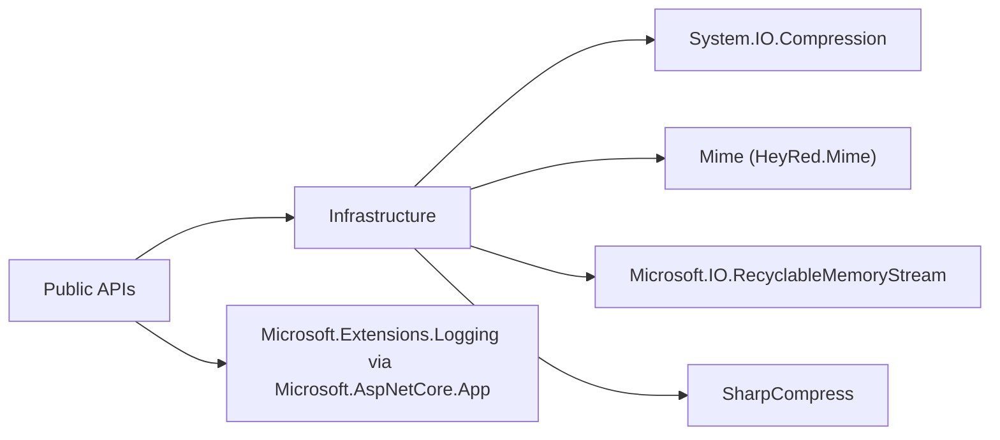

# 03 - References

## 1. Purpose & Scope
This document collects static API references: internal file paths, external dependencies, return models, and ReasonCodes.

## 2. Public Return Models
| Type | Public members | Purpose |
|---|---|---|
| `FileKind` | enum values (e.g. `Unknown`, `Pdf`, `Zip`, `Docx`) | canonical type classification |
| `FileType` | `Kind`, `CanonicalExtension`, `Mime`, `Allowed`, `Aliases` | content-based type decision |
| `DetectionDetail` | `DetectedType`, `ReasonCode`, `UsedZipContentCheck`, `UsedStructuredRefinement`, `ExtensionVerified` | auditable detailed result |
| `ZipExtractedEntry` | `RelativePath`, `Content`, `Size`, `OpenReadOnlyStream()` | safe in-memory extracted entry |
| `FileTypeProjectOptions` | `HeaderOnlyNonZip`, `MaxBytes`, `SniffBytes`, `MaxZipEntries`, `MaxZipTotalUncompressedBytes`, `MaxZipEntryUncompressedBytes`, `MaxZipCompressionRatio`, `MaxZipNestingDepth`, `MaxZipNestedBytes`, `RejectArchiveLinks`, `AllowUnknownArchiveEntrySize`, `DeterministicHash`, `Logger` | global options model |

## 2.1 Model paths in the repository (abstractions split)
| Area | README | File(s) |
|---|---|---|
| Detection | `src/FileTypeDetection/Abstractions/Detection/README.md` | `src/FileTypeDetection/Abstractions/Detection/FileKind.vb`, `src/FileTypeDetection/Abstractions/Detection/FileType.vb`, `src/FileTypeDetection/Abstractions/Detection/DetectionDetail.vb` |
| Archive | `src/FileTypeDetection/Abstractions/Archive/README.md` | `src/FileTypeDetection/Abstractions/Archive/ZipExtractedEntry.vb` |
| Hashing | `src/FileTypeDetection/Abstractions/Hashing/README.md` | `src/FileTypeDetection/Abstractions/Hashing/HashSourceType.vb`, `src/FileTypeDetection/Abstractions/Hashing/HashDigestSet.vb`, `src/FileTypeDetection/Abstractions/Hashing/HashEvidence.vb`, `src/FileTypeDetection/Abstractions/Hashing/HashRoundTripReport.vb`, `src/FileTypeDetection/Abstractions/Hashing/HashOptions.vb` |

## 3. ReasonCode reference (DetectDetailed)
Source: `FileTypeDetector.vb`.

| ReasonCode | Meaning |
|---|---|
| `Unknown` | no reliable detection |
| `FileNotFound` | input file is missing |
| `InvalidLength` | file length is invalid |
| `FileTooLarge` | `MaxBytes` exceeded |
| `Exception` | exception in the detection path |
| `ExceptionUnauthorizedAccess` | `UnauthorizedAccessException` in the detection path |
| `ExceptionSecurity` | `System.Security.SecurityException` in the detection path |
| `ExceptionIO` | `IOException` in the detection path |
| `ExceptionInvalidData` | `InvalidDataException` in the detection path |
| `ExceptionNotSupported` | `NotSupportedException` in the detection path |
| `ExceptionArgument` | `ArgumentException` in the detection path |
| `ExtensionMismatch` | extension does not match the detected kind |
| `HeaderUnknown` | header magic insufficient/unknown |
| `HeaderMatch` | header magic detected the kind directly |
| `ArchiveGateFailed` | archive safety check failed |
| `ArchiveStructuredRefined` | archive was refined structurally (e.g. OOXML) |
| `ArchiveRefined` | archive kind was refined by content |
| `ArchiveGeneric` | archive stayed generic |

## 4. Internal core paths (guided reading)
| Internal path | File | Meaning | Detail README |
|---|---|---|---|
| Header/type SSOT | `Detection/FileTypeRegistry.vb` | header magic, aliases, canonical extensions | [Detection module](https://github.com/tomtastisch/FileClassifier/blob/main/src/FileTypeDetection/Detection/README.md) |
| Core guards | `Infrastructure/CoreInternals.vb` | bounds, security gates, path guards | [Infrastructure module](https://github.com/tomtastisch/FileClassifier/blob/main/src/FileTypeDetection/Infrastructure/README.md) |
| Managed archive internals | `Infrastructure/ArchiveManagedInternals.vb` | archive iteration and managed-backend adapter (incl. ZIP) | [Infrastructure module](https://github.com/tomtastisch/FileClassifier/blob/main/src/FileTypeDetection/Infrastructure/README.md) |
| Archive internals | `Infrastructure/ArchiveInternals.vb` | archive dispatch, entry adapters, generic extractor | [Infrastructure module](https://github.com/tomtastisch/FileClassifier/blob/main/src/FileTypeDetection/Infrastructure/README.md) |
| MIME resolution | `Infrastructure/MimeProvider.vb` | MIME mapping | [Infrastructure module](https://github.com/tomtastisch/FileClassifier/blob/main/src/FileTypeDetection/Infrastructure/README.md) |

## 5. External dependencies
### 5.1 Diagram


### 5.2 Table
| Package/framework | Used in | Purpose |
|---|---|---|
| `System.IO.Compression` (BCL) | `Infrastructure/CoreInternals.vb`, `Infrastructure/ArchiveManagedInternals.vb` | read/iterate archive data (ZIP backend via BCL) |
| `Mime` | `Infrastructure/MimeProvider.vb` | MIME resolution from extension |
| `Microsoft.IO.RecyclableMemoryStream` | `Infrastructure/ArchiveManagedInternals.vb` | controlled memory streams |
| `SharpCompress` | `Infrastructure/ArchiveInternals.vb`, `FileMaterializer.vb` | archive type detection, generic archive iteration, defensive readability check |
| `Microsoft.AspNetCore.App` (FrameworkReference) | logging via `Microsoft.Extensions.Logging` | optional diagnostics |

## 6. Reference index (where to find what?)
| Topic | Primary document |
|---|---|
| Public signatures + examples | `docs/110_API_CORE.MD` |
| E2E architecture + sequences | `docs/120_ARCH_CORE.MD` |
| Normative requirements | `docs/specs/101_SPEC_DIN.MD` |
| Module overview | [Module README: FileTypeDetection](https://github.com/tomtastisch/FileClassifier/blob/main/src/FileTypeDetection/README.md) |
| Subfolder details | [Detection README](https://github.com/tomtastisch/FileClassifier/blob/main/src/FileTypeDetection/Detection/README.md), [Infrastructure README](https://github.com/tomtastisch/FileClassifier/blob/main/src/FileTypeDetection/Infrastructure/README.md), [Configuration README](https://github.com/tomtastisch/FileClassifier/blob/main/src/FileTypeDetection/Configuration/README.md), [Abstractions README](https://github.com/tomtastisch/FileClassifier/blob/main/src/FileTypeDetection/Abstractions/README.md), [Abstractions: Detection README](https://github.com/tomtastisch/FileClassifier/blob/main/src/FileTypeDetection/Abstractions/Detection/README.md), [Abstractions: Archive README](https://github.com/tomtastisch/FileClassifier/blob/main/src/FileTypeDetection/Abstractions/Archive/README.md), [Abstractions: Hashing README](https://github.com/tomtastisch/FileClassifier/blob/main/src/FileTypeDetection/Abstractions/Hashing/README.md), [CLI README](https://github.com/tomtastisch/FileClassifier/blob/main/src/FileClassifier.App/README.md) |

## 6.1 Change playbooks
| Topic | Guide |
|---|---|
| Create/adjust options | `docs/guides/101_GUIDE_OPTIONS.MD` |
| Extend new datatypes/API models | `docs/guides/102_GUIDE_DATATYPE.MD` |
| Guides index | `docs/guides/100_INDEX_GUIDES.MD` |

## 7. Verification references
Recommended release checks:
```bash
dotnet restore FileClassifier.sln -v minimal
dotnet build FileClassifier.sln --no-restore -v minimal
dotnet test tests/FileTypeDetectionLib.Tests/FileTypeDetectionLib.Tests.csproj --no-build -v minimal
```

## Documentation Maintenance Checklist
- [ ] Content verified against current code state.
- [ ] Links and anchors checked with `python3 tools/check-docs.py`.
- [ ] Examples/commands verified locally.
- [ ] Terminology aligned with `docs/110_API_CORE.MD`.
