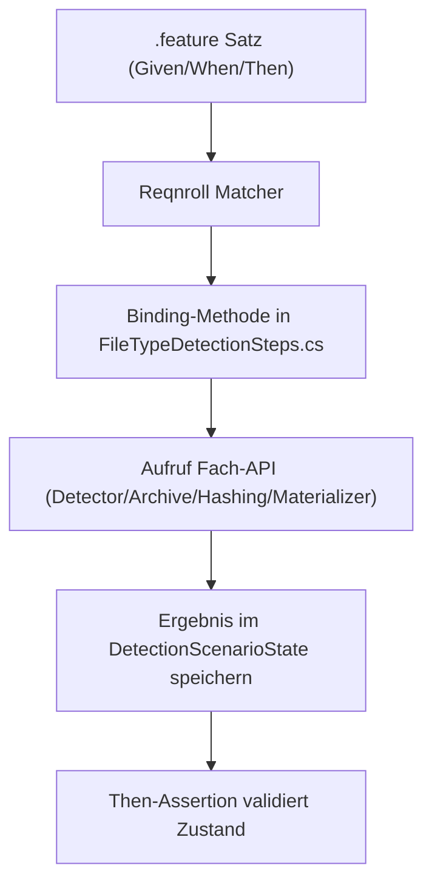
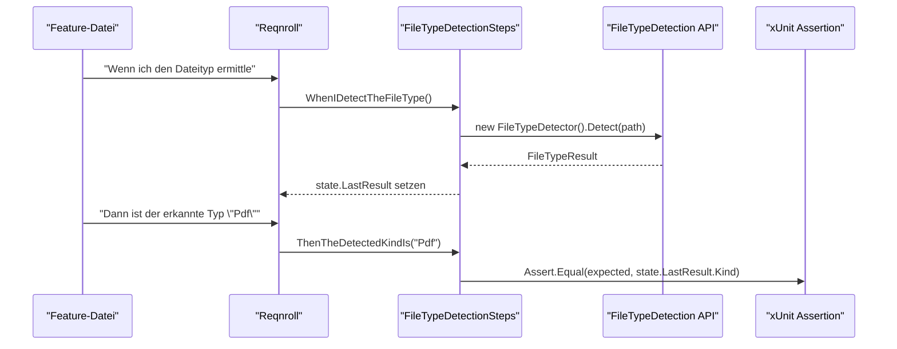
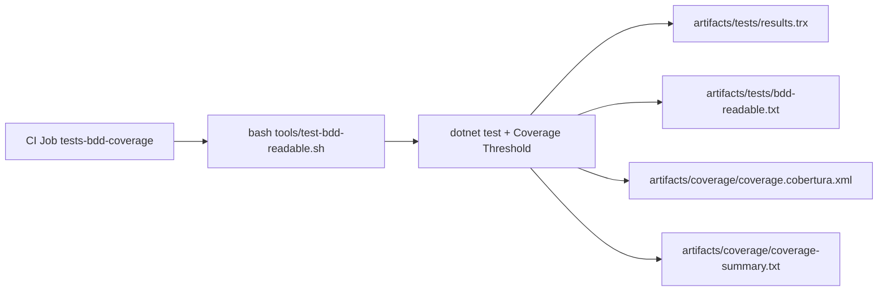

# BDD-Ausfuehrung und Gherkin-Flow

## 1. Zweck
Dieses Dokument beschreibt den End-to-End-Ablauf der BDD-Tests: vom Gherkin-Satz ueber Step-Binding bis zur ausgefuehrten Fachmethode.

## 2. Geltungsbereich
- Feature-Saetze unter `tests/FileTypeDetectionLib.Tests/Features/`
- Step-Bindings in `tests/FileTypeDetectionLib.Tests/Steps/FileTypeDetectionSteps.cs`
- Ausfuehrung ueber `tools/test-bdd-readable.sh`

## 3. Ablaufmodell


## 4. Gherkin zu Methode zu Funktion


## 5. Satzarten und Verantwortungen
| Satzart | Verantwortungsziel | Typischer Inhalt |
|---|---|---|
| `Given` | Startzustand herstellen | Ressource laden, Temp-Verzeichnis anlegen, Limits setzen |
| `When` | Fachaktion ausfuehren | Detect, Validate, Extract, Persist, Hashing |
| `Then` | Ergebnis verifizieren | Typ, Bool-Ergebnis, Dateiexistenz, Hash-Konsistenz |

## 6. Warum der Ansatz deterministisch ist
- Feature-Saetze sind kanonisch und eindeutig.
- Jeder Satz mappt auf genau eine Binding-Methode.
- Ergebniszustand wird zentral in `DetectionScenarioState` gehalten.
- Assertions pruefen nur diesen Zustand und nicht implizite Nebeneffekte.

## 7. CI-Integration


## 8. Verifikation
```bash
bash tools/test-bdd-readable.sh
TEST_BDD_OUTPUT_DIR=artifacts/tests bash tools/test-bdd-readable.sh -- \
  /p:CollectCoverage=true \
  /p:Include="[FileTypeDetectionLib]*" \
  /p:CoverletOutputFormat=cobertura \
  /p:CoverletOutput="$(pwd)/artifacts/coverage/coverage" \
  /p:Threshold=85%2c69 \
  /p:ThresholdType=line%2cbranch \
  /p:ThresholdStat=total
```

## 9. Verlinkte SSOT-Quellen
- [BDD-Satzkatalog (Deutsch, kanonisch)](https://github.com/tomtastisch/FileClassifier/blob/main/docs/tests/003_CATALOG_BDD.MD)
- [CI-Pipeline (SSOT)](https://github.com/tomtastisch/FileClassifier/blob/main/docs/ci/001_PIPELINE_CI.MD)
- [Filetypedetectionsteps](https://github.com/tomtastisch/FileClassifier/blob/main/tests/FileTypeDetectionLib.Tests/Steps/FileTypeDetectionSteps.cs)
