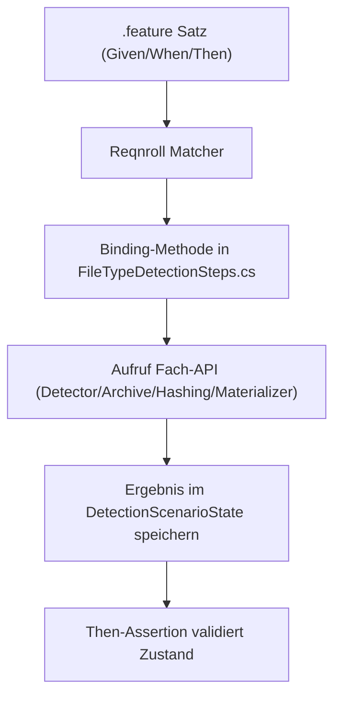
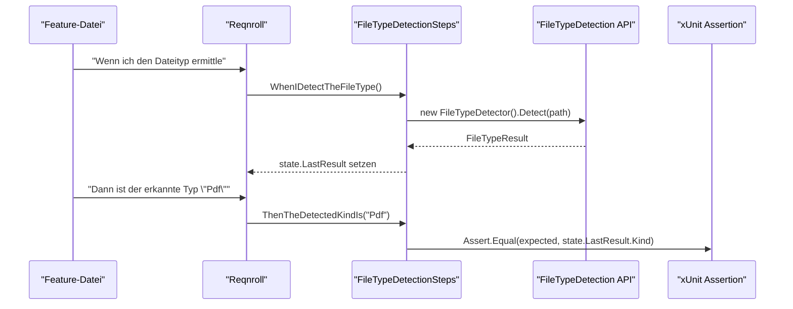
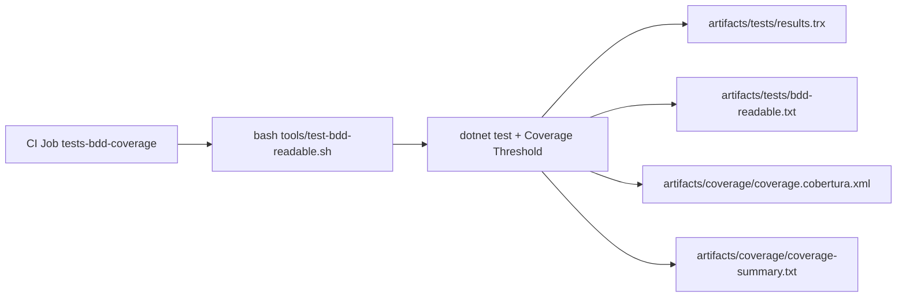

# BDD Execution and Gherkin Flow

## 1. Purpose
This document describes the end-to-end flow of the BDD tests: from the Gherkin sentence through step binding to the executed domain method.

## 2. Scope
- Feature sentences under `tests/FileTypeDetectionLib.Tests/Features/`
- Step bindings in `tests/FileTypeDetectionLib.Tests/Steps/FileTypeDetectionSteps.cs`
- Execution via `tools/test-bdd-readable.sh`

## 3. Flow Model


## 4. Gherkin -> Method -> Function


## 5. Sentence Types and Responsibilities
| Sentence type | Responsibility target | Typical content |
|---|---|---|
| `Given` | set up initial state | load resource, create temp directory, set limits |
| `When` | execute domain action | detect, validate, extract, persist, hashing |
| `Then` | verify result | kind, bool result, file existence, hash consistency |

## 6. Why the Approach Is Deterministic
- Feature sentences are canonical and unambiguous.
- Each sentence maps to exactly one binding method.
- Result state is held centrally in `DetectionScenarioState`.
- Assertions validate only that state, not implicit side effects.

## 7. CI Integration


## 8. Verification
```bash
bash tools/test-bdd-readable.sh
TEST_BDD_OUTPUT_DIR=artifacts/tests bash tools/test-bdd-readable.sh -- \
  /p:CollectCoverage=true \
  /p:Include="[FileTypeDetectionLib]*" \
  /p:CoverletOutputFormat=cobertura \
  /p:CoverletOutput="$(pwd)/artifacts/coverage/coverage" \
  /p:Threshold=85%2c69 \
  /p:ThresholdType=line%2cbranch \
  /p:ThresholdStat=total
```

## 9. Linked SSOT Sources
- [BDD catalog (German, canonical)](https://github.com/tomtastisch/FileClassifier/blob/main/docs/verification/103_CATALOG_BDD.MD)
- [CI pipeline (SSOT)](https://github.com/tomtastisch/FileClassifier/blob/main/docs/ci/101_PIPELINE_CI.MD)
- [FileTypeDetectionSteps](https://github.com/tomtastisch/FileClassifier/blob/main/tests/FileTypeDetectionLib.Tests/Steps/FileTypeDetectionSteps.cs)
