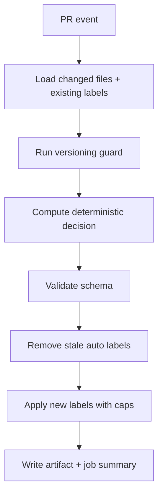
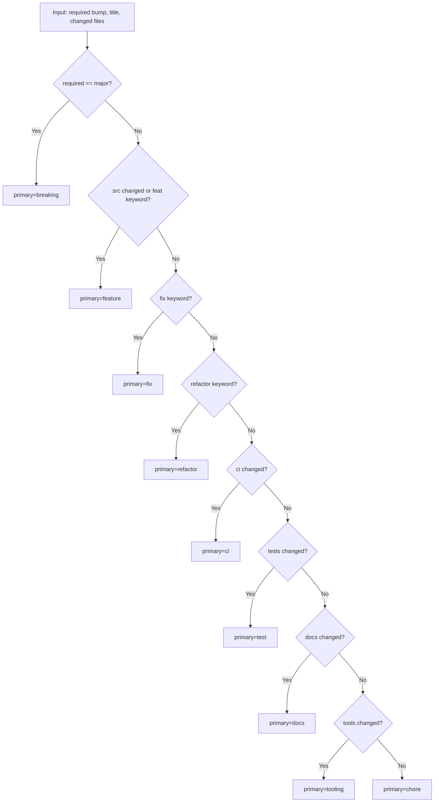
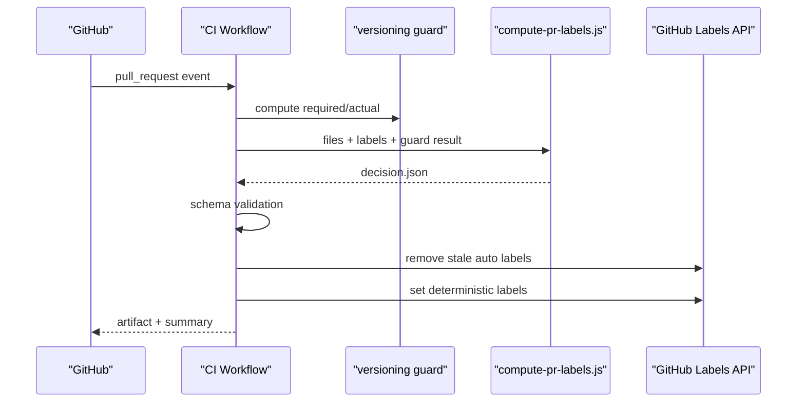
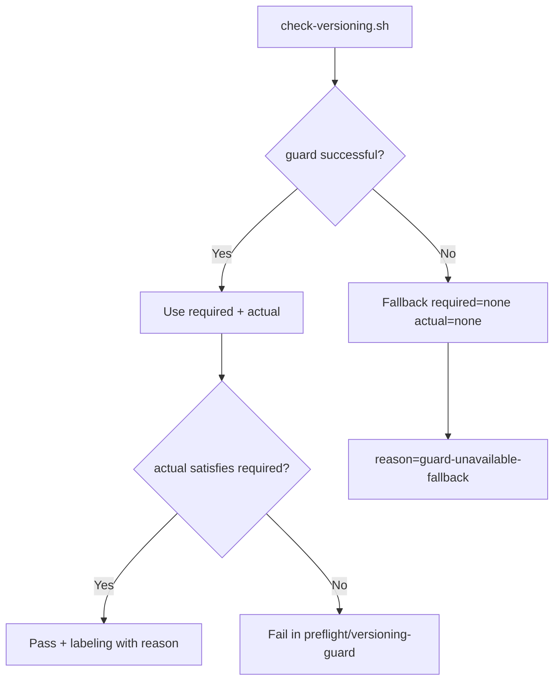

# Auto Labeling and Auto Versioning (SSOT)

## 1. Purpose
This specification defines the deterministic decision flow for PR labeling and versioning evidence.

## 2. Binding Caps
Per PR run, the auto labeler enforces:
- exactly one `version:*`
- exactly one primary label from `breaking|feature|fix|refactor|ci|test|docs|tooling|chore`
- at most one `impl:*`
- at most two `area:*`

There is no additional keyword label group.

## 3. Versioning SSOT
`tools/versioning/check-versioning.sh` provides the SemVer decision.
The CI evidence must include:
- `required=<major|minor|patch|none>`
- `actual=<major|minor|patch|none>`
- `reason=<deterministic-reason>`

## 4. Priority Rule
Fixed order:
`breaking > feature > fix > refactor > ci > test > docs > tooling > chore`

## 5. Mapping Rules
### 5.1 `impl:*` (max 1)
- `impl:security` for security/vulnerability changes
- `impl:docs` for documentation-only work
- `impl:config` for CI/tooling/config/versioning mechanics
- `impl:quality` for code/test quality work

### 5.2 `area:*` (max 2)
- `area:pipeline` -> `.github/workflows/**`
- `area:qodana` -> `qodana.yaml`, `.qodana/**`
- `area:archive` -> archive internals/processing
- `area:hashing` -> deterministic hashing
- `area:detection` -> detection engine
- `area:materializer` -> materializer flows
- `area:versioning` -> `docs/versioning/**`, `Directory.Build.props`
- `area:tests` -> `tests/**`
- `area:docs` -> `docs/**`, `README.md`
- `area:tooling` -> `tools/**`

## 6. End-to-End Flow

## 7. Primary Decision Flow

## 8. Sequence Diagram

## 9. Version Guard Flow

## 10. Regression Safety
Golden test data:
- `tools/versioning/testcases/*.json`

Validation:
- `tools/versioning/test-compute-pr-labels.js`
- `tools/versioning/validate-label-decision.js`

## 11. Linked SSOT Sources
- `docs/versioning/101_POLICY_VERSIONING.MD`
- `docs/ci/101_PIPELINE_CI.MD`
- `docs/governance/102_POLICY_LABELING.MD`
- `docs/governance/104_POLICY_DOCUMENTATION.MD`

## RoC References
- [Artifact contract rule](https://github.com/tomtastisch/FileClassifier/blob/main/tools/ci/policies/rules/artifact_contract.yaml)
- [Docs drift rule](https://github.com/tomtastisch/FileClassifier/blob/main/tools/ci/policies/rules/docs_drift.yaml)
- [Shell safety rules](https://github.com/tomtastisch/FileClassifier/blob/main/tools/ci/policies/rules/shell_safety.yaml)
