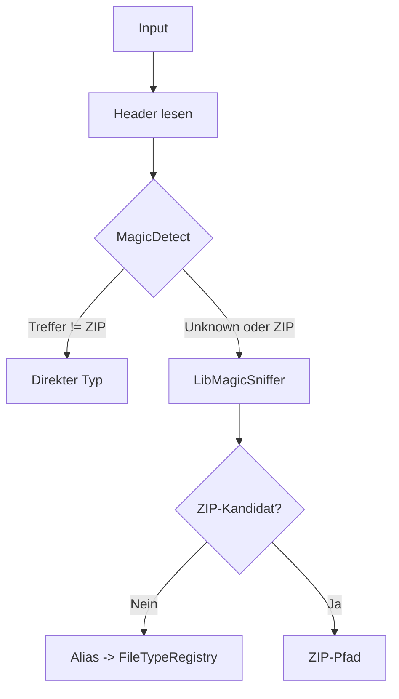
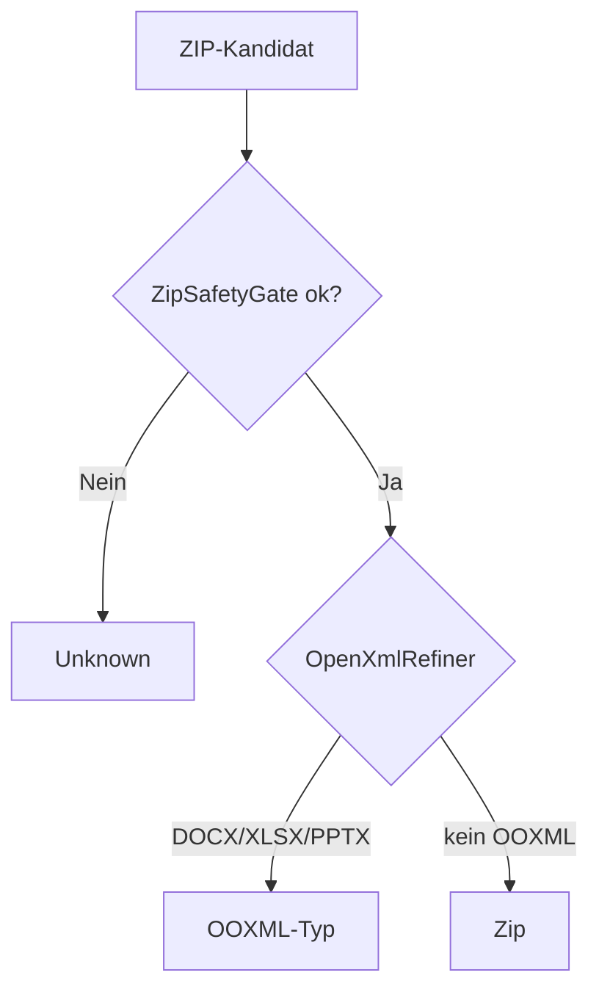
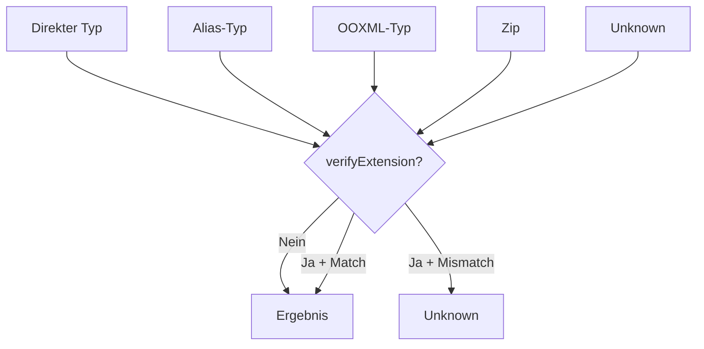
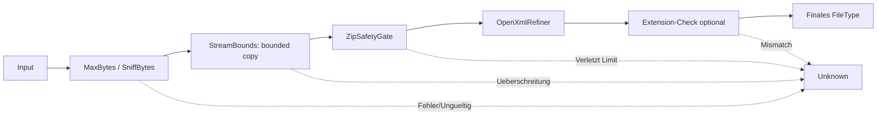

# Portable FileTypeDetection (Deutsch)

Dieser Ordner ist bewusst **copy/paste-freundlich** aufgebaut und enthaelt nur
die benoetigten Quellcodedateien fuer `FileTypeDetector`:

- keine Tests
- kein `bin/`
- kein `obj/`

## Schnellstart im Zielprojekt
1. Ordner `FileTypeDetection` in dein Zielprojekt kopieren.
2. In der Ziel-`.vbproj` sicherstellen:
   - NuGet: `DocumentFormat.OpenXml` (3.4.1)
   - NuGet: `Mime` (3.8.0)
   - FrameworkReference: `Microsoft.AspNetCore.App`
3. Empfohlen: `<RootNamespace></RootNamespace>` setzen (oder Namespaces/Imports entsprechend anpassen).
4. Projekt bauen.

## Dokumentstruktur
- [Abstractions/index.md](Abstractions/index.md) - fachliche Basistypen (`FileKind`, `FileType`)
- [Detection/index.md](Detection/index.md) - SSOT-Registry und Alias-Aufloesung
- [Infrastructure/index.md](Infrastructure/index.md) - Sicherheits- und Infrastrukturkomponenten

## Oeffentliche API (extern nutzbar)
### FileTypeDetector (Methoden)
| Methode | Zweck | Typischer Einsatz |
|---|---|---|
| `SetDefaultOptions(opt)` | Globale Optionen setzen (Snapshot). | Einmalig beim Start (z. B. strengere Limits). |
| `GetDefaultOptions()` | Aktuelle globale Optionen lesen (Kopie). | Vor Anpassungen/Debugging. |
| `LoadOptions(path)` | Optionen aus JSON laden (defensiv, mit Fallback). | Konfigurierbare Betriebsparameter aus Datei. |
| `ReadFileSafe(path)` | Datei bounded in Bytes lesen. | Sicheres Vorladen fuer `Detect(byte())`. |
| `Detect(path)` | Dateityp inhaltsbasiert bestimmen. | Standardfall fuer Pfadinput. |
| `Detect(path, verifyExtension)` | Erkennung + optionale Endungspruefung. | Bei Bedarf auf stricte Endungs-Konsistenz. |
| `DetectAndVerifyExtension(path)` | Nur Endungs-Validitaet gegen Inhalt pruefen. | Policy-/Compliance-Checks. |
| `Detect(data)` | Dateityp aus Byte-Array bestimmen. | Streams, Uploads, In-Memory-Workflows. |
| `IsOfType(data, kind)` | Shortcut fuer Typvergleich. | Schnelle Guard-Checks in Pipelines. |

### Wann nutze ich welche Methode?
1. **Normalfall (Datei auf Platte):** `Detect(path)`
2. **Strenge Dateiannahmen (Endung muss passen):** `Detect(path, verifyExtension:=True)`
3. **Nur Endung gegen echten Inhalt pruefen:** `DetectAndVerifyExtension(path)`
4. **Upload/Memory-Bytes vorhanden:** `Detect(data)` (optional `IsOfType(...)`)
5. **Konfigurierbare Sicherheitsgrenzen:** `LoadOptions(...)` + `SetDefaultOptions(...)`

## Architektur und Ablauf (Logik + Sicherheitsinstanzen)

### 1) Hauptablauf der Typentscheidung

#### 1.1 Vorentscheidung (Signatur + Fallback)


#### 1.2 ZIP-Pfad (Sicherheitspruefung + Verfeinerung)


#### 1.3 Finale Policy (optionale Endungspruefung)


### 2) Sicherheitsinstanzen (Gate-Reihenfolge)


## Sicherheitsmodell (kompakt)
- **Fail-Closed:** Bei Fehlern oder Unsicherheit wird `Unknown` geliefert.
- **Bounded IO:** Lesen/Kopieren nur mit harten Byte-Grenzen (`StreamBounds`).
- **ZIP-Haertung:** `ZipSafetyGate` prueft Entries, Groessen, Kompressionsrate und Verschachtelung.
- **Deterministisch:** Signaturlogik zentral in `MagicDetect`; Typmetadaten zentral in `FileTypeRegistry`.
- **Defensives Logging:** `LogGuard` darf nie die Erkennung beeinflussen.

## Grundlegende Sicherheitswirkungen der Umsetzung
- **Zip-Bomb-Reduktion:** Begrenzung von Entry-Anzahl, unkomprimierten Bytes, Ratio und Nesting-Tiefe verhindert unkontrollierte Entpack-Last.
- **Sicheres Byte-Handling:** `ReadFileSafe` und `StreamBounds.CopyBounded` erzwingen harte Obergrenzen beim Lesen/Kopieren.
- **Keine Codeausfuehrung bei Erkennung:** Die Erkennung arbeitet auf Headern/Bytes/ZIP-Metadaten; es werden keine Makros, Skripte oder Dokumentinhalte ausgefuehrt.
- **Fail-Closed statt False Positive:** Bei Parser-/I/O-/ZIP-Fehlern wird sicher auf `Unknown` bzw. `False` zurueckgefallen.
- **Optional stricte Endungs-Policy:** Mit `verifyExtension` lassen sich inhaltlich falsche Umbenennungen (z. B. PDF als `.txt`) blockieren.

## Dateien und Verantwortungen
- `FileTypeDetector.vb`  
  Haupt-API (`Detect`, `DetectAndVerifyExtension`), Orchestrierung der gesamten Erkennung.
- `FileTypeDetectorOptions.vb`  
  Sicherheits- und Laufzeitgrenzen (Dateigroesse, ZIP-Limits, Sniff-Bytes, Logger).
- `Abstractions/FileKind.vb`  
  Kanonische Typen als Enum.
- `Abstractions/FileType.vb`  
  Unveraenderliches Typobjekt (Kind, Extension, Mime, Allowed, Aliases).
- `Detection/FileTypeRegistry.vb`  
  SSOT fuer Typmetadaten und Alias-Aufloesung.
- `Infrastructure/MimeProvider.vb`  
  MIME-Aufloesung (HeyRed.Mime oder optional ASP.NET-Provider via Compile-Toggle).
- `Infrastructure/Internals.vb`  
  Sicherheits- und Infrastrukturbausteine (`StreamBounds`, `ZipSafetyGate`, `OpenXmlRefiner`, `LogGuard`, `LibMagicSniffer`).

## Unterordner-Indexe (normorientierte Detaildokumentation)
- [Abstractions/index.md](Abstractions/index.md)
- [Detection/index.md](Detection/index.md)
- [Infrastructure/index.md](Infrastructure/index.md)

## Pflege / Aktualisierung des Portable-Ordners
Im Repo-Root ausfuehren:

```bash
./tools/sync-portable-filetypedetection.sh
```
