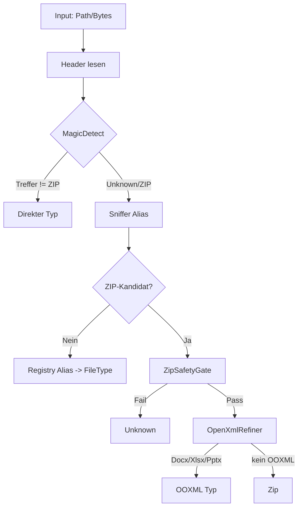

# Portable FileTypeDetection

Copy/paste-freundliche Struktur der Kernbibliothek (ohne Tests, ohne `bin/`, ohne `obj/`).

## 1) Schnellstart
1. Ordner `FileTypeDetection` in das Zielprojekt kopieren.
2. In der Ziel-`.vbproj` sicherstellen:
   - `DocumentFormat.OpenXml` `3.4.1`
   - `Mime` `3.8.0`
   - `Microsoft.IO.RecyclableMemoryStream` `3.0.1`
   - `FrameworkReference` auf `Microsoft.AspNetCore.App`
3. Empfohlen: `<RootNamespace></RootNamespace>`.
4. Projekt bauen.

## 2) Oeffentliche API (wann und warum)
| API | Zweck | Wann verwenden | Warum |
|---|---|---|---|
| `Detect(path)` | Inhaltsbasierte Dateityp-Erkennung | Standardfall fuer Dateien auf Disk | Header + Fallback + ZIP-Gate |
| `Detect(path, verifyExtension)` | Erkennung + optionale Endungs-Policy | Wenn Dateiendung sicherheitsrelevant ist | Fail-closed bei Mismatch |
| `Detect(data)` | Erkennung fuer In-Memory-Daten | Upload-Bytes, Queue-Workflows | Kein Dateisystem notwendig |
| `DetectAndVerifyExtension(path)` | Endungsvalidierung gegen Erkennung | Compliance/Policy-Pruefungen | Ergebnis als Bool |
| `ReadFileSafe(path)` | Begrenztes Datei-Einlesen | Vor `Detect(data)` | Bounded-I/O gegen DoS |
| `ExtractZipSafe(path, dest, verify)` | Sicheres ZIP-Entpacken | Kontrolliertes Entpacken in neue Zielstruktur | Traversal-Block, Limits, atomic stage |
| `FileTypeSecurityBaseline.ApplyDeterministicDefaults()` | Harte Sicherheitsdefaults global setzen | App-Startup | Einheitliches, reproduzierbares Profil |

## 3) Ablauf und Sicherheitsinstanzen
### 3.1 Typentscheidung


### 3.2 Sicheres Entpacken
```mermaid
flowchart TD
    A[ExtractZipSafe] --> B{verifyBeforeExtract}
    B -->|True| C[Detect(path)]
    C --> D{Zip/OOXML?}
    D -->|Nein| X[False]
    D -->|Ja| E[TryExtractZipStream]
    B -->|False| E
    E --> F[ProcessZipStream SSOT]
    F --> G[Entry-Checks + Path-Checks]
    G --> H[Stage-Directory schreiben]
    H --> I[Atomarer Move]
    I --> J[True]
```

## 4) Sicherheitswirkungen
- fail-closed bei Fehlern (`Unknown` / `False`)
- ZIP-Limits: Entries, Gesamtgroesse, Entry-Groesse, Ratio, Nesting
- Path-Traversal-Blockade beim Entpacken
- deterministic ordering bei ZIP-Entry-Verarbeitung
- stream-bounded copy fuer harte Byte-Grenzen

## 5) Dokumentnavigation
- [Abstractions/INDEX.md](Abstractions/INDEX.md)
- [Detection/INDEX.md](Detection/INDEX.md)
- [Infrastructure/INDEX.md](Infrastructure/INDEX.md)

## 6) Pflege
- Portable-Struktur neu erzeugen: `./tools/sync-portable-filetypedetection.sh`
- Portable Smoke-Check: `./tools/check-portable-filetypedetection.sh --clean`
