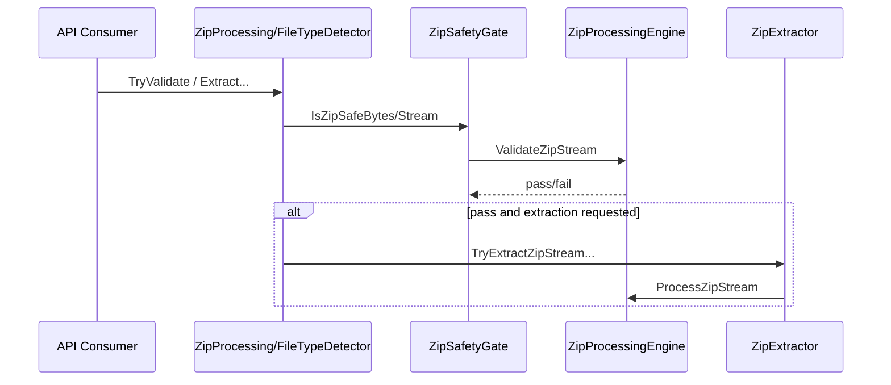

# API-Referenz (DE) - FileTypeDetection

## 1. Zweck
Diese Referenz beschreibt die vollstaendige oeffentliche API sowie den empfohlenen Einsatz je Szenario.
Ergaenzende normorientierte Spezifikation: [DIN_SPECIFICATION_DE.md](./DIN_SPECIFICATION_DE.md).

## 2. Entscheidungs-Matrix (welche Methode wann)
| Ziel | Empfohlene API | Warum |
|---|---|---|
| Dateityp einer Datei bestimmen | `new FileTypeDetector().Detect(path)` | einfachster fail-closed Einstieg |
| Dateityp bestimmen und Endung erzwingen | `new FileTypeDetector().Detect(path, verifyExtension:=True)` | Konflikte werden zu `Unknown` normalisiert |
| Upload/Message-Bytes pruefen | `new FileTypeDetector().Detect(data)` | kein Dateisystemzugriff notwendig |
| Auditierbares Ergebnis inkl. Grundcode | `new FileTypeDetector().DetectDetailed(...)` | `ReasonCode` + Policy-Flags |
| Nur ZIP-Sicherheit pruefen (ohne Extraktion) | `new FileTypeDetector().TryValidateZip(path)` oder `ZipProcessing.TryValidate(...)` | Gate-only, keine Seiteneffekte |
| ZIP sicher auf Platte entpacken | `new FileTypeDetector().ExtractZipSafe(...)` | Traversal-/Bomb-Schutz |
| ZIP sicher in Memory entpacken | `new FileTypeDetector().ExtractZipSafeToMemory(...)` oder `ZipProcessing.ExtractToMemory(...)` | kein Persistieren auf Disk |
| Byte-Payload persistieren (optional ZIP->Disk) | `FileMaterializer.Persist(...)` | ein Einstieg fuer rohe Bytes und sichere ZIP-Extraktion |
| Globale Laufzeit-Optionen setzen/lesen | `FileTypeOptions.LoadOptions(...)` / `FileTypeOptions.GetOptions()` | zentrale, deterministische Snapshot-Verwaltung |

## 3. Oeffentliche API - Detailtabelle
### 3.1 `FileTypeDetector` (Instanz + Shared)
| Symbol | Signatur | Input | Output | Einsatzzeitpunkt | Verhalten/Trigger |
|---|---|---|---|---|---|
| Datei sicher lesen | `ReadFileSafe(path)` | Datei-Pfad | `Byte()` | Vorverarbeitung fuer Byte-Pipelines | Groessenlimit erzwungen, Fehler => leeres Array |
| Detect (Pfad) | `Detect(path)` | Datei-Pfad | `FileType` | Standardfall | Header -> ZIP-Gate/Refiner -> fail-closed |
| Detect (Pfad + Policy) | `Detect(path, verifyExtension)` | Datei-Pfad + Bool | `FileType` | strikte Endungspolitik | Endungskonflikt => `Unknown` |
| DetectDetailed | `DetectDetailed(path)` | Datei-Pfad | `DetectionDetail` | Audit/UX/Telemetry | liefert `ReasonCode` und Flags |
| DetectDetailed + Policy | `DetectDetailed(path, verifyExtension)` | Datei-Pfad + Bool | `DetectionDetail` | Audit bei Endungsregeln | dokumentiert Mismatch explizit |
| Endungscheck | `DetectAndVerifyExtension(path)` | Datei-Pfad | `Boolean` | schnelles Policy-Gate | `False` bei Mismatch oder `Unknown` |
| ZIP-Validierung | `TryValidateZip(path)` | Datei-Pfad | `Boolean` | nur Sicherheitspruefung | kein Extract, nur Gate-Entscheid |
| Detect (Bytes) | `Detect(data)` | Payload | `FileType` | Upload/Queue/Event | gleiche Sicherheitslogik wie Pfad-Variante |
| Typvergleich | `IsOfType(data, kind)` | Payload + `FileKind` | `Boolean` | Guard-Checks in Workflows | intern auf `Detect(data)` aufgebaut |
| ZIP->Disk | `ExtractZipSafe(path, destination, verifyBeforeExtract)` | Pfad + Ziel + Bool | `Boolean` | kontrollierte Extraktion | Ziel darf nicht existieren, Root-Ziele sind blockiert |
| ZIP->Memory | `ExtractZipSafeToMemory(path, verifyBeforeExtract)` | Pfad + Bool | `IReadOnlyList(Of ZipExtractedEntry)` | sichere In-Memory-Verarbeitung | bei Fehler: leere Liste |

### 3.2 `ZipProcessing` (statische Fassade)
| Symbol | Signatur | Input | Output | Einsatzzeitpunkt | Verhalten/Trigger |
|---|---|---|---|---|---|
| ZIP validieren (Pfad) | `TryValidate(path)` | Datei-Pfad | `Boolean` | ZIP-Gate als Utility | delegiert an `FileTypeDetector.TryValidateZip` |
| ZIP validieren (Bytes) | `TryValidate(data)` | Payload | `Boolean` | Upload-Gate ohne Dateisystem | Header muss ZIP sein, dann Gate |
| ZIP->Memory (Pfad) | `ExtractToMemory(path, verifyBeforeExtract)` | Pfad + Bool | `IReadOnlyList(Of ZipExtractedEntry)` | statische API fuer Leser | delegiert auf fail-closed Extract |
| ZIP->Memory (Bytes) | `TryExtractToMemory(data)` | Payload | `IReadOnlyList(Of ZipExtractedEntry)` | API/Queue ohne Temp-Datei | validiert zuerst, dann extrahiert |

### 3.3 `FileMaterializer` (statische Fassade)
| Symbol | Signatur | Input | Output | Einsatzzeitpunkt | Verhalten/Trigger |
|---|---|---|---|---|---|
| Persist (Default) | `Persist(data, destinationPath)` | Payload + Zielpfad | `Boolean` | Standardfall fuer Byte->Datei | schreibt fail-closed direkt auf Disk |
| Persist (Overwrite) | `Persist(data, destinationPath, overwrite)` | Payload + Zielpfad + Bool | `Boolean` | explizite Overwrite-Policy | `overwrite=False` verhindert Ueberschreiben |
| Persist (Full) | `Persist(data, destinationPath, overwrite, secureExtract)` | Payload + Zielpfad + 2 Bool | `Boolean` | ZIP-Bytes optional sicher entpacken | bei `secureExtract=True` + ZIP: Validierung und sichere Extraktion statt Raw-Write |

### 3.4 `FileTypeOptions` (statische Fassade)
| Symbol | Signatur | Input | Output | Einsatzzeitpunkt | Verhalten/Trigger |
|---|---|---|---|---|---|
| Optionen laden | `LoadOptions(json)` | JSON-String | `Boolean` | Startup/Runtime-Rekonfiguration | partielle JSON-Werte ueberschreiben Defaults; unbekannte Keys werden ignoriert; ungueltige Grenzwerte fallen auf Defaults zurueck |
| Optionen lesen | `GetOptions()` | - | `String` (JSON) | Audit/Diagnose/API-Ausgabe | liefert aktuellen globalen Snapshot als JSON |

### 3.5 `FileTypeSecurityBaseline`
| Symbol | Signatur | Zweck |
|---|---|---|
| Baseline anwenden | `ApplyDeterministicDefaults()` | setzt konservative globale Security-Grenzen |

### 3.6 Oeffentliche Rueckgabemodelle
| Typ | Oeffentliche Member | Zweck |
|---|---|---|
| `FileKind` | Enum-Werte (z. B. `Unknown`, `Pdf`, `Zip`, `Docx`) | kanonische Typklassifikation |
| `FileType` | `Kind`, `CanonicalExtension`, `Mime`, `Allowed`, `Aliases` | inhaltsbasierte Typentscheidung |
| `DetectionDetail` | `DetectedType`, `ReasonCode`, `UsedZipContentCheck`, `UsedStructuredRefinement`, `ExtensionVerified` | auditierbares Detailergebnis |
| `ZipExtractedEntry` | `RelativePath`, `Content`, `Size`, `OpenReadOnlyStream()` | sicherer In-Memory-Extrakteintrag |

### 3.7 Oeffentliche Konfigurationsklasse
| Typ | Oeffentliche Member | Zweck |
|---|---|---|
| `FileTypeDetectorOptions` | `HeaderOnlyNonZip`, `MaxBytes`, `SniffBytes`, `MaxZipEntries`, `MaxZipTotalUncompressedBytes`, `MaxZipEntryUncompressedBytes`, `MaxZipCompressionRatio`, `MaxZipNestingDepth`, `MaxZipNestedBytes`, `Logger` | explizites Optionsmodell fuer Snapshot/Baseline-Strategien |

## 4. Interne Kernpfade (Lesefuehrung)
| Interner Pfad | Datei | Bedeutung |
|---|---|---|
| Header/Typ-SSOT | `Detection/FileTypeRegistry.vb` | Aliase, Canonical Extensions, Magic-Patterns |
| ZIP-Gate/Bounds/Refiner | `Infrastructure/CoreInternals.vb` | sicherheitskritische Guards |
| ZIP-Engine/Extractor | `Infrastructure/ZipInternals.vb` | deterministische ZIP-Iteration + Extraktion |

## 5. Prozess- und Sicherheitsdiagramme
### 5.1 Detektionsablauf (Pfad/Bytes)
```mermaid
flowchart TD
    A[Input: Path oder Bytes] --> B[ReadHeader + DetectByMagic]
    B -->|non-zip match| C[Resolve(kind)]
    B -->|zip-like| D[ZipSafetyGate]
    D -->|fail| E[Unknown]
    D -->|ok| F[OpenXmlRefiner]
    F -->|known| G[Refined Type]
    F -->|unknown| H[Generic Zip]
```

### 5.2 ZIP-Sicherheitskette


## 6. Verwendungsbeispiele (C#)
### 6.1 Minimal: Typ bestimmen
```csharp
using FileTypeDetection;

var detector = new FileTypeDetector();
var t = detector.Detect("/data/upload.bin");
Console.WriteLine($"Kind={t.Kind}, Allowed={t.Allowed}");
```

### 6.2 Auditierbare Entscheidung mit Endungs-Policy
```csharp
using FileTypeDetection;

var detector = new FileTypeDetector();
var detail = detector.DetectDetailed("/data/invoice.pdf", verifyExtension: true);

Console.WriteLine($"Kind={detail.DetectedType.Kind}");
Console.WriteLine($"Reason={detail.ReasonCode}");
Console.WriteLine($"ZipCheck={detail.UsedZipContentCheck}");
Console.WriteLine($"ExtensionVerified={detail.ExtensionVerified}");
```

### 6.3 ZIP validieren und aus Pfad in Memory extrahieren
```csharp
using FileTypeDetection;

if (!ZipProcessing.TryValidate("/data/archive.zip"))
{
    throw new InvalidOperationException("Unsicheres ZIP.");
}

var entries = ZipProcessing.ExtractToMemory("/data/archive.zip", verifyBeforeExtract: true);
```

### 6.4 ZIP sicher in Memory (Byte-Input)
```csharp
using FileTypeDetection;

byte[] payload = File.ReadAllBytes("/data/archive.zip");
if (!ZipProcessing.TryValidate(payload))
{
    throw new InvalidOperationException("Unsicheres ZIP.");
}

var entries = ZipProcessing.TryExtractToMemory(payload);
foreach (var e in entries)
{
    Console.WriteLine($"{e.RelativePath} -> {e.Size} bytes");
}
```

### 6.5 Byte-Payload schreiben (ohne ZIP-Extraktion)
```csharp
using FileTypeDetection;

byte[] payload = File.ReadAllBytes("/data/input.bin");
bool ok = FileMaterializer.Persist(payload, "/data/out/input.bin", overwrite: false, secureExtract: false);
```

### 6.6 ZIP-Bytes sicher auf Verzeichnis extrahieren
```csharp
using FileTypeDetection;

byte[] zipPayload = File.ReadAllBytes("/data/archive.zip");
bool ok = FileMaterializer.Persist(zipPayload, "/data/out/unpacked", overwrite: false, secureExtract: true);
```

### 6.7 Optionen per JSON laden und auslesen
```csharp
using FileTypeDetection;

var json = """
{
  "maxBytes": 134217728,
  "maxZipEntries": 3000,
  "maxZipCompressionRatio": 30
}
""";

if (!FileTypeOptions.LoadOptions(json))
{
    throw new InvalidOperationException("Optionen ungueltig.");
}

Console.WriteLine(FileTypeOptions.GetOptions());
```

### 6.8 Konservative Baseline aktivieren
```csharp
using FileTypeDetection;

FileTypeSecurityBaseline.ApplyDeterministicDefaults();
```

## 7. Verwendungsbeispiele (VB)
```vb
Imports FileTypeDetection

FileTypeSecurityBaseline.ApplyDeterministicDefaults()

Dim detector As New FileTypeDetector()
Dim detail = detector.DetectDetailed("/data/sample.docx", verifyExtension:=True)
Console.WriteLine($"{detail.DetectedType.Kind} / {detail.ReasonCode}")

Dim json = "{""maxBytes"":134217728}"
Dim optOk = FileTypeOptions.LoadOptions(json)
Console.WriteLine($"Options loaded: {optOk}")
```

## 8. Abhaengigkeiten (NuGet/BCL/Framework)
### 8.1 Abhaengigkeitsdiagramm
```mermaid
flowchart LR
    API[Public API Layer]
    INF[Infrastructure]

    API --> INF
    INF --> BCLZIP[System.IO.Compression]
    INF --> MIME[Mime (HeyRed.Mime)]
    INF --> RMS[Microsoft.IO.RecyclableMemoryStream]
    API --> SHARP[SharpCompress]
    API --> LOG[Microsoft.Extensions.Logging\n(via Microsoft.AspNetCore.App)]
```

### 8.2 Mapping-Tabelle
| Paket/Framework | Verwendet in | Zweck |
|---|---|---|
| `System.IO.Compression` (BCL) | `Infrastructure/CoreInternals.vb`, `Infrastructure/ZipInternals.vb` | ZIP lesen/iterieren |
| `Mime` | `Infrastructure/MimeProvider.vb` | MIME-Aufloesung aus Extension |
| `Microsoft.IO.RecyclableMemoryStream` | `Infrastructure/ZipInternals.vb` | kontrollierte Memory-Streams |
| `SharpCompress` | `FileMaterializer.vb` | defensiver ZIP-Lesbarkeits-Check |
| `Microsoft.AspNetCore.App` (FrameworkReference) | Logging via `Microsoft.Extensions.Logging` | optionale Diagnostik |

## 9. API-Stabilitaet und Versionierung
- Oeffentliche Einstiegspunkte liegen im Modul-Root (`FileTypeDetector.vb`, `ZipProcessing.vb`, `FileMaterializer.vb`, `FileTypeOptions.vb`).
- Sicherheitskritische Low-Level-Bausteine bleiben intern (`Friend`) in `Infrastructure/`.
- Neue Use-Cases bevorzugt als additive Methoden in den Root-APIs.
