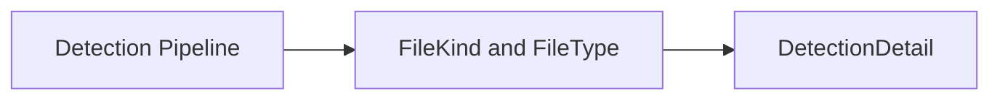

# Abstractions Detection Modul

## 1. Zweck
Dieses Verzeichnis bündelt die Detection-Rückgabemodelle für die Public API.

## 2. Inhalt
- `FileKind.vb`
- `FileType.vb`
- `DetectionDetail.vb`

## 3. API und Verhalten
- Modelle bilden Typ, Zulässigkeit und auditierbare Details deterministisch ab.
- Kein I/O und keine Seiteneffekte.

## 4. Verifikation
- Modelltests prüfen Defaults, Stabilität und Konsistenz.

## 5. Diagramm

## 6. Verweise
- [Abstractions-Übersicht](https://github.com/tomtastisch/FileClassifier/blob/90a2825/src/FileTypeDetection/Abstractions/README.md)
- [API-Kernübersicht](https://github.com/tomtastisch/FileClassifier/blob/90a2825/docs/010_API_CORE.MD)
