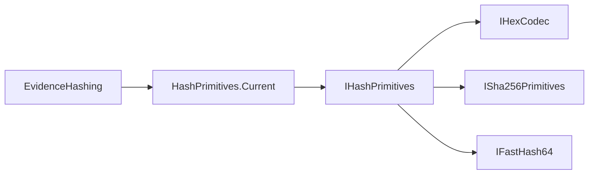

# Abstractions Providers Modul

## 1. Zweck
Dieses Verzeichnis enthält interne Verträge für TFM-sensitive Hashing-Primitive.

## 2. Inhalt
- `IHexCodec`
- `ISha256Primitives`
- `IFastHash64`
- `IHashPrimitives`

## 3. API und Verhalten
- Die Interfaces sind intern (`Friend`) und gehören nicht zur Public API.
- Core-/Fassadenlogik konsumiert nur diese Abstraktionen statt direkter TFM-APIs.

## 4. Verifikation
- Provider-Implementierungen müssen die gleichen Ausgabekontrakte je TFM einhalten.

## 5. Diagramm

## 6. Verweise
- [Abstractions Modul](https://github.com/tomtastisch/FileClassifier/blob/main/src/FileTypeDetection/Abstractions/README.md)
- [Composition Modul](https://github.com/tomtastisch/FileClassifier/blob/main/src/FileTypeDetection/Composition/README.md)
- [Providers Modul](https://github.com/tomtastisch/FileClassifier/blob/main/src/FileTypeDetection/Providers/README.md)
