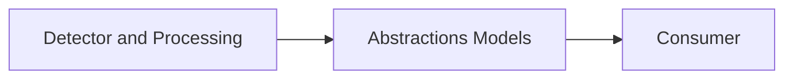

# Abstractions Modul

## 1. Zweck
Dieses Verzeichnis enthält immutable Rückgabemodelle der öffentlichen API.

## 2. Inhalt
- Detection-Modelle (`FileKind`, `FileType`, `DetectionDetail`).
- Archive-Modell (`ZipExtractedEntry`).
- Hashing-Modelle (`DeterministicHash*`).

## 3. API und Verhalten
- Modelle führen keine I/O aus und dienen als stabile Vertragsobjekte.
- `Unknown` bleibt fail-closed Standardrückgabe für unsichere/unklare Pfade.

## 4. Verifikation
- Unit-Tests prüfen Modell-Defaults, Normalisierung und Null-/Edge-Verhalten.

## 5. Diagramm

## 6. Verweise
- [Modulübersicht](https://github.com/tomtastisch/FileClassifier/blob/90a2825/src/FileTypeDetection/README.md)
- [Detection-Modelle](https://github.com/tomtastisch/FileClassifier/blob/90a2825/src/FileTypeDetection/Abstractions/Detection/README.md)
- [Archive-Modelle](https://github.com/tomtastisch/FileClassifier/blob/90a2825/src/FileTypeDetection/Abstractions/Archive/README.md)
- [Hashing-Modelle](https://github.com/tomtastisch/FileClassifier/blob/90a2825/src/FileTypeDetection/Abstractions/Hashing/README.md)
