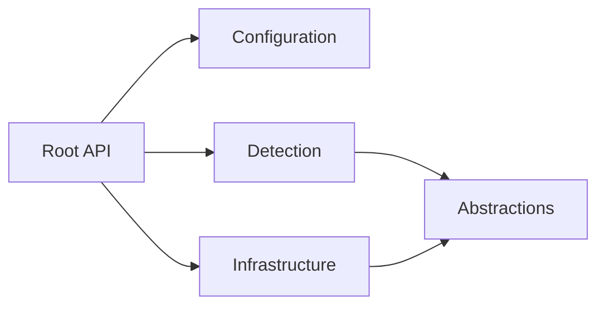

# Index - src/FileTypeDetection

## 1. Ziel dieses Moduls
Deterministische Dateityp-Erkennung und sichere ZIP-Verarbeitung mit fail-closed Verhalten.

## 2. Schnellstart fuer Leser
1. [API-Referenz](./docs/API_REFERENCE.md)
2. [Detection-Details](./Detection/INDEX.md)
3. [Infrastructure-Details](./Infrastructure/INDEX.md)

## 3. Strukturregel (wichtig)
Im Modul-Root liegen **nur** oeffentliche API-Einstiegspunkte:
- [FileTypeDetector.vb](./FileTypeDetector.vb)
- [ZipProcessing.vb](./ZipProcessing.vb)
- [FileMaterializer.vb](./FileMaterializer.vb)
- [FileTypeOptions.vb](./FileTypeOptions.vb)

Alle Low-Level-Implementierungen liegen in Unterordnern.

## 4. Ordner und Verantwortungen
| Pfad | Verantwortung | Typische Leser |
|---|---|---|
| [Abstractions/](./Abstractions/INDEX.md) | Immutable Rueckgabemodelle | API-Consumer |
| [Configuration/](./Configuration/INDEX.md) | Optionen, Security-Baseline | Ops, Security, Entwickler |
| [Detection/](./Detection/INDEX.md) | SSOT fuer Typen, Aliase, Header-Magic | Maintainer Detection |
| [Infrastructure/](./Infrastructure/INDEX.md) | ZIP-Gate, Refiner, Extractor, Bounds | Maintainer Security/IO |

## 5. Architekturdiagramm

## 6. Oeffentliche Funktionen (Uebersicht)
| Klasse | Funktionale Rolle | Detailtabelle |
|---|---|---|
| `FileTypeDetector` | Erkennung, Policy, ZIP-Path-Operationen | [docs/API_REFERENCE.md](./docs/API_REFERENCE.md#31-filetypedetector-instanz--shared) |
| `ZipProcessing` | statische ZIP-Fassade (Path/Bytes) | [docs/API_REFERENCE.md](./docs/API_REFERENCE.md#32-zipprocessing-statische-fassade) |
| `FileMaterializer` | einheitliche Persistenz fuer Byte-Payloads (optional ZIP->Disk) | [docs/API_REFERENCE.md](./docs/API_REFERENCE.md#33-filematerializer-statische-fassade) |
| `FileTypeOptions` | zentrale JSON-Optionsschnittstelle (laden/lesen) | [docs/API_REFERENCE.md](./docs/API_REFERENCE.md#34-filetypeoptions-statische-fassade) |
| `FileTypeSecurityBaseline` | konservative Security-Defaults | [Configuration/INDEX.md](./Configuration/INDEX.md) |

## 7. Qualitaetsziele (ISO/IEC 25010)
- **Functional suitability:** korrektes Mapping Header/Container -> `FileKind`.
- **Reliability:** fail-closed bei Fehlerpfaden und Grenzverletzungen.
- **Security:** ZIP-Traversal/Bomb-Schutz, kein Endungsvertrauen.
- **Maintainability:** Root-API klein, interne Verantwortungen getrennt.

## 8. Nachweise
- Build: `dotnet build FileClassifier.sln --no-restore -v minimal`
- Test: `dotnet test FileClassifier.sln --no-build -v minimal`
- Portable Check: `bash tools/check-portable-filetypedetection.sh --clean`
