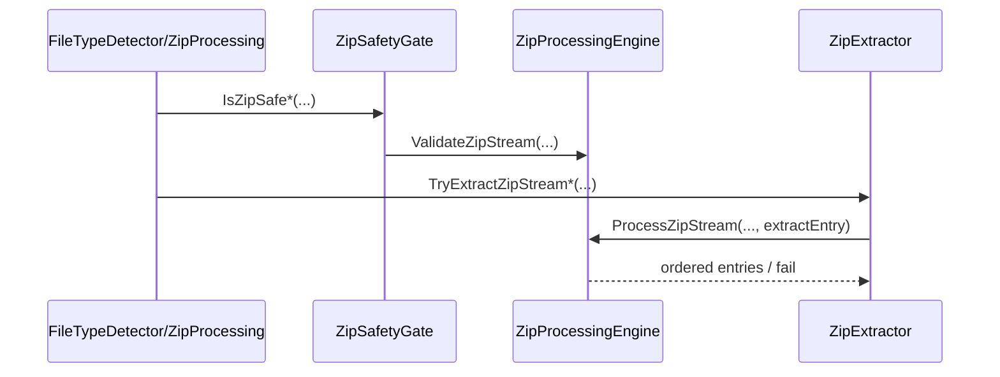

# Index - Infrastructure

## 1. Zweck
Interne, sicherheitskritische Implementierung (kein Public Surface).

## 2. Dateien und Verantwortungen
| Datei | Verantwortungsbereich | Wichtige Funktionen |
|---|---|---|
| [CoreInternals.vb](./CoreInternals.vb) | Bounds, Gate, Payload-/Path-Guards, Refiner, Logging-Schutz | `CopyBounded`, `IsZipSafe*`, `IsSafeZipPayload`, `PrepareMaterializationTarget`, `ValidateNewExtractionTarget`, `TryRefine*`, `LogGuard.*` |
| [ZipInternals.vb](./ZipInternals.vb) | ZIP-Iteration, sichere Extraktion, Pfadschutz | `ProcessZipStream`, `TryExtractZipStream*` |
| [MimeProvider.vb](./MimeProvider.vb) | MIME-Map aus Extension | `GetMime` |

## 3. Sicherheits-Trigger
| Condition | Komponente | Ergebnis |
|---|---|---|
| Byte-Limit ueberschritten | `StreamBounds.CopyBounded` | Exception -> fail-closed |
| ZIP zu tief/zu gross/zu viele Entries | `ZipProcessingEngine.ProcessZipStream` | `False` |
| Traversal-Versuch (`../`, root path) | `ZipExtractor.TryGetSafeEntryName` + Pfadprefix-Check | `False` |
| Refiner-Fehler | `OpenXmlRefiner.TryRefine*` | `Unknown` |
| Logger wirft Exception | `LogGuard` | Fehler wird geschluckt |

## 4. Sequenz: ZIP-Extraktion intern

## 5. Testverknuepfungen
- [ZipAdversarialTests.cs](../../../tests/FileTypeDetectionLib.Tests/Unit/ZipAdversarialTests.cs)
- [ZipExtractionUnitTests.cs](../../../tests/FileTypeDetectionLib.Tests/Unit/ZipExtractionUnitTests.cs)
- [ZipGatePropertyTests.cs](../../../tests/FileTypeDetectionLib.Tests/Property/ZipGatePropertyTests.cs)

## 6. Siehe auch
- [Modulindex](../README.md)
- [Architektur und Ablaufe](../docs/02_ARCHITECTURE_AND_FLOWS.md)
- [Referenzen](../docs/03_REFERENCES.md)
