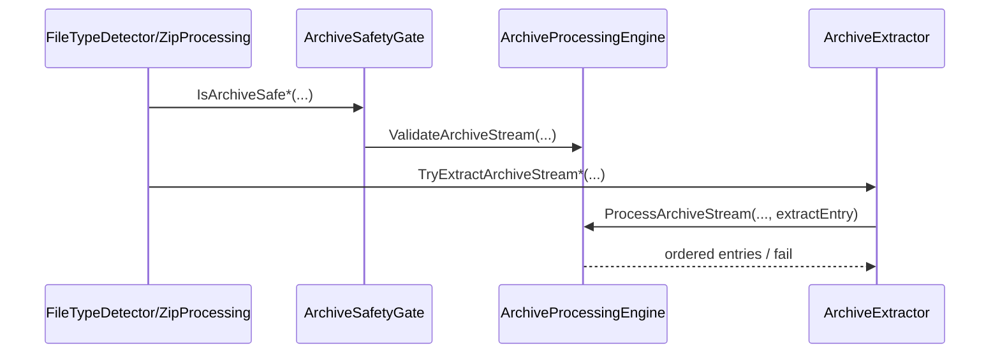

# Index - Infrastructure

## 1. Zweck
Interne, sicherheitskritische Implementierung (kein Public Surface).

## 2. Dateien und Verantwortungen
| Datei | Verantwortungsbereich | Wichtige Funktionen |
|---|---|---|
| [CoreInternals.vb](./CoreInternals.vb) | Bounds, Gate, Payload-/Path-Guards, Refiner, Logging-Schutz | `CopyBounded`, `IsZipSafe*`, `IsArchiveSafe*`, `IsSafeZipPayload`, `IsSafeArchivePayload`, `PrepareMaterializationTarget`, `ValidateNewExtractionTarget`, `TryRefine*`, `LogGuard.*` |
| [ZipInternals.vb](./ZipInternals.vb) | ZIP-Iteration, sichere Extraktion, Pfadschutz | `ProcessZipStream`, `TryExtractZipStream*` |
| [ArchiveInternals.vb](./ArchiveInternals.vb) | Unified Archive Backend, Entry-Adapter, Archiv-Dispatch | `ArchiveTypeResolver`, `ArchiveBackendRegistry`, `ArchiveProcessingEngine`, `ArchiveExtractor` |
| [MimeProvider.vb](./MimeProvider.vb) | MIME-Map aus Extension | `GetMime` |

## 3. Sicherheits-Trigger
| Condition | Komponente | Ergebnis |
|---|---|---|
| Byte-Limit ueberschritten | `StreamBounds.CopyBounded` | Exception -> fail-closed |
| Archiv zu tief/zu gross/zu viele Entries | `ArchiveProcessingEngine.ProcessArchiveStream` | `False` |
| Link-Entry (symlink/hardlink) bei `RejectArchiveLinks=true` | `ArchiveExtractor.TryGetSafeEntryName` / `SharpCompressArchiveBackend` | `False` |
| Unbekannte Entry-Groesse bei `AllowUnknownArchiveEntrySize=false` | `SharpCompressArchiveBackend.TryMeasureEntrySize` | bounded measurement, bei Ueberschreitung `False` |
| Traversal-Versuch (`../`, root path) | `ArchiveExtractor.TryGetSafeEntryName` + Pfadprefix-Check | `False` |
| Refiner-Fehler | `OpenXmlRefiner.TryRefine*` | `Unknown` |
| Logger wirft Exception | `LogGuard` | Fehler wird geschluckt |

## 4. Sequenz: Archiv-Extraktion intern

## 5. Testverknuepfungen
- [ZipAdversarialTests.cs](../../../tests/FileTypeDetectionLib.Tests/Unit/ZipAdversarialTests.cs)
- [ZipExtractionUnitTests.cs](../../../tests/FileTypeDetectionLib.Tests/Unit/ZipExtractionUnitTests.cs)
- [ZipGatePropertyTests.cs](../../../tests/FileTypeDetectionLib.Tests/Property/ZipGatePropertyTests.cs)

## 6. Siehe auch
- [Modulindex](../README.md)
- [Architektur und Ablaufe](../../../docs/02_ARCHITECTURE_AND_FLOWS.md)
- [Referenzen](../../../docs/03_REFERENCES.md)
