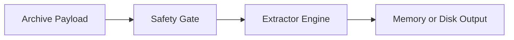

# Infrastructure Modul

## 1. Zweck
Dieses Verzeichnis kapselt sicherheitskritische interne Ausführungslogik für Archive, Bounds, Guards und Extraktion.

## 2. Inhalt
- `CoreInternals.vb`, `ArchiveInternals.vb`, `ArchiveManagedInternals.vb`, `MimeProvider.vb`.

## 3. API und Verhalten
- Erzwingt fail-closed bei Traversal, Link-Entries, Größenlimits und ungültigen Archiven.
- Stellt einheitliche Archiv-Backends und sichere Extraktion bereit.

## 4. Verifikation
- Unit-/Property-Tests decken adversariale Archive, Grenzen und Fehlerpfade ab.

## 5. Diagramm

## 6. Verweise
- [Modulübersicht](https://github.com/tomtastisch/FileClassifier/blob/90a2825/src/FileTypeDetection/README.md)
- [Architektur und Flows](https://github.com/tomtastisch/FileClassifier/blob/90a2825/docs/020_ARCH_CORE.MD)
- [Policy CI](https://github.com/tomtastisch/FileClassifier/blob/90a2825/docs/governance/001_POLICY_CI.MD)
