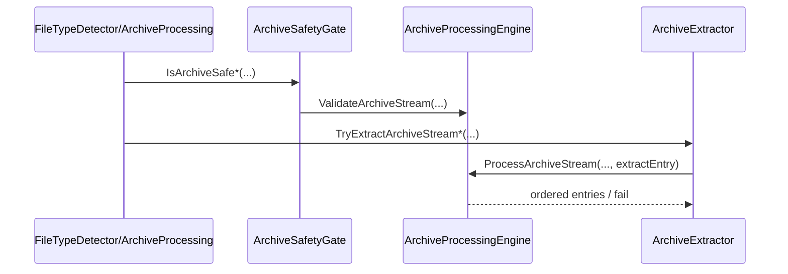

# Index - Infrastructure

## 1. Zweck
Interne, sicherheitskritische Implementierung (kein Public Surface).

## 2. Dateien und Verantwortungen
| Datei | Verantwortungsbereich | Wichtige Funktionen |
|---|---|---|
| [CoreInternals.vb](./CoreInternals.vb) | Bounds, Gate, Payload-/Path-Guards, Refiner, Logging-Schutz | `CopyBounded`, `IsArchiveSafe*`, `IsArchiveSignatureCandidate`, `IsSafeArchivePayload`, `TryNormalizeRelativePath`, `PrepareMaterializationTarget`, `ValidateNewExtractionTarget`, `TryRefine*`, `LogGuard.*` |
| [ArchiveManagedInternals.vb](./ArchiveManagedInternals.vb) | managed Archiv-Iteration und Backend-Adapter (u. a. ZIP) | `ProcessArchiveStream`, `ArchiveManagedBackend` |
| [ArchiveInternals.vb](./ArchiveInternals.vb) | Unified Archive Backend, Entry-Adapter, Archiv-Dispatch | `ArchiveTypeResolver`, `ArchiveBackendRegistry`, `ArchiveProcessingEngine`, `ArchiveExtractor`, `ArchiveEntryCollector` |
| [MimeProvider.vb](./MimeProvider.vb) | MIME-Map aus Extension | `GetMime` |

## 3. Sicherheits-Trigger
| Condition | Komponente | Ergebnis |
|---|---|---|
| Byte-Limit überschritten | `StreamBounds.CopyBounded` | Exception -> fail-closed |
| Archiv zu tief/zu gross/zu viele Entries | `ArchiveProcessingEngine.ProcessArchiveStream` | `False` |
| Link-Entry (symlink/hardlink) bei `RejectArchiveLinks=true` | `ArchiveExtractor.TryGetSafeEntryName` / `SharpCompressArchiveBackend` | `False` |
| Unbekannte Entry-Grösse bei `AllowUnknownArchiveEntrySize=false` | `SharpCompressArchiveBackend.TryMeasureEntrySize` | bounded measurement, bei Überschreitung `False` |
| Traversal-Versuch (`../`, root path) | `ArchiveExtractor.TryGetSafeEntryName` + Pfadprefix-Check | `False` |
| Refiner-Fehler | `OpenXmlRefiner.TryRefine*` | `Unknown` |
| Logger wirft Exception | `LogGuard` | Fehler wird geschluckt |

Hinweis zur Terminologie: `ContainerType` in der Codebasis beschreibt das physische Archivformat (z. B. ZIP/TAR/GZIP/7z/RAR). Die öffentliche Typausgabe bleibt aus Kompatibilitätsgründen bei `FileKind.Zip`.

## 4. Sequenz: Archiv-Extraktion intern

## 5. Testverknüpfungen
- [ArchiveAdversarialTests.cs](../../../tests/FileTypeDetectionLib.Tests/Unit/ArchiveAdversarialTests.cs)
- [ArchiveExtractionUnitTests.cs](../../../tests/FileTypeDetectionLib.Tests/Unit/ArchiveExtractionUnitTests.cs)
- [ArchiveGatePropertyTests.cs](../../../tests/FileTypeDetectionLib.Tests/Property/ArchiveGatePropertyTests.cs)

## 6. Siehe auch
- [Modulindex](../README.md)
- [Architektur und Ablaufe](../../../docs/02_ARCHITECTURE_AND_FLOWS.md)
- [Referenzen](../../../docs/03_REFERENCES.md)

## Dokumentpflege-Checkliste
- [ ] Inhalt auf aktuellen Code-Stand geprüft.
- [ ] Links und Anker mit `python3 tools/check-markdown-links.py` geprüft.
- [ ] Beispiele/Kommandos lokal verifiziert.
- [ ] Begriffe mit `docs/01_FUNCTIONS.md` abgeglichen.
