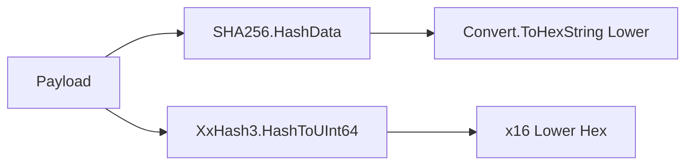

# Providers Net8_0Plus Modul

## 1. Zweck
Dieses Verzeichnis implementiert interne Hashing-Primitive für net8.0 und net10.0.

## 2. Inhalt
- `HashPrimitivesProvider.vb`

## 3. API und Verhalten
- SHA256 wird über `SHA256.HashData` berechnet.
- Lower-Hex wird über `Convert.ToHexString(...).ToLowerInvariant()` ausgegeben.
- FastHash64 wird über `System.IO.Hashing.XxHash3` als lower-hex ausgegeben.

## 4. Verifikation
- Build mit `-f net8.0` und `-f net10.0` muss diesen Provider kompilieren.

## 5. Diagramm

## 6. Verweise
- [Providers Modul](https://github.com/tomtastisch/FileClassifier/blob/main/src/FileTypeDetection/Providers/README.md)
- [Abstractions Providers Modul](https://github.com/tomtastisch/FileClassifier/blob/main/src/FileTypeDetection/Abstractions/Providers/README.md)
