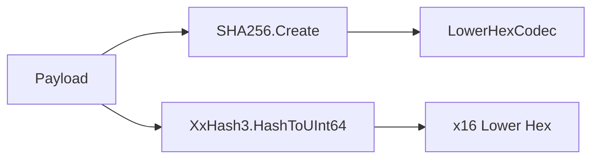

# Providers NetStandard2_0 Modul

## 1. Zweck
Dieses Verzeichnis implementiert interne Hashing-Primitive ohne moderne, net8/net10-exklusive APIs.

## 2. Inhalt
- `HashPrimitivesProvider.vb`

## 3. API und Verhalten
- SHA256 wird über `SHA256.Create()` berechnet.
- Lower-Hex wird deterministisch über nibble-map kodiert.
- FastHash64 wird über `System.IO.Hashing.XxHash3` als lower-hex ausgegeben.

## 4. Verifikation
- Build mit `-f netstandard2.0` muss diesen Provider kompilieren.

## 5. Diagramm

## 6. Verweise
- [Providers Modul](https://github.com/tomtastisch/FileClassifier/blob/main/src/FileTypeDetection/Providers/README.md)
- [Abstractions Providers Modul](https://github.com/tomtastisch/FileClassifier/blob/main/src/FileTypeDetection/Abstractions/Providers/README.md)
