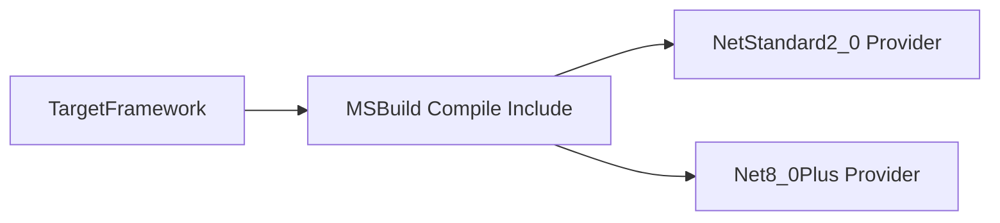

# Providers Modul

## 1. Zweck
Dieses Verzeichnis kapselt TFM-spezifische Implementierungen für interne Hashing-Primitive.

## 2. Inhalt
- `NetStandard2_0/`
- `Net8_0Plus/`

## 3. API und Verhalten
- Die Provider-Auswahl ist compile-time und MSBuild-gesteuert.
- Pro TFM wird exakt ein Provider-Set kompiliert.

## 4. Verifikation
- Build-Logs weisen je TFM die inkludierten Providerdateien nach.

## 5. Diagramm

## 6. Verweise
- [FileTypeDetectionLib.vbproj](https://github.com/tomtastisch/FileClassifier/blob/main/src/FileTypeDetection/FileTypeDetectionLib.vbproj)
- [Abstractions Providers Modul](https://github.com/tomtastisch/FileClassifier/blob/main/src/FileTypeDetection/Abstractions/Providers/README.md)
- [Composition Modul](https://github.com/tomtastisch/FileClassifier/blob/main/src/FileTypeDetection/Composition/README.md)
