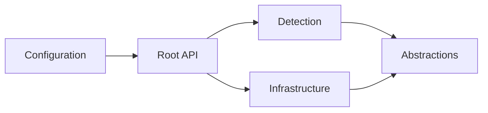
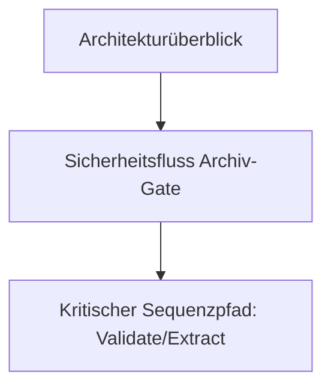

# Index - src/FileTypeDetection

## 1. Ziel dieses Moduls

Deterministische Dateityp-Erkennung und sichere Archiv-Verarbeitung (u. a. für ZIP/TAR/GZIP/7z/RAR) mit fail-closed
Verhalten.

## 2. Schnellstart für Leser

1. [Doku-Index](../../docs/README.md)
2. [Funktionen](../../docs/01_FUNCTIONS.md)
3. [Architektur und Ablaufe](../../docs/02_ARCHITECTURE_AND_FLOWS.md)
4. [Referenzen](../../docs/03_REFERENCES.md)
5. [Production Readiness Checklist](../../docs/PRODUCTION_READINESS_CHECKLIST.md)
6. [DIN-orientierte Spezifikation](../../docs/DIN_SPECIFICATION_DE.md)
7. [Detection-Details](./Detection/README.md)
8. [Infrastructure-Details](./Infrastructure/README.md)
9. [Configuration-Details](./Configuration/README.md)
10. [Abstractions-Details](./Abstractions/README.md)
11. [Abstractions/Detection-Details](./Abstractions/Detection/README.md)
12. [Abstractions/Archive-Details](./Abstractions/Archive/README.md)
13. [Abstractions/Hashing-Details](./Abstractions/Hashing/README.md)
14. [Guides-Index](../../docs/guides/README.md)
15. [Playbook: Options ändern](../../docs/guides/OPTIONS_CHANGE_GUIDE.md)
16. [Playbook: Datatypes/Modelle erweitern](../../docs/guides/DATATYPE_EXTENSION_GUIDE.md)

## 2.1 Empfohlene Lesepfade

- API-Nutzung
  zuerst: [docs/01_FUNCTIONS.md](../../docs/01_FUNCTIONS.md) -> [docs/02_ARCHITECTURE_AND_FLOWS.md](../../docs/02_ARCHITECTURE_AND_FLOWS.md) -> [docs/03_REFERENCES.md](../../docs/03_REFERENCES.md)
- Implementierungsdetails zu
  Flows: [Detection/README.md](./Detection/README.md) + [Infrastructure/README.md](./Infrastructure/README.md)
- Konfigurations- und
  Modellsicht: [Configuration/README.md](./Configuration/README.md) + [Abstractions/README.md](./Abstractions/README.md)
-
Modell-Drill-Down: [Abstractions/Detection/README.md](./Abstractions/Detection/README.md), [Abstractions/Archive/README.md](./Abstractions/Archive/README.md), [Abstractions/Hashing/README.md](./Abstractions/Hashing/README.md)
-
Änderungs-Playbooks: [docs/guides/OPTIONS_CHANGE_GUIDE.md](../../docs/guides/OPTIONS_CHANGE_GUIDE.md) + [docs/guides/DATATYPE_EXTENSION_GUIDE.md](../../docs/guides/DATATYPE_EXTENSION_GUIDE.md)

## 2.2 API-Semantikhinweis (wichtig)

- `TryValidateArchive(...)` und `ArchiveProcessing.*` sind die kanonischen Archiv-APIs.
- Die aktuelle Semantik ist archivformat-generisch: validiert/extrahiert werden intern alle unterstützten
  Archivformate (z. B. ZIP/TAR/GZIP/7z/RAR) fail-closed.
- Begriffsklärung: `ContainerType` bezeichnet das physische Archivformat; der logische Rückgabetyp bleibt aus
  Kompatibilitätsgründen `FileKind.Zip`.
- Verbindliche Details stehen in `docs/01_FUNCTIONS.md`:
    - Abschnitt "API-Semantik"
    - Abschnitt "Security-Gate Mini-Contract (neutral)"
    - Abschnitt "Formatmatrix (implementierte Semantik)"

## 3. Strukturregel (wichtig)

Im Modul-Root liegen nur öffentliche API-Einstiegspunkte:

- [FileTypeDetector.vb](./FileTypeDetector.vb)
- [ArchiveProcessing.vb](./ArchiveProcessing.vb)
- [FileMaterializer.vb](./FileMaterializer.vb)
- [FileTypeOptions.vb](./FileTypeOptions.vb)
- [DeterministicHashing.vb](./DeterministicHashing.vb)

Alle Low-Level-Implementierungen liegen in Unterordnern.

## 4. Ordner und Verantwortungen

| Pfad                                          | Verantwortung                                         | Typische Leser            |
|-----------------------------------------------|-------------------------------------------------------|---------------------------|
| [Abstractions/](./Abstractions/README.md)     | Immutable Rückgabemodelle (Detection/Archive/Hashing) | API-Consumer              |
| [Configuration/](./Configuration/README.md)   | Optionen, Security-Baseline                           | Ops, Security, Entwickler |
| [Detection/](./Detection/README.md)           | SSOT für Typen, Aliase, Header-Magic                  | Maintainer Detection      |
| [Infrastructure/](./Infrastructure/README.md) | Archiv-Gate, Refiner, Extractor, Bounds               | Maintainer Security/IO    |

## 5. Architekturdiagramm



## 6. Öffentliche Funktionen (Übersicht)

| Klasse                    | Funktionale Rolle                                                           | Detailtabelle                                        |
|---------------------------|-----------------------------------------------------------------------------|------------------------------------------------------|
| `FileTypeDetector`        | Erkennung, Policy, Archiv-Path-Operationen                                  | [docs/01_FUNCTIONS.md](../../docs/01_FUNCTIONS.md)   |
| `ArchiveProcessing`       | statische Archiv-Fassade (Path/Bytes)                                       | [docs/01_FUNCTIONS.md](../../docs/01_FUNCTIONS.md)   |
| `FileMaterializer`        | einheitliche Persistenz für Byte-Payloads (optional Archiv->Disk)           | [docs/01_FUNCTIONS.md](../../docs/01_FUNCTIONS.md)   |
| `FileTypeOptions`         | zentrale JSON-Optionsschnittstelle (laden/lesen)                            | [docs/01_FUNCTIONS.md](../../docs/01_FUNCTIONS.md)   |
| `FileTypeProjectBaseline` | konservative Security-Defaults                                              | [Configuration/README.md](./Configuration/README.md) |
| `DeterministicHashing`    | deterministische Physical/Logical Hash-Nachweise und h1-h4 RoundTrip-Report | [docs/01_FUNCTIONS.md](../../docs/01_FUNCTIONS.md)   |

## 7. Qualitätsziele (ISO/IEC 25010)

- Functional suitability: korrektes Mapping Header/Archivformat -> `FileKind`.
- Reliability: fail-closed bei Fehlerpfaden und Grenzverletzungen.
- Security: Archiv-Traversal/Bomb-Schutz, kein Endungsvertraün.
- Maintainability: Root-API klein, interne Verantwortungen getrennt.

## 8. Pflichtdiagramme für Entwickler



## 9. NuGet-/Framework-Abhängigkeiten (Übersicht)

```mermaid
flowchart LR
    API[Public APIs] --> CORE[Infrastructure]
    CORE --> COMPR[System.IO.Compression (managed archive backend)]
    CORE --> SHARP[SharpCompress]
    CORE --> MIME[Mime]
    CORE --> RMS[Microsoft.IO.RecyclableMemoryStream]
    CORE --> HASH[System.IO.Hashing]
    API --> LOG[Microsoft.AspNetCore.App -> Logging]
```

## 10. Nachweise

- Build: `dotnet build FileClassifier.sln --no-restore -v minimal`
- Test: `dotnet test FileClassifier.sln --no-build -v minimal`
- Portable Check: `bash tools/check-portable-filetypedetection.sh --clean`

## Dokumentpflege-Checkliste

- [ ] Inhalt auf aktuellen Code-Stand geprüft.
- [ ] Links und Anker mit `python3 tools/check-markdown-links.py` geprüft.
- [ ] Beispiele/Kommandos lokal verifiziert.
- [ ] Begriffe mit `docs/01_FUNCTIONS.md` abgeglichen.
