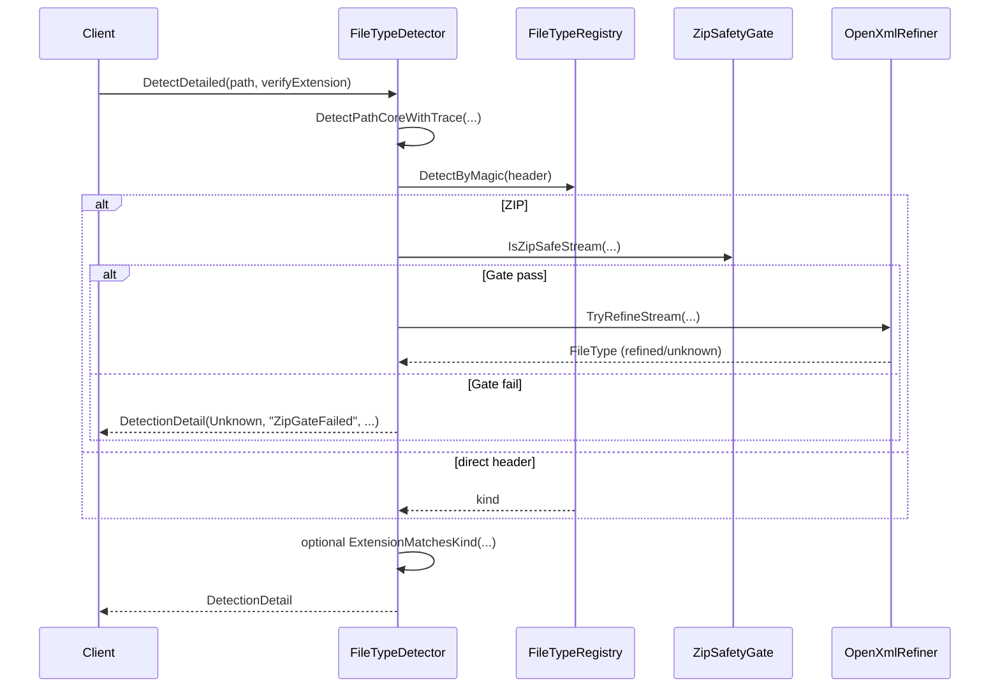
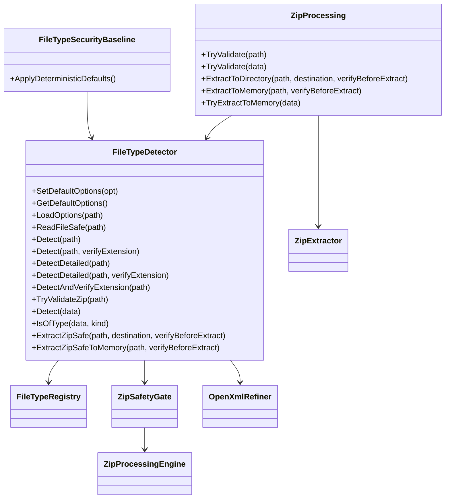

# FileTypeDetection Modul

## Lesepfad
1. [INDEX.md](./INDEX.md)
2. [API_REFERENCE.md](./API_REFERENCE.md)
3. [Detection/INDEX.md](./Detection/INDEX.md)
4. [Infrastructure/INDEX.md](./Infrastructure/INDEX.md)
5. [Abstractions/INDEX.md](./Abstractions/INDEX.md)
6. [Configuration/INDEX.md](./Configuration/INDEX.md)

## Strukturregel
Im Modul-Root liegen nur die oeffentlichen API-Einstiegspunkte als `.vb`-Dateien:
- `FileTypeDetector.vb`
- `ZipProcessing.vb`

## Ablauf-, Prozess- und UML-Dokumentation

### 1. Gesamtstruktur (Datei-/Ordnermodell)
```text
src/FileTypeDetection/
  FileTypeDetector.vb            # oeffentliche Erkennungs-/Policy-API
  ZipProcessing.vb               # oeffentliche ZIP-Fassade
  API_REFERENCE.md               # detailierte Funktionsreferenz
  README.md                      # Modulueberblick, Ablauf, UML
  INDEX.md
  Abstractions/
    DetectionDetail.vb
    FileKind.vb
    FileType.vb
    ZipExtractedEntry.vb
    INDEX.md
  Configuration/
    FileTypeDetectorOptions.vb
    FileTypeSecurityBaseline.vb
    INDEX.md
  Detection/
    FileTypeRegistry.vb
    INDEX.md
  Infrastructure/
    Internals.vb
    MimeProvider.vb
    ZipInternals.vb
    INDEX.md
```

### 2. Ablauf: Dateityp-Erkennung (Pfad)
```mermaid
flowchart TD
    A[Detect(path)] --> B{Datei vorhanden?}
    B -->|Nein| U1[Unknown]
    B -->|Ja| C{Groesse <= MaxBytes?}
    C -->|Nein| U1
    C -->|Ja| D[Header lesen]
    D --> E{Magic Match?}
    E -->|Direkter Nicht-ZIP-Typ| R1[Resolve(kind)]
    E -->|ZIP| Z1[ZipSafetyGate]
    E -->|Unknown| U1
    Z1 -->|Fail| U1
    Z1 -->|Pass| Z2[OpenXmlRefiner]
    Z2 -->|Docx/Xlsx/Pptx| R2[Resolve(refined)]
    Z2 -->|nichts erkannt| R3[Resolve(Zip)]
```

### 3. Ablauf: Sichere ZIP-Extraktion (Disk)
```mermaid
flowchart TD
    A[ExtractZipSafe(path,dest,verify)] --> B{Quelle gueltig?}
    B -->|Nein| F[False]
    B -->|Ja| C{verifyBeforeExtract?}
    C -->|Ja| D[Detect(path)]
    D --> E{Zip Container Kind?}
    E -->|Nein| F
    E -->|Ja| G[ZipProcessingEngine.ProcessZipStream]
    C -->|Nein| G
    G --> H{Traversal/Kollision/Limits ok?}
    H -->|Nein| F
    H -->|Ja| I[Stage-Verzeichnis]
    I --> J[Atomarer Move nach Ziel]
    J --> T[True]
```

### 4. Sequenzdiagramm: `DetectDetailed(path, verifyExtension)`


### 5. UML Klassendiagramm (Public + zentrale internals)


### 6. Trigger-/Ereignismatrix
| Event/Condition | Methode/Komponente | Ergebnis |
|---|---|---|
| Datei fehlt | `Detect(path)` / `DetectDetailed(path)` | `Unknown` / `ReasonCode=FileNotFound` |
| Datei groesser als `MaxBytes` | `Detect(path)` / `ReadFileSafe(path)` | fail-closed (`Unknown` oder leeres `Byte()`) |
| Header = ZIP | `ResolveByHeaderAndFallback` | ZIP-Gate + optional Refiner |
| ZIP-Gate verletzt | `ZipSafetyGate.IsZipSafe*` | `Unknown` / `False` |
| Endung passt nicht zum Content | `Detect(..., verifyExtension:=True)` | `Unknown` / `ExtensionMismatch` |
| Disk-Extraction Ziel existiert | `ZipExtractor.TryExtractZipStream` | `False` |
| In-Memory ZIP invalid | `TryExtractToMemory(data)` | leere Liste |

## Nachweis
- `bash tools/sync-doc-conventions.sh`
- `bash tools/sync-portable-filetypedetection.sh`
