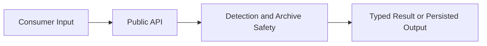

# FileTypeDetection Modul

## 1. Zweck
Dieses Verzeichnis stellt die öffentliche Bibliotheksoberfläche für Dateityperkennung, sichere Archivverarbeitung, deterministische Hashing-Nachweise und Byte-Materialisierung bereit.

## 2. Inhalt
- Öffentliche API-Einstiegspunkte: `FileTypeDetector`, `ArchiveProcessing`, `FileMaterializer`, `FileTypeOptions`, `EvidenceHashing`.
- Submodule für Modellklassen, Registry/Detection, Konfiguration und Infrastruktur.

## 3. API und Verhalten
- `FileTypeDetector`: Typdetektion aus Pfad/Bytes, Detailnachweise und sichere Archivpfade.
- `ArchiveProcessing`: statische Fassade für Validierung/Extraktion.
- `FileMaterializer`: persistiert Byte-Payloads, optional sichere Archiv-Materialisierung.
- `EvidenceHashing`: Physical/Logical Hash-Evidence und RoundTrip-Reports.

## 4. Verifikation
- Unit/Integration/BDD-Nachweise liegen unter dem Testprojekt.
- Dokumentations- und Link-Gates laufen über die zentralen Tools.

## 5. Diagramm


## 6. Verweise
- [Dokumentationsindex](https://github.com/tomtastisch/FileClassifier/blob/main/docs/001_INDEX_CORE.MD)
- [API-Kernübersicht](https://github.com/tomtastisch/FileClassifier/blob/main/docs/010_API_CORE.MD)
- [Architektur und Flows](https://github.com/tomtastisch/FileClassifier/blob/main/docs/020_ARCH_CORE.MD)
- [Audit Index](https://github.com/tomtastisch/FileClassifier/blob/main/docs/audit/000_INDEX.MD)
- [Detektion-Submodul](https://github.com/tomtastisch/FileClassifier/blob/main/src/FileTypeDetection/Detection/README.md)
- [Infrastruktur-Submodul](https://github.com/tomtastisch/FileClassifier/blob/main/src/FileTypeDetection/Infrastructure/README.md)
- [Konfiguration-Submodul](https://github.com/tomtastisch/FileClassifier/blob/main/src/FileTypeDetection/Configuration/README.md)
- [Abstractions-Submodul](https://github.com/tomtastisch/FileClassifier/blob/main/src/FileTypeDetection/Abstractions/README.md)

## 7. Provenance Verification
```bash
dotnet nuget verify <package.nupkg>
gh attestation verify <artifact> --repo tomtastisch/FileClassifier
```
