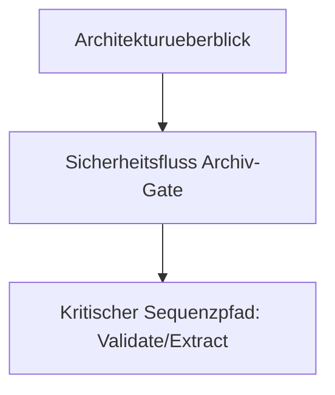
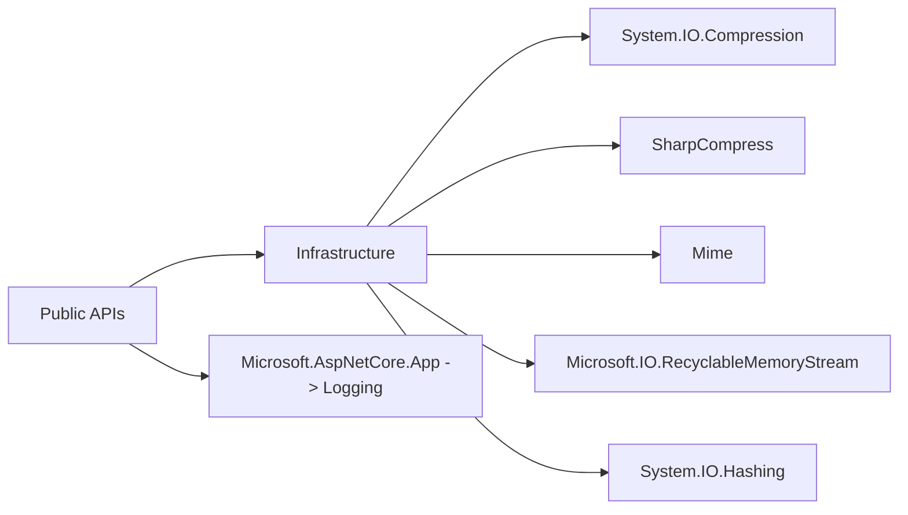

# Index - src/FileTypeDetection

## 1. Ziel dieses Moduls
Deterministische Dateityp-Erkennung und sichere Archiv-Verarbeitung (u. a. ZIP/TAR/GZIP/7z/RAR) mit fail-closed Verhalten.

## 2. Schnellstart fuer Leser
1. [Doku-Index](../../docs/README.md)
2. [Funktionen](../../docs/01_FUNCTIONS.md)
3. [Architektur und Ablaufe](../../docs/02_ARCHITECTURE_AND_FLOWS.md)
4. [Referenzen](../../docs/03_REFERENCES.md)
5. [Production Readiness Checklist](../../docs/PRODUCTION_READINESS_CHECKLIST.md)
6. [DIN-orientierte Spezifikation](../../docs/DIN_SPECIFICATION_DE.md)
7. [Detection-Details](./Detection/README.md)
8. [Infrastructure-Details](./Infrastructure/README.md)
9. [Configuration-Details](./Configuration/README.md)
10. [Abstractions-Details](./Abstractions/README.md)

## 2.1 Empfohlene Lesepfade
- API-Nutzung zuerst: [docs/01_FUNCTIONS.md](../../docs/01_FUNCTIONS.md) -> [docs/02_ARCHITECTURE_AND_FLOWS.md](../../docs/02_ARCHITECTURE_AND_FLOWS.md) -> [docs/03_REFERENCES.md](../../docs/03_REFERENCES.md)
- Implementierungsdetails zu Flows: [Detection/README.md](./Detection/README.md) + [Infrastructure/README.md](./Infrastructure/README.md)
- Konfigurations- und Modellsicht: [Configuration/README.md](./Configuration/README.md) + [Abstractions/README.md](./Abstractions/README.md)

## 2.2 API-Semantikhinweis (wichtig)
- `TryValidateArchive(...)` und `ArchiveProcessing.*` sind die kanonischen Archiv-APIs.
- Die aktuelle Semantik ist archivformat-generisch: validiert/extrahiert werden intern alle unterstuetzten Archive (ZIP/TAR/GZIP/7z/RAR) fail-closed.
- Begriffsklaerung: `ContainerType` bezeichnet das physische Archivformat; der logische Rueckgabetyp bleibt aus Kompatibilitaetsgruenden `FileKind.Zip`.
- Verbindliche Details stehen in `docs/01_FUNCTIONS.md`:
  - Abschnitt "API-Semantik"
  - Abschnitt "Security-Gate Mini-Contract (neutral)"
  - Abschnitt "Formatmatrix (implementierte Semantik)"

## 3. Strukturregel (wichtig)
Im Modul-Root liegen nur oeffentliche API-Einstiegspunkte:
- [FileTypeDetector.vb](./FileTypeDetector.vb)
- [ArchiveProcessing.vb](./ArchiveProcessing.vb)
- [FileMaterializer.vb](./FileMaterializer.vb)
- [FileTypeOptions.vb](./FileTypeOptions.vb)
- [DeterministicHashing.vb](./DeterministicHashing.vb)

Alle Low-Level-Implementierungen liegen in Unterordnern.

## 4. Ordner und Verantwortungen
| Pfad | Verantwortung | Typische Leser |
|---|---|---|
| [Abstractions/](./Abstractions/README.md) | Immutable Rueckgabemodelle | API-Consumer |
| [Configuration/](./Configuration/README.md) | Optionen, Security-Baseline | Ops, Security, Entwickler |
| [Detection/](./Detection/README.md) | SSOT fuer Typen, Aliase, Header-Magic | Maintainer Detection |
| [Infrastructure/](./Infrastructure/README.md) | Archiv-Gate, Refiner, Extractor, Bounds | Maintainer Security/IO |

## 5. Architekturdiagramm

## 6. Oeffentliche Funktionen (Uebersicht)
| Klasse | Funktionale Rolle | Detailtabelle |
|---|---|---|
| `FileTypeDetector` | Erkennung, Policy, Archiv-Path-Operationen | [docs/01_FUNCTIONS.md](../../docs/01_FUNCTIONS.md) |
| `ArchiveProcessing` | statische Archiv-Fassade (Path/Bytes) | [docs/01_FUNCTIONS.md](../../docs/01_FUNCTIONS.md) |
| `FileMaterializer` | einheitliche Persistenz fuer Byte-Payloads (optional Archiv->Disk) | [docs/01_FUNCTIONS.md](../../docs/01_FUNCTIONS.md) |
| `FileTypeOptions` | zentrale JSON-Optionsschnittstelle (laden/lesen) | [docs/01_FUNCTIONS.md](../../docs/01_FUNCTIONS.md) |
| `FileTypeProjectBaseline` | konservative Security-Defaults | [Configuration/README.md](./Configuration/README.md) |
| `DeterministicHashing` | deterministische Physical/Logical Hash-Nachweise und h1-h4 RoundTrip-Report | [docs/01_FUNCTIONS.md](../../docs/01_FUNCTIONS.md) |

## 7. Qualitaetsziele (ISO/IEC 25010)
- Functional suitability: korrektes Mapping Header/Archivformat -> `FileKind`.
- Reliability: fail-closed bei Fehlerpfaden und Grenzverletzungen.
- Security: Archiv-Traversal/Bomb-Schutz, kein Endungsvertrauen.
- Maintainability: Root-API klein, interne Verantwortungen getrennt.

## 8. Pflichtdiagramme fuer Entwickler

## 9. NuGet-/Framework-Abhaengigkeiten (Uebersicht)

## 10. Nachweise
- Build: `dotnet build FileClassifier.sln --no-restore -v minimal`
- Test: `dotnet test FileClassifier.sln --no-build -v minimal`
- Portable Check: `bash tools/check-portable-filetypedetection.sh --clean`
