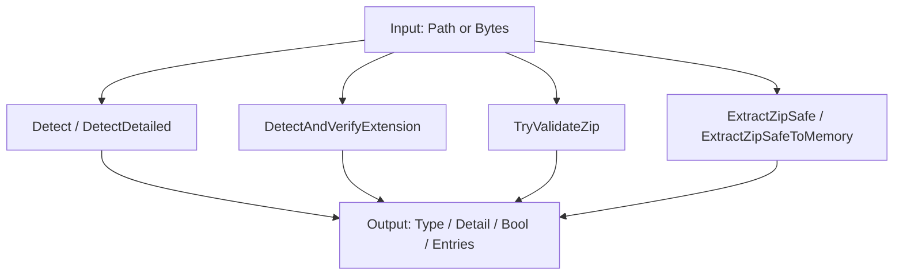
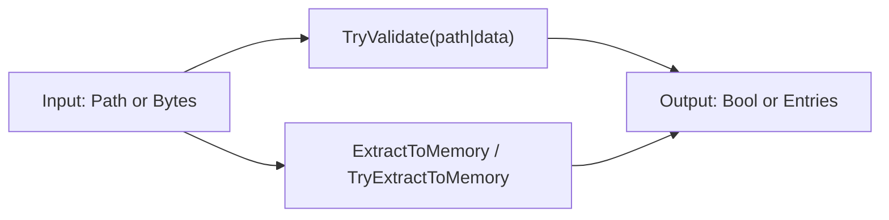
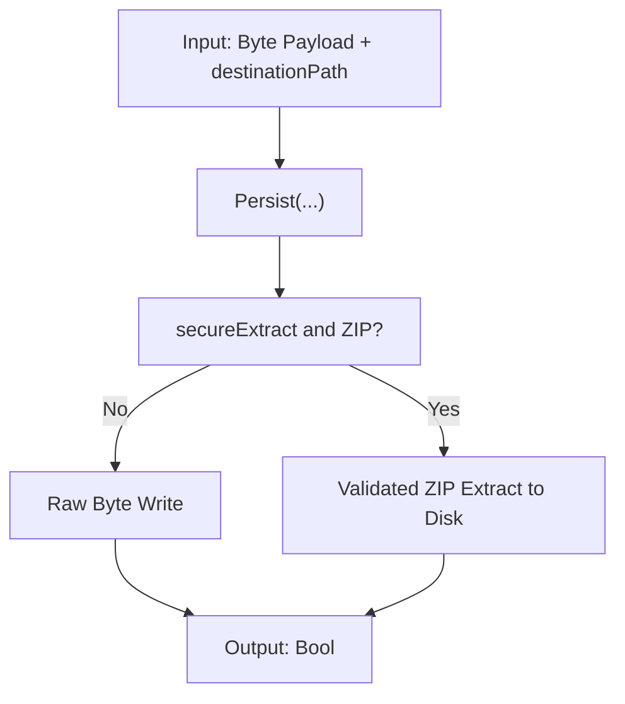
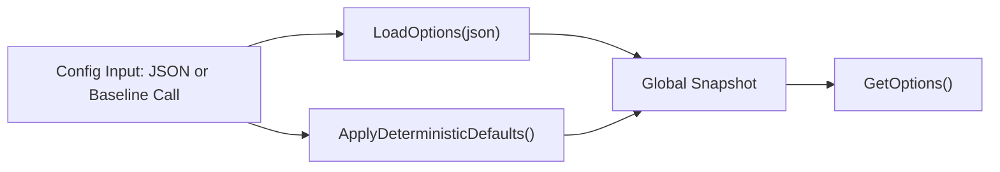

# 01 - Funktionen

## 1. Zweck & Scope
Dieses Dokument beschreibt alle oeffentlichen Einstiegspunkte der API mit Signaturen, Einsatzfall, Seiteneffekten und minimalen Aufrufbeispielen.

## 2. Definitionen
- Fail-closed: Fehlerpfade liefern nur sichere Rueckgaben (`Unknown`, `False`, leere Liste).
- Side-Effects: Dateisystemschreibvorgaenge oder globale Optionsaenderungen.
- Flow-ID: Verweis auf Architekturablaeufe in `02_ARCHITECTURE_AND_FLOWS.md`.

## 2.1 Weiterfuehrende Detailquellen pro Familie
| API-Familie | Detailquelle | Zweck |
|---|---|---|
| `FileTypeDetector` / `ZipProcessing` | [`../Detection/README.md`](../Detection/README.md) | SSOT-Detektion, Header-Magic, Aliaslogik |
| `FileTypeDetector` / `ZipProcessing` / `FileMaterializer` | [`../Infrastructure/README.md`](../Infrastructure/README.md) | ZIP-Gate, Guards, Extraktions-Engine |
| `FileTypeOptions` / `FileTypeSecurityBaseline` | [`../Configuration/README.md`](../Configuration/README.md) | globale Optionen und Baseline |
| Rueckgabemodelle (`FileType`, `DetectionDetail`, `ZipExtractedEntry`) | [`../Abstractions/README.md`](../Abstractions/README.md) | Modellvertraege der Public API |
| Modulnavigation | [`../README.md`](../README.md) | Uebersicht und Einstieg je Leserrolle |

## 3. Vollstaendige Methodenmatrix (Public API)
| Familie | Methode | Input | Output | Side-Effects | Primarer Flow |
|---|---|---|---|---|---|
| `FileTypeDetector` | `ReadFileSafe(path)` | Datei-Pfad | `Byte()` | keine (read-only) | `F0` |
| `FileTypeDetector` | `Detect(path)` | Datei-Pfad | `FileType` | keine | `F1` |
| `FileTypeDetector` | `Detect(path, verifyExtension)` | Datei-Pfad + Bool | `FileType` | keine | `F1` |
| `FileTypeDetector` | `DetectDetailed(path)` | Datei-Pfad | `DetectionDetail` | keine | `F1` |
| `FileTypeDetector` | `DetectDetailed(path, verifyExtension)` | Datei-Pfad + Bool | `DetectionDetail` | keine | `F1` |
| `FileTypeDetector` | `DetectAndVerifyExtension(path)` | Datei-Pfad | `Boolean` | keine | `F8` |
| `FileTypeDetector` | `TryValidateZip(path)` | Datei-Pfad | `Boolean` | keine | `F3` |
| `FileTypeDetector` | `Detect(data)` | `Byte()` | `FileType` | keine | `F2` |
| `FileTypeDetector` | `IsOfType(data, kind)` | `Byte()` + `FileKind` | `Boolean` | keine | `F2` |
| `FileTypeDetector` | `ExtractZipSafe(path, destination, verifyBeforeExtract)` | Pfad + Ziel + Bool | `Boolean` | schreibt auf Disk | `F5` |
| `FileTypeDetector` | `ExtractZipSafeToMemory(path, verifyBeforeExtract)` | Pfad + Bool | `IReadOnlyList(Of ZipExtractedEntry)` | keine | `F4` |
| `ZipProcessing` | `TryValidate(path)` | Datei-Pfad | `Boolean` | keine | `F3` |
| `ZipProcessing` | `TryValidate(data)` | `Byte()` | `Boolean` | keine | `F3` |
| `ZipProcessing` | `ExtractToMemory(path, verifyBeforeExtract)` | Pfad + Bool | `IReadOnlyList(Of ZipExtractedEntry)` | keine | `F4` |
| `ZipProcessing` | `TryExtractToMemory(data)` | `Byte()` | `IReadOnlyList(Of ZipExtractedEntry)` | keine | `F4` |
| `FileMaterializer` | `Persist(data, destinationPath)` | `Byte()` + Zielpfad | `Boolean` | schreibt auf Disk | `F6` |
| `FileMaterializer` | `Persist(data, destinationPath, overwrite)` | `Byte()` + Zielpfad + Bool | `Boolean` | schreibt auf Disk | `F6` |
| `FileMaterializer` | `Persist(data, destinationPath, overwrite, secureExtract)` | `Byte()` + Zielpfad + 2 Bool | `Boolean` | schreibt auf Disk | `F5`/`F6` |
| `FileTypeOptions` | `LoadOptions(json)` | JSON | `Boolean` | aendert globale Optionen | `F7` |
| `FileTypeOptions` | `GetOptions()` | - | `String` (JSON) | keine | `F7` |
| `FileTypeSecurityBaseline` | `ApplyDeterministicDefaults()` | - | `Void` | aendert globale Optionen | `F7` |

## 4. Methodenfamilien
### 4.1 FileTypeDetector
Details: [`../README.md`](../README.md), [`../Detection/README.md`](../Detection/README.md), [`../Infrastructure/README.md`](../Infrastructure/README.md).



```csharp
using FileTypeDetection;

var detector = new FileTypeDetector();
var t = detector.Detect("/data/invoice.pdf", verifyExtension: true);
var d = detector.DetectDetailed("/data/archive.docx", verifyExtension: true);
bool zipOk = detector.TryValidateZip("/data/archive.zip");
var entries = detector.ExtractZipSafeToMemory("/data/archive.zip", verifyBeforeExtract: true);

Console.WriteLine($"{t.Kind} / {d.ReasonCode} / {zipOk} / {entries.Count}");
```

### 4.2 ZipProcessing
Details: [`../README.md`](../README.md), [`../Infrastructure/README.md`](../Infrastructure/README.md).



```csharp
using FileTypeDetection;

bool okPath = ZipProcessing.TryValidate("/data/archive.zip");
bool okBytes = ZipProcessing.TryValidate(File.ReadAllBytes("/data/archive.zip"));
var entriesPath = ZipProcessing.ExtractToMemory("/data/archive.zip", verifyBeforeExtract: true);
var entriesBytes = ZipProcessing.TryExtractToMemory(File.ReadAllBytes("/data/archive.zip"));
```

### 4.3 FileMaterializer
Details: [`../README.md`](../README.md), [`../Infrastructure/README.md`](../Infrastructure/README.md).



```csharp
using FileTypeDetection;

byte[] payload = File.ReadAllBytes("/data/input.bin");
byte[] zipPayload = File.ReadAllBytes("/data/archive.zip");

bool rawOk = FileMaterializer.Persist(payload, "/data/out/input.bin", overwrite: false, secureExtract: false);
bool zipOk = FileMaterializer.Persist(zipPayload, "/data/out/unpacked", overwrite: false, secureExtract: true);
```

### 4.4 FileTypeOptions + FileTypeSecurityBaseline
Details: [`../README.md`](../README.md), [`../Configuration/README.md`](../Configuration/README.md).



```csharp
using FileTypeDetection;

FileTypeSecurityBaseline.ApplyDeterministicDefaults();
bool loaded = FileTypeOptions.LoadOptions("{\"maxBytes\":134217728}");
string snapshot = FileTypeOptions.GetOptions();
Console.WriteLine($"Loaded={loaded}; Snapshot={snapshot}");
```

## 5. Nicht-Ziele
- Keine interne Low-Level-Implementierung im Detail (siehe `03_REFERENCES.md`).
- Keine Norm/Compliance-Herleitung (siehe `DIN_SPECIFICATION_DE.md`).
