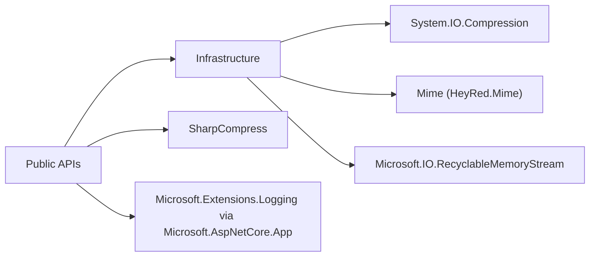

# 03 - Referenzen

## 1. Zweck & Scope
Dieses Dokument sammelt die statischen Referenzen zur API: interne Dateipfade, externe Abhaengigkeiten, Rueckgabemodelle und ReasonCodes.

## 2. Oeffentliche Rueckgabemodelle
| Typ | Oeffentliche Member | Zweck |
|---|---|---|
| `FileKind` | Enum-Werte (u. a. `Unknown`, `Pdf`, `Zip`, `Docx`) | kanonische Typklassifikation |
| `FileType` | `Kind`, `CanonicalExtension`, `Mime`, `Allowed`, `Aliases` | inhaltsbasierte Typentscheidung |
| `DetectionDetail` | `DetectedType`, `ReasonCode`, `UsedZipContentCheck`, `UsedStructuredRefinement`, `ExtensionVerified` | auditierbares Detailergebnis |
| `ZipExtractedEntry` | `RelativePath`, `Content`, `Size`, `OpenReadOnlyStream()` | sicherer In-Memory-Extrakteintrag |
| `FileTypeDetectorOptions` | `HeaderOnlyNonZip`, `MaxBytes`, `SniffBytes`, `MaxZipEntries`, `MaxZipTotalUncompressedBytes`, `MaxZipEntryUncompressedBytes`, `MaxZipCompressionRatio`, `MaxZipNestingDepth`, `MaxZipNestedBytes`, `Logger` | globales Optionsmodell |

## 3. ReasonCode-Referenz (DetectDetailed)
Quelle: `FileTypeDetector.vb`.

| ReasonCode | Bedeutung |
|---|---|
| `Unknown` | keine belastbare Erkennung |
| `FileNotFound` | Eingabedatei fehlt |
| `InvalidLength` | Dateilaenge ist ungueltig |
| `FileTooLarge` | `MaxBytes` wurde ueberschritten |
| `Exception` | Ausnahme im Detektionspfad |
| `ExtensionMismatch` | Endung passt nicht zum erkannten Typ |
| `HeaderUnknown` | Header-Magic unzureichend/unbekannt |
| `HeaderMatch` | Header-Magic hat Typ direkt erkannt |
| `ZipGateFailed` | ZIP-Sicherheitspruefung fehlgeschlagen |
| `ZipStructuredRefined` | ZIP wurde strukturiert (z. B. OOXML) verfeinert |
| `ZipRefined` | ZIP-Typ wurde inhaltlich verfeinert |
| `ZipGeneric` | ZIP blieb generisch |

## 4. Interne Kernpfade (Lesefuehrung)
| Interner Pfad | Datei | Bedeutung | Detail-README |
|---|---|---|---|
| Header/Typ-SSOT | `Detection/FileTypeRegistry.vb` | Header-Magic, Aliase, Canonical Extensions | [`../Detection/README.md`](../Detection/README.md) |
| Core Guards | `Infrastructure/CoreInternals.vb` | Bounds, Security Gates, Path Guards | [`../Infrastructure/README.md`](../Infrastructure/README.md) |
| ZIP internals | `Infrastructure/ZipInternals.vb` | ZIP-Iteration, Validierung, Extraktion | [`../Infrastructure/README.md`](../Infrastructure/README.md) |
| MIME Aufloesung | `Infrastructure/MimeProvider.vb` | MIME-Mapping | [`../Infrastructure/README.md`](../Infrastructure/README.md) |

## 5. Externe Abhaengigkeiten
### 5.1 Diagramm


### 5.2 Tabelle
| Paket/Framework | Verwendet in | Zweck |
|---|---|---|
| `System.IO.Compression` (BCL) | `Infrastructure/CoreInternals.vb`, `Infrastructure/ZipInternals.vb` | ZIP lesen/iterieren |
| `Mime` | `Infrastructure/MimeProvider.vb` | MIME-Aufloesung aus Extension |
| `Microsoft.IO.RecyclableMemoryStream` | `Infrastructure/ZipInternals.vb` | kontrollierte Memory-Streams |
| `SharpCompress` | `FileMaterializer.vb` | defensiver ZIP-Lesbarkeits-Check |
| `Microsoft.AspNetCore.App` (FrameworkReference) | Logging via `Microsoft.Extensions.Logging` | optionale Diagnostik |

## 6. Referenz-Index (wo finde ich was?)
| Thema | Primardokument |
|---|---|
| Public Signaturen + Beispiele | `01_FUNCTIONS.md` |
| E2E-Architektur + Sequenzen | `02_ARCHITECTURE_AND_FLOWS.md` |
| Normative Anforderungen | `DIN_SPECIFICATION_DE.md` |
| Modul-Uebersicht | `../README.md` |
| Unterordner-Details | `../Detection/README.md`, `../Infrastructure/README.md`, `../Configuration/README.md`, `../Abstractions/README.md` |

## 7. Verifikationsreferenzen
Empfohlene Freigabe-Checks:
```bash
dotnet restore FileClassifier.sln -v minimal
dotnet build FileClassifier.sln --no-restore -v minimal
dotnet test tests/FileTypeDetectionLib.Tests/FileTypeDetectionLib.Tests.csproj --no-build -v minimal
```
