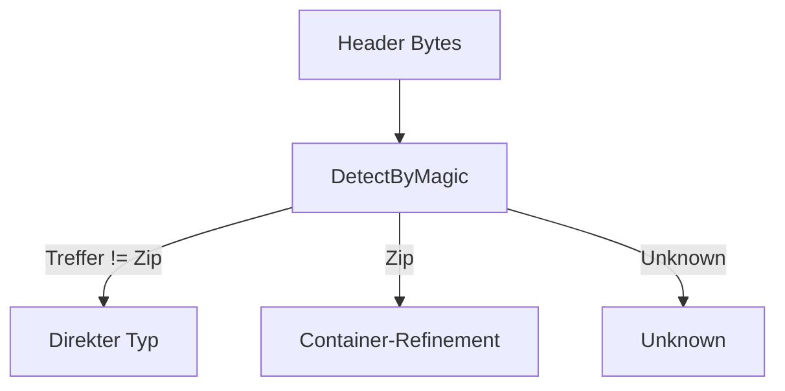

# Index - Detection

## 1. Purpose
SSOT fuer Typmetadaten, Policy-Regeln und Magic-Pattern.

## 2. Inputs
- Header-Bytes
- `FileKind`-Definitionen

## 3. Outputs
- `FileType`-Aufloesung (`Resolve*`)
- Header-/Content-Detektionsentscheidungen

## 4. Failure Modes / Guarantees
- Nicht erkennbare Inhalte => `Unknown`.
- Deterministische Normalisierung via `NormalizeAlias`.

## 5. Verification & Evidence
- `HeaderCoveragePolicyUnitTests.cs`
- `FileTypeRegistryUnitTests.cs`

## 6. Glossar
| Begriff | Definition |
|---|---|
| `HasDirectHeaderDetection` | direkter Header-Magic-Match vorhanden |
| `HasStructuredContainerDetection` | sichere Container-Spezifizierung (OOXML in ZIP) |
| `HasDirectContentDetection` | Header oder strukturierte Content-Erkennung |
| `Allowed` | Policy-Flag im `FileType` |

## 7. Parameter-/Policy-Tabelle
| Parameter | Quelle | Bedeutung | Regel |
|---|---|---|---|
| `Kind` | `FileKind` | kanonische Typ-ID | nur definierte Enum-Werte sind bekannt |
| `CanonicalExtension` | Registry | kanonische Endung | Metadatum, nicht Vertrauensquelle |
| `Aliases` | Registry | normalisierte Aliasnamen | deterministische, case-insensitive Normalisierung |
| `Mime` | `MimeProvider` | MIME-Metadatum | keine prim. Sicherheitsentscheidung |
| `Allowed` | `FileType` | boolesche Freigabe | `Unknown=False`, bekannte Typen `True` |
| `HasDirectHeaderDetection(kind)` | Registry | Header-signaturbasierte Erkennung | notwendig fuer direkte Nicht-ZIP-Typen |
| `HasStructuredContainerDetection(kind)` | Registry | strukturierte Content-Erkennung | `Docx/Xlsx/Pptx` via ZIP+Marker |
| `HasDirectContentDetection(kind)` | Registry | Header ODER strukturierte Erkennung | Vertrauensbasis fuer Typentscheidung |

## 8. Entscheidungsfluss

